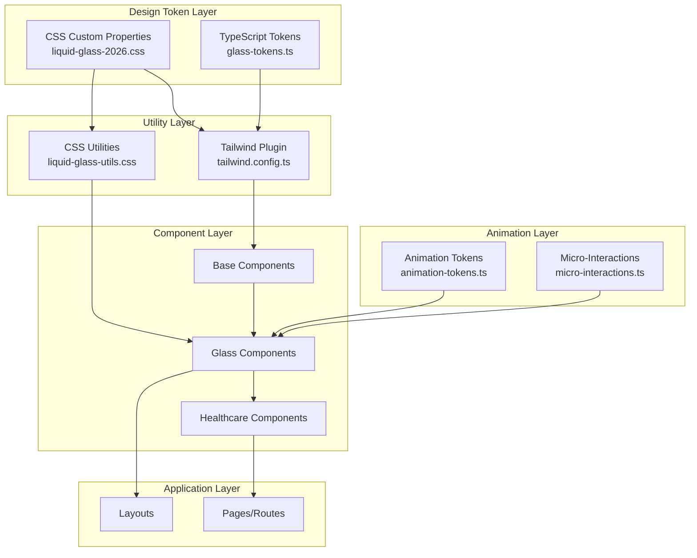
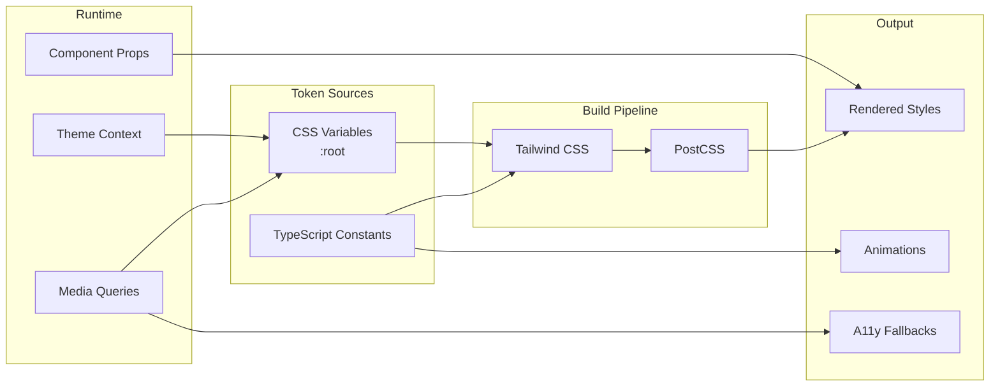
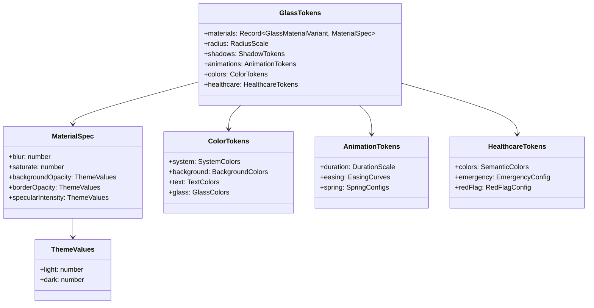
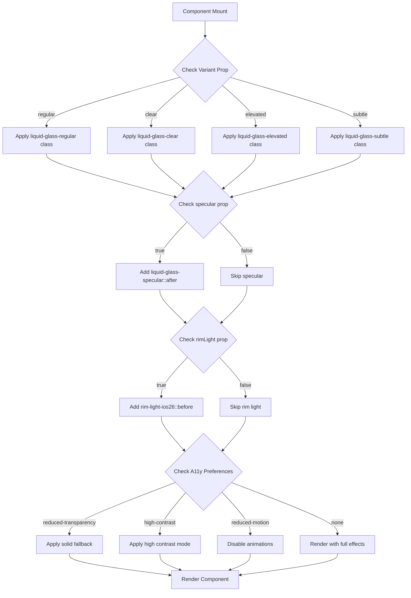
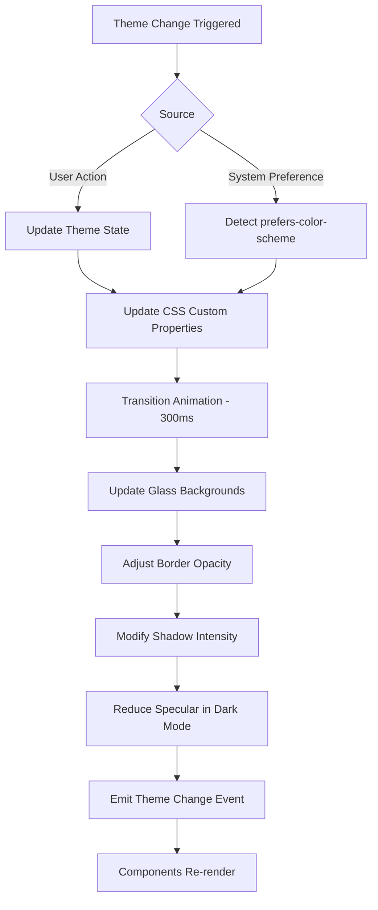
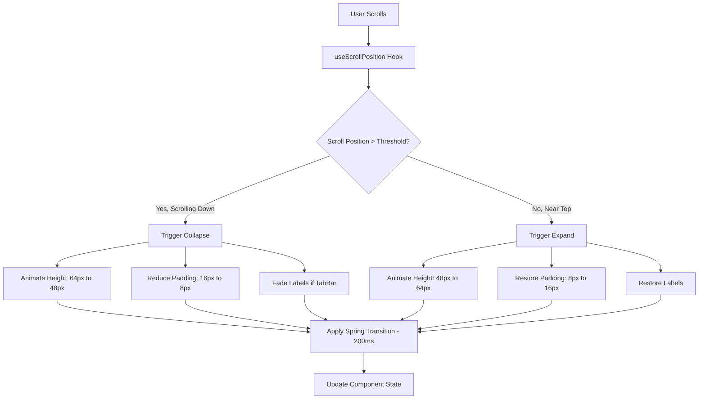
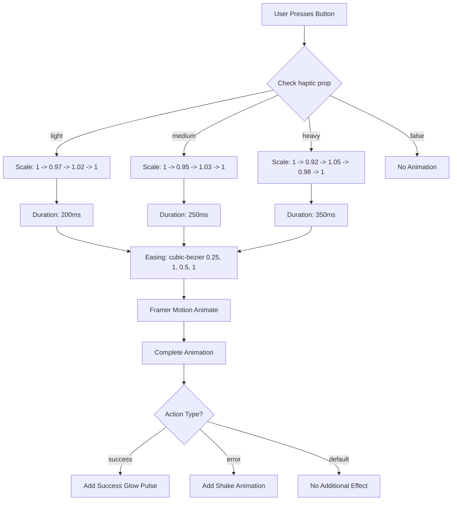
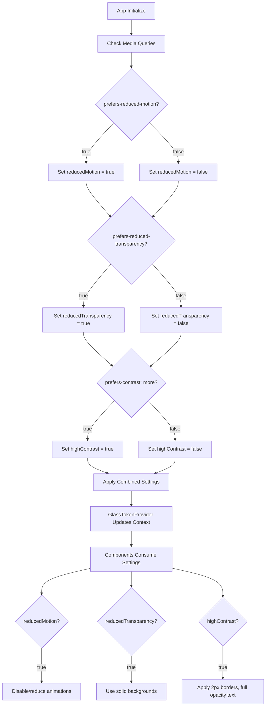

# Design Document

## Apple Liquid Glass 2026 Design System Implementation for WellWave

**Version:** 1.0
**Date:** 2026-01-24
**Feature:** liquid-glass-2026
**Status:** Draft

---

## Overview

This design document outlines the architecture and implementation strategy for the Apple Liquid Glass 2026 design system in WellWave. The design aims to unify existing glass components under a single, consistent token system while achieving visual parity with Apple's iOS 26/macOS Tahoe 26 specifications.

### Design Goals

1. **Unification**: Consolidate fragmented token files (`glass-tokens.ts`, `liquidGlassColors.ts`) into a single source of truth
2. **Consistency**: Ensure all glass components use standardized material variants (Regular, Clear, Elevated, Subtle)
3. **Performance**: Maintain 60fps animations and Lighthouse score >= 70 for emergency healthcare scenarios
4. **Accessibility**: Full WCAG 2.1 AA compliance with respect for user preferences
5. **Healthcare Priority**: Critical medical information always takes visual precedence over aesthetic effects

---

## Architecture Design

### System Architecture Diagram



### Data Flow Diagram



---

## Components and Interfaces

### Component 1: GlassTokenProvider

**Purpose**: Context provider for glass design tokens with theme awareness

**Responsibilities**:
- Provide access to design tokens throughout the component tree
- Handle theme switching (light/dark mode)
- Manage accessibility preferences (reduced motion, transparency, contrast)

**Interface**:

```typescript
interface GlassTokenContextValue {
  // Current theme
  theme: 'light' | 'dark' | 'system';

  // Accessibility preferences
  prefersReducedMotion: boolean;
  prefersReducedTransparency: boolean;
  prefersHighContrast: boolean;

  // Token access
  tokens: GlassTokens;

  // Theme control
  setTheme: (theme: 'light' | 'dark' | 'system') => void;
}

interface GlassTokenProviderProps {
  children: React.ReactNode;
  defaultTheme?: 'light' | 'dark' | 'system';
}
```

**Dependencies**: React Context, useMediaQuery hook

---

### Component 2: Unified GlassTokens Module

**Purpose**: Single source of truth for all design tokens

**Responsibilities**:
- Export CSS custom property names
- Export TypeScript constants for animations
- Provide variant configurations
- Define healthcare semantic colors

**Interface**:

```typescript
// Material variant types
type GlassMaterialVariant = 'regular' | 'clear' | 'elevated' | 'subtle';

// Healthcare semantic variants
type HealthcareVariant =
  | 'healthcare-primary'
  | 'healthcare-success'
  | 'healthcare-warning'
  | 'healthcare-critical'
  | 'healthcare-info';

// Combined variant type
type GlassVariant = GlassMaterialVariant | HealthcareVariant;

// Token structure
interface GlassTokens {
  // Material specifications
  materials: Record<GlassMaterialVariant, MaterialSpec>;

  // Border radius scale
  radius: RadiusScale;

  // Shadow definitions
  shadows: ShadowTokens;

  // Animation configurations
  animations: AnimationTokens;

  // Color palette
  colors: ColorTokens;

  // Healthcare semantics
  healthcare: HealthcareTokens;
}

interface MaterialSpec {
  blur: number;
  saturate: number;
  backgroundOpacity: { light: number; dark: number };
  borderOpacity: { light: number; dark: number };
  specularIntensity: { light: number; dark: number };
}

interface RadiusScale {
  xs: string;  // 8px - badges, pills
  sm: string;  // 12px - buttons, inputs
  md: string;  // 16px - cards, dialogs
  lg: string;  // 24px - large cards
  xl: string;  // 32px - modals
  '2xl': string; // 40px - hero elements
  full: string;  // 9999px - circular
}
```

**Dependencies**: None (pure data module)

---

### Component 3: GlassCard (Updated)

**Purpose**: Base glass card component with all material variants

**Responsibilities**:
- Render glass surface with appropriate material variant
- Apply specular highlights and rim light effects
- Handle hover/press animations
- Support healthcare semantic colors
- Maintain accessibility compliance

**Interface**:

```typescript
interface GlassCardProps extends HTMLMotionProps<'div'> {
  // Material variant (Regular, Clear, Elevated, Subtle)
  variant?: GlassMaterialVariant;

  // Healthcare semantic variant (optional, overrides material)
  healthcareVariant?: HealthcareVariant;

  // Enable specular highlight (top shine)
  specular?: boolean;

  // Enable rim light border effect
  rimLight?: boolean;

  // Enable hover animations
  interactive?: boolean;

  // Glow color on hover
  glow?: 'none' | 'blue' | 'green' | 'teal' | 'purple' | 'orange' | SemanticGlow;

  // Enable 35% dimming layer (for clear variant)
  dimming?: boolean;

  // Size presets affecting padding and radius
  size?: 'sm' | 'md' | 'lg';
}

type SemanticGlow = 'primary' | 'success' | 'warning' | 'critical' | 'info';
```

**Dependencies**: Framer Motion, glassMaterial utilities, GlassTokens

---

### Component 4: GlassButton (Updated)

**Purpose**: Glass morphism button with haptic feedback

**Responsibilities**:
- Render glass button surface
- Provide visual haptic feedback on press
- Support healthcare semantic variants
- Handle loading and disabled states

**Interface**:

```typescript
interface GlassButtonProps extends Omit<HTMLMotionProps<'button'>, 'variant'> {
  variant?: 'default' | 'primary' | 'secondary' | 'ghost' | 'danger';
  healthcareVariant?: HealthcareVariant;
  size?: 'sm' | 'md' | 'lg';
  leftIcon?: React.ReactNode;
  rightIcon?: React.ReactNode;
  loading?: boolean;
  haptic?: 'light' | 'medium' | 'heavy' | false;
  rimLight?: boolean;
}
```

**Dependencies**: Framer Motion, microInteractions, GlassTokens

---

### Component 5: GlassInput (Updated)

**Purpose**: Glass morphism form input

**Responsibilities**:
- Render glass input field
- Handle focus states with glow effects
- Support error/success states
- Maintain accessibility with proper contrast

**Interface**:

```typescript
interface GlassInputProps extends React.InputHTMLAttributes<HTMLInputElement> {
  variant?: GlassMaterialVariant;
  state?: 'default' | 'error' | 'success' | 'warning';
  leftIcon?: React.ReactNode;
  rightIcon?: React.ReactNode;
  label?: string;
  helperText?: string;
}
```

**Dependencies**: React, GlassTokens, glassFocusRing utilities

---

### Component 6: GlassNavigation (New)

**Purpose**: Scroll-responsive glass navigation (header/tab bar)

**Responsibilities**:
- Shrink/expand on scroll
- Maintain glass effect during transitions
- Support collapsed and expanded states
- Handle mobile responsiveness

**Interface**:

```typescript
interface GlassNavigationProps {
  variant: 'header' | 'tabBar' | 'sidebar';
  children: React.ReactNode;
  scrollThreshold?: number;
  expandedHeight?: number;
  collapsedHeight?: number;
  sticky?: boolean;
}
```

**Dependencies**: Framer Motion, useScrollPosition hook, GlassTokens

---

### Component 7: GlassTooltip (New)

**Purpose**: Glass morphism tooltip

**Responsibilities**:
- Render glass tooltip surface
- Position correctly relative to trigger
- Animate entrance/exit
- Support dark/light themes

**Interface**:

```typescript
interface GlassTooltipProps {
  content: React.ReactNode;
  children: React.ReactElement;
  position?: 'top' | 'bottom' | 'left' | 'right';
  delay?: number;
  variant?: GlassMaterialVariant;
}
```

**Dependencies**: Radix UI Tooltip, Framer Motion, GlassTokens

---

### Component 8: GlassAccordion (New)

**Purpose**: Glass morphism accordion/collapsible

**Responsibilities**:
- Render glass accordion panels
- Animate open/close transitions
- Support multiple open items or single selection
- Maintain accessibility

**Interface**:

```typescript
interface GlassAccordionProps {
  items: AccordionItem[];
  type?: 'single' | 'multiple';
  variant?: GlassMaterialVariant;
  defaultExpanded?: string[];
}

interface AccordionItem {
  id: string;
  title: React.ReactNode;
  content: React.ReactNode;
  icon?: React.ReactNode;
}
```

**Dependencies**: Radix UI Accordion, Framer Motion, GlassTokens

---

### Component 9: GlassProgress (New)

**Purpose**: Glass morphism progress indicators

**Responsibilities**:
- Render glass progress bar/circular indicator
- Animate progress changes
- Support determinate and indeterminate states
- Display healthcare status colors

**Interface**:

```typescript
interface GlassProgressProps {
  value?: number; // 0-100, undefined for indeterminate
  variant?: 'bar' | 'circular' | 'steps';
  size?: 'sm' | 'md' | 'lg';
  healthcareVariant?: HealthcareVariant;
  showLabel?: boolean;
  label?: string;
}
```

**Dependencies**: Framer Motion, GlassTokens

---

## Data Models

### Core Data Structure Definitions

```typescript
// ============================================
// MATERIAL SPECIFICATIONS
// ============================================

interface MaterialSpec {
  /** Backdrop blur in pixels (40-120px range) */
  blur: number;

  /** Saturation enhancement percentage (180-280%) */
  saturate: number;

  /** Background opacity by theme */
  backgroundOpacity: {
    light: number; // 0.12-0.38 range
    dark: number;  // +0.06-0.10 from light
  };

  /** Border opacity by theme */
  borderOpacity: {
    light: number; // 0.25-0.50 range
    dark: number;  // -0.10-0.15 from light
  };

  /** Specular highlight intensity */
  specularIntensity: {
    light: number; // 0.4-0.8
    dark: number;  // 0.25-0.5
  };
}

// ============================================
// COLOR TOKENS
// ============================================

interface ColorTokens {
  /** Apple 2026 System Colors */
  system: {
    blue: string;      // #007AFF (light) / #0A84FF (dark)
    green: string;     // #34C759 (light) / #30D158 (dark)
    red: string;       // #FF3B30 (light) / #FF453A (dark)
    orange: string;    // #FF9500 (light) / #FF9F0A (dark)
    teal: string;      // #5AC8FA (light) / #64D2FF (dark)
    purple: string;    // #AF52DE (light) / #BF5AF2 (dark)
  };

  /** Background colors */
  background: {
    primary: string;   // Page background
    secondary: string; // Secondary surfaces
    tertiary: string;  // Tertiary surfaces
  };

  /** Text colors */
  text: {
    primary: string;   // Main text
    secondary: string; // Secondary text
    tertiary: string;  // Muted text
    inverse: string;   // Light text on dark
  };

  /** Glass-specific colors */
  glass: {
    surface: string;   // Glass surface base
    border: string;    // Glass border
    shadow: string;    // Shadow color
    highlight: string; // Specular highlight
  };
}

// ============================================
// ANIMATION TOKENS
// ============================================

interface AnimationTokens {
  /** Duration values in milliseconds */
  duration: {
    instant: number;   // 100ms - micro feedback
    fast: number;      // 200ms - standard transitions
    normal: number;    // 300ms - default animations
    slow: number;      // 500ms - major transitions
    slower: number;    // 700ms - page transitions
  };

  /** Easing curves */
  easing: {
    standard: [number, number, number, number]; // Apple ease out
    spring: [number, number, number, number];   // Bounce effect
    in: [number, number, number, number];       // Ease in
    out: [number, number, number, number];      // Ease out
    inOut: [number, number, number, number];    // Ease in-out
  };

  /** Spring physics */
  spring: {
    default: SpringConfig;
    glass: SpringConfig;
    soft: SpringConfig;
    haptic: SpringConfig;
  };
}

interface SpringConfig {
  type: 'spring';
  stiffness: number;
  damping: number;
  mass: number;
}

// ============================================
// HEALTHCARE TOKENS
// ============================================

interface HealthcareTokens {
  /** Semantic colors for medical context */
  colors: {
    primary: string;   // Trust, clinical blue
    success: string;   // Positive outcomes
    warning: string;   // Attention needed
    critical: string;  // Emergency, urgent
    info: string;      // Informational teal
  };

  /** Emergency mode settings */
  emergency: {
    /** Reduce glass effects for clarity */
    reduceEffects: boolean;
    /** Force high contrast */
    highContrast: boolean;
    /** Critical alert z-index */
    alertZIndex: number;
  };

  /** Red flag visualization */
  redFlag: {
    minContrastRatio: number; // 7:1 for AAA
    pulseAnimation: boolean;
    persistentVisibility: boolean;
  };
}

// ============================================
// SHADOW DEFINITIONS
// ============================================

interface ShadowTokens {
  /** Base shadow for standard elements */
  base: string;

  /** Elevated shadow for high z-index */
  elevated: string;

  /** Inset shadow for depth */
  inset: string;

  /** Glow shadows by color */
  glow: {
    blue: string;
    green: string;
    red: string;
    orange: string;
    teal: string;
    purple: string;
  };
}
```

### Data Model Diagram



---

## Business Process

### Process 1: Component Rendering with Glass Material



### Process 2: Theme Switching



### Process 3: Scroll-Responsive Navigation



### Process 4: Haptic Visual Feedback



### Process 5: Accessibility Preference Detection



---

## Error Handling Strategy

### Error Categories

1. **Rendering Errors**: Component fails to render due to invalid props
2. **CSS Feature Errors**: Browser does not support backdrop-filter
3. **Animation Errors**: Framer Motion animation failures
4. **Theme Errors**: Invalid theme configuration

### Error Handling Approaches

```typescript
// 1. CSS Feature Detection with Fallback
// In liquid-glass-2026.css
@supports not (backdrop-filter: blur(1px)) {
  .liquid-glass-2026,
  .liquid-glass-2026-regular,
  .liquid-glass-2026-clear,
  .liquid-glass-2026-elevated,
  .liquid-glass-2026-subtle {
    background: rgba(255, 255, 255, 0.95);
    border: 1px solid rgba(0, 0, 0, 0.1);
  }
}

// 2. Component Error Boundary
interface GlassErrorBoundaryState {
  hasError: boolean;
  error?: Error;
}

class GlassErrorBoundary extends React.Component<
  { children: React.ReactNode; fallback: React.ReactNode },
  GlassErrorBoundaryState
> {
  static getDerivedStateFromError(error: Error) {
    return { hasError: true, error };
  }

  componentDidCatch(error: Error, errorInfo: React.ErrorInfo) {
    console.error('Glass component error:', error, errorInfo);
  }

  render() {
    if (this.state.hasError) {
      return this.props.fallback;
    }
    return this.props.children;
  }
}

// 3. Animation Error Handling
const safeAnimate = async (
  controls: AnimationControls,
  animation: TargetAndTransition
) => {
  try {
    await controls.start(animation);
  } catch (error) {
    console.warn('Animation failed, applying static state:', error);
    // Apply end state immediately without animation
    controls.set(animation);
  }
};

// 4. Theme Validation
const validateTheme = (theme: unknown): theme is 'light' | 'dark' | 'system' => {
  return theme === 'light' || theme === 'dark' || theme === 'system';
};

const setTheme = (theme: unknown) => {
  if (!validateTheme(theme)) {
    console.warn(`Invalid theme "${theme}", falling back to "system"`);
    return 'system';
  }
  return theme;
};
```

### Recovery Mechanisms

| Error Type | Detection | Recovery Action |
|------------|-----------|-----------------|
| Backdrop filter unsupported | `@supports` query | Solid color fallback |
| Animation frame drop | Performance observer | Reduce blur intensity |
| Theme context missing | useContext check | Default to system theme |
| Invalid variant prop | PropTypes/TypeScript | Default to 'regular' |
| High memory usage | Performance API | Disable caustics/shimmer |

---

## Testing Strategy

### Unit Tests

**Components to Test**:
- GlassCard: Variant application, specular/rimLight rendering
- GlassButton: Haptic feedback, loading states
- GlassInput: Focus states, error states
- GlassNavigation: Scroll behavior, height calculations

**Test Cases**:
```typescript
describe('GlassCard', () => {
  it('applies correct class for each variant', () => {
    const { rerender, container } = render(<GlassCard variant="regular" />);
    expect(container.firstChild).toHaveClass('liquid-glass-regular');

    rerender(<GlassCard variant="elevated" />);
    expect(container.firstChild).toHaveClass('liquid-glass-elevated');
  });

  it('respects reduced-motion preference', () => {
    // Mock matchMedia to return prefers-reduced-motion: reduce
    window.matchMedia = jest.fn().mockImplementation(query => ({
      matches: query === '(prefers-reduced-motion: reduce)',
      addEventListener: jest.fn(),
      removeEventListener: jest.fn(),
    }));

    const { container } = render(<GlassCard interactive />);
    // Verify no animation classes or inline animation styles
    expect(container.firstChild).not.toHaveStyle({ animation: expect.anything() });
  });
});
```

### Integration Tests

**Scenarios**:
1. Theme switching updates all glass components
2. Scroll-responsive navigation collapses/expands
3. Healthcare critical alerts override glass effects
4. Form validation with glass inputs

### Accessibility Tests

**Tools**: Axe, WAVE, manual screen reader testing

**Test Cases**:
- Contrast ratios >= 4.5:1 for normal text
- Contrast ratios >= 7:1 for critical medical alerts
- Focus indicators visible on all interactive elements
- Reduced motion respected for all animations
- Reduced transparency applies solid backgrounds

### Performance Tests

**Metrics**:
- First Contentful Paint < 2s
- Lighthouse Performance >= 70
- 60fps during animations
- Total Blocking Time < 300ms

**Test Environment**:
- Throttled CPU (4x slowdown)
- Throttled network (3G)
- Multiple glass components on screen

---

## File Structure

```
lib/
  design-system/
    index.ts                    # Main export barrel
    glass-tokens.ts             # Unified token definitions (UPDATED)
    animation-tokens.ts         # Animation configurations (EXISTS)
    micro-interactions.ts       # Haptic feedback (EXISTS)
    liquidGlassColors.ts        # DEPRECATED - merge into glass-tokens.ts

app/
  liquid-glass-2026.css         # CSS custom properties and variants (EXISTS)
  liquid-glass-utils.css        # Utility classes (EXISTS - CONSOLIDATE)
  liquid-glass-tailwind.css     # Tailwind integration (EXISTS - REVIEW)

components/
  ui/
    glass/
      index.ts                  # Barrel export
      GlassTokenProvider.tsx    # NEW - Context provider
      GlassCard.tsx             # UPDATED from glass-card.tsx
      GlassButton.tsx           # UPDATED from glass-button.tsx
      GlassInput.tsx            # UPDATED from glass-input.tsx
      GlassCheckbox.tsx         # UPDATED from glass-checkbox.tsx
      GlassSelect.tsx           # UPDATED from glass-select.tsx
      GlassSheet.tsx            # UPDATED from glass-sheet.tsx
      GlassModal.tsx            # UPDATED from glass-modal.tsx
      GlassDialog.tsx           # UPDATED from glass-dialog.tsx
      GlassSlider.tsx           # UPDATED from glass-slider.tsx
      GlassNotification.tsx     # UPDATED from glass-notification.tsx
      GlassBadge.tsx            # UPDATED from glass-badge.tsx
      GlassNavigation.tsx       # NEW - Scroll-responsive nav
      GlassTooltip.tsx          # NEW - Glass tooltip
      GlassAccordion.tsx        # NEW - Glass accordion
      GlassProgress.tsx         # NEW - Glass progress indicators

    # Legacy files to be deprecated after migration
    glass-card.tsx              # DEPRECATE - move to glass/
    glass-button.tsx            # DEPRECATE - move to glass/
    # ... etc

tailwind.config.ts              # UPDATED - Add glass plugin configuration

hooks/
  useScrollPosition.ts          # NEW - Scroll position hook
  useReducedMotion.ts           # NEW - A11y motion preference
  useGlassTokens.ts             # NEW - Token access hook
```

---

## CSS Class Naming Conventions

### Base Classes

| Class | Purpose | CSS Properties |
|-------|---------|----------------|
| `liquid-glass-2026` | Base glass surface | backdrop-filter, border-radius, transition |
| `liquid-glass-2026-regular` | Regular variant | bg gradient, border, shadow |
| `liquid-glass-2026-clear` | Clear variant | Lower opacity bg |
| `liquid-glass-2026-elevated` | Elevated variant | Higher opacity, stronger shadow |
| `liquid-glass-2026-subtle` | Subtle variant | Minimal opacity |

### Effect Classes

| Class | Purpose | Effect |
|-------|---------|--------|
| `specular-2026` | Specular highlight | Radial gradient ::after |
| `rim-light-2026` | Rim light border | Conic gradient ::before |
| `caustics-2026` | Caustic light patterns | Multiple radial gradients |
| `shimmer-effect` | Hover shimmer | Linear gradient animation |
| `noise-grain` | Texture overlay | SVG noise pattern |

### Animation Classes

| Class | Purpose | Animation |
|-------|---------|-----------|
| `animate-haptic-light` | Light haptic | 200ms scale bounce |
| `animate-haptic-medium` | Medium haptic | 250ms scale bounce |
| `animate-haptic-heavy` | Heavy haptic | 350ms scale bounce |
| `stagger-child` | Stagger fade-in | 600ms delay per child |

### Accessibility Override Classes

| Class | Trigger | Effect |
|-------|---------|--------|
| Auto-applied | `prefers-reduced-motion` | Disable animations |
| Auto-applied | `prefers-reduced-transparency` | Solid backgrounds |
| Auto-applied | `prefers-contrast: more` | High contrast mode |

---

## Integration Patterns

### Pattern 1: Using GlassCard in Healthcare Context

```tsx
import { GlassCard } from '@/components/ui/glass';

// Standard medical card
<GlassCard
  variant="regular"
  specular
  rimLight
  className="p-6"
>
  <PatientInfo />
</GlassCard>

// Critical alert - healthcare variant overrides glass aesthetics
<GlassCard
  healthcareVariant="healthcare-critical"
  glow="critical"
  className="p-4"
>
  <RedFlagAlert />
</GlassCard>
```

### Pattern 2: Scroll-Responsive Header

```tsx
import { GlassNavigation } from '@/components/ui/glass';

function Header() {
  return (
    <GlassNavigation
      variant="header"
      scrollThreshold={50}
      expandedHeight={64}
      collapsedHeight={48}
      sticky
    >
      <Logo />
      <Navigation />
      <UserMenu />
    </GlassNavigation>
  );
}
```

### Pattern 3: Form with Glass Inputs

```tsx
import { GlassInput, GlassButton } from '@/components/ui/glass';

function PatientForm() {
  const [error, setError] = useState<string | null>(null);

  return (
    <form>
      <GlassInput
        label="Patient Name"
        state={error ? 'error' : 'default'}
        helperText={error}
      />
      <GlassButton
        variant="primary"
        haptic="medium"
        type="submit"
      >
        Save Patient
      </GlassButton>
    </form>
  );
}
```

### Pattern 4: Theming with Provider

```tsx
import { GlassTokenProvider } from '@/components/ui/glass';

function App() {
  return (
    <GlassTokenProvider defaultTheme="system">
      <DashboardLayout />
    </GlassTokenProvider>
  );
}

// Consuming theme in child component
function ThemeSwitcher() {
  const { theme, setTheme } = useGlassTokens();

  return (
    <GlassButton onClick={() => setTheme(theme === 'light' ? 'dark' : 'light')}>
      Toggle Theme
    </GlassButton>
  );
}
```

---

## Migration Strategy

### Phase 1: Token Consolidation

1. Merge `liquidGlassColors.ts` into `glass-tokens.ts`
2. Add missing token categories (healthcare, animations)
3. Create TypeScript types for all tokens
4. Update imports in existing components

### Phase 2: CSS Consolidation

1. Audit `liquid-glass-utils.css` for duplicates with `liquid-glass-2026.css`
2. Remove duplicate declarations
3. Organize CSS by category (base, variants, effects, a11y)
4. Add CSS custom properties for all hardcoded values

### Phase 3: Component Updates

1. Create new glass/ directory structure
2. Update existing components one by one:
   - GlassCard -> support all 4 variants consistently
   - GlassButton -> standardize haptic feedback
   - GlassInput -> add healthcare states
3. Create new components (GlassNavigation, GlassTooltip, etc.)
4. Add deprecation warnings to old component locations

### Phase 4: Testing and Validation

1. Run accessibility audits
2. Performance benchmarking
3. Visual regression testing
4. Cross-browser testing (Safari, Chrome, Firefox, Edge)

### Phase 5: Documentation and Cleanup

1. Update component documentation
2. Create migration guide for teams
3. Remove deprecated files
4. Update Storybook examples

---

## Performance Considerations

### GPU Acceleration

All glass components use:
```css
transform: translateZ(0);
backface-visibility: hidden;
contain: layout style paint;
```

### Animation Optimization

- Only animate `opacity` and `transform` properties
- Backdrop-filter values are static (no animation)
- Use `will-change` sparingly, only during animations
- Batch DOM updates with `requestAnimationFrame`

### Mobile Performance

For devices with limited GPU:
- Reduce blur from 40px to 20px
- Simplify shadow layers
- Shorten animation durations
- Disable caustics and shimmer effects

### Performance Mode Toggle

```typescript
interface PerformanceSettings {
  blurIntensity: 'full' | 'reduced' | 'none';
  enableCaustics: boolean;
  enableShimmer: boolean;
  animationSpeed: 'normal' | 'fast' | 'instant';
}
```

---

## References

- [Apple Newsroom: Liquid Glass Announcement](https://www.apple.com/newsroom/2025/06/apple-introduces-a-delightful-and-elegant-new-software-design/)
- [Apple Human Interface Guidelines - Materials](https://developer.apple.com/design/human-interface-guidelines/materials)
- [WWDC 2025 Session: Build a SwiftUI app with the new design](https://developer.apple.com/videos/play/wwdc2025/323/)
- [Apple Design Resources](https://developer.apple.com/design/resources/)
- [WCAG 2.1 Guidelines](https://www.w3.org/WAI/WCAG21/quickref/)
- [Framer Motion Documentation](https://www.framer.com/motion/)

---

**Document Status**: Draft
**Next Steps**: Review and approval, then proceed to implementation plan
