# Implementation Plan

## Apple Liquid Glass 2026 Design System for WellWave

**Version:** 1.0
**Date:** 2026-01-24
**Feature:** liquid-glass-2026
**Status:** Ready for Implementation

---

## Overview

This implementation plan breaks down the Liquid Glass 2026 design system into actionable coding tasks. Tasks are organized in phases with clear dependencies, enabling parallel execution where possible.

**Legend:**
- `[P]` - Can be executed in parallel with other `[P]` tasks in the same phase
- `S/M/L` - Size estimate (Small: <2h, Medium: 2-4h, Large: 4-8h)
- `P0/P1/P2` - Priority (P0: Critical, P1: Important, P2: Nice-to-have)

---

## Phase 1: Foundation (Design Tokens & Core CSS)

### 1.1 Token System Unification

- [x] 1.1 Consolidate design token files into unified glass-tokens.ts
  - Merge `lib/design-system/liquidGlassColors.ts` into `lib/design-system/glass-tokens.ts`
  - Add missing token categories: healthcare semantic colors, animation tokens, full color palette
  - Create comprehensive TypeScript interfaces for all tokens (GlassTokens, MaterialSpec, ColorTokens, AnimationTokens, HealthcareTokens)
  - Export both CSS custom property names and raw values
  - Add JSDoc documentation for all token categories
  - **Files:** `lib/design-system/glass-tokens.ts`
  - **Acceptance:** All tokens accessible from single import, TypeScript types complete, no duplicate definitions
  - **Size:** M | **Priority:** P0
  - _Requirements: 1.1, 1.2, 1.3, 1.4, 1.5_

- [x] 1.2 [P] Add animation token definitions
  - Define duration scale (instant: 100ms, fast: 200ms, normal: 300ms, slow: 500ms, slower: 700ms)
  - Define easing curves (Apple standard, spring, ease-in, ease-out, ease-in-out)
  - Define spring physics configurations (default, glass, soft, haptic)
  - Export as both JS constants and CSS custom property references
  - **Files:** `lib/design-system/glass-tokens.ts` (animation section)
  - **Acceptance:** All animation values accessible, Framer Motion compatible spring configs
  - **Size:** S | **Priority:** P0
  - _Requirements: 6.1, 6.2, 6.3_

- [x] 1.3 [P] Add healthcare semantic token definitions
  - Define healthcare color palette (primary, success, warning, critical, info)
  - Add emergency mode configuration tokens
  - Add red flag visualization tokens (contrast ratio, pulse animation, visibility)
  - Include z-index scale for critical alerts
  - **Files:** `lib/design-system/glass-tokens.ts` (healthcare section)
  - **Acceptance:** Healthcare variants defined, emergency mode settings complete
  - **Size:** S | **Priority:** P0
  - _Requirements: 12.1, 12.2, 12.3, 4.4_

### 1.2 CSS Custom Properties

- [ ] 1.4 Update liquid-glass-2026.css with complete CSS custom properties
  - Add CSS variables for all material variants (regular, clear, elevated, subtle)
  - Add CSS variables for blur, opacity, border, and shadow values
  - Add CSS variables for color palette (Apple 2026 system colors)
  - Add CSS variables for healthcare semantic colors
  - Ensure all hardcoded values reference CSS variables
  - **Files:** `app/liquid-glass-2026.css`
  - **Acceptance:** All values use CSS custom properties, variables work in light/dark mode
  - **Size:** M | **Priority:** P0
  - _Requirements: 1.1, 1.2, 1.4_

- [ ] 1.5 [P] Add dark mode CSS custom property overrides
  - Define dark mode values for all glass backgrounds (slate-based colors)
  - Adjust opacity values (+10-20% for backgrounds, -30-40% for borders)
  - Reduce specular intensity for dark mode (25-50% of light values)
  - Add shadow intensity adjustments (opacity 0.35-0.5)
  - **Files:** `app/liquid-glass-2026.css`
  - **Acceptance:** Smooth dark mode transitions, proper contrast in dark mode
  - **Size:** S | **Priority:** P0
  - _Requirements: 8.1, 8.2, 8.3, 8.4_

- [ ] 1.6 [P] Add accessibility CSS overrides
  - Add `@media (prefers-reduced-motion)` rules to disable animations
  - Add `@media (prefers-reduced-transparency)` rules for solid fallbacks
  - Add `@media (prefers-contrast: more)` rules for high contrast mode
  - Add `@supports not (backdrop-filter)` fallback rules
  - **Files:** `app/liquid-glass-2026.css`
  - **Acceptance:** All accessibility preferences respected, graceful fallbacks work
  - **Size:** M | **Priority:** P0
  - _Requirements: 9.1, 9.2, 9.3, 9.4_

### 1.3 CSS Consolidation

- [ ] 1.7 Audit and consolidate CSS utility files
  - Review `app/liquid-glass-utils.css` for duplicates with `liquid-glass-2026.css`
  - Remove duplicate declarations
  - Organize CSS by category (base, variants, effects, accessibility)
  - Update import order in `app/globals.css`
  - **Files:** `app/liquid-glass-utils.css`, `app/liquid-glass-2026.css`, `app/globals.css`
  - **Acceptance:** No duplicate CSS rules, organized structure, correct import order
  - **Size:** M | **Priority:** P1
  - _Requirements: 1.2_

- [ ] 1.8 [P] Add specular highlight CSS classes
  - Create `.specular-2026` class with radial gradient highlight
  - Implement 8-second shimmer cycle animation
  - Add `prefers-reduced-motion` override to disable animation
  - Position highlight at top 50-55% of component
  - **Files:** `app/liquid-glass-2026.css`
  - **Acceptance:** Specular highlight visible on glass surfaces, animation respects motion preferences
  - **Size:** S | **Priority:** P1
  - _Requirements: 3.1, 3.2, 3.5_

- [ ] 1.9 [P] Add rim light CSS classes
  - Create `.rim-light-2026` class with conic gradient border
  - Implement opacity variation around perimeter (1.0 at highlights, 0.15 at shadows)
  - Apply 0.5px blur for softness
  - Use CSS mask for proper border rendering
  - **Files:** `app/liquid-glass-2026.css`
  - **Acceptance:** Rim light visible on glass edges, proper gradient rendering
  - **Size:** S | **Priority:** P1
  - _Requirements: 3.3, 3.4_

### 1.4 Tailwind Integration

- [ ] 1.10 Update Tailwind config with glass plugin configuration
  - Add glass material variant classes to Tailwind theme
  - Add glass radius scale to theme.extend.borderRadius
  - Add glass shadow tokens to theme.extend.boxShadow
  - Add Apple easing curves to theme.extend.transitionTimingFunction
  - Add animation keyframes for haptic feedback
  - **Files:** `tailwind.config.ts`
  - **Acceptance:** Tailwind classes available for all glass variants, theme values match design tokens
  - **Size:** M | **Priority:** P0
  - _Requirements: 1.2, 1.4, 6.2_

---

## Phase 2: Core Infrastructure

### 2.1 React Context Provider

- [ ] 2.1 Create GlassTokenProvider context component
  - Implement context with theme state (light/dark/system)
  - Detect and subscribe to system theme preference (prefers-color-scheme)
  - Detect and subscribe to accessibility preferences (reduced-motion, reduced-transparency, high-contrast)
  - Provide setTheme function for manual theme control
  - Memoize context value to prevent unnecessary re-renders
  - **Files:** `components/ui/glass/GlassTokenProvider.tsx`
  - **Acceptance:** Context provides theme and accessibility state, automatic system preference detection
  - **Size:** M | **Priority:** P0
  - _Requirements: 8.3, 9.1, 9.2, 9.3_

- [ ] 2.2 [P] Create useGlassTokens hook
  - Export hook for consuming GlassTokenProvider context
  - Throw helpful error if used outside provider
  - Return all context values (theme, preferences, tokens, setTheme)
  - **Files:** `hooks/useGlassTokens.ts`
  - **Acceptance:** Hook works correctly, error handling for missing provider
  - **Size:** S | **Priority:** P0
  - _Requirements: 1.2_

- [ ] 2.3 [P] Create useReducedMotion hook
  - Detect prefers-reduced-motion media query
  - Subscribe to changes in preference
  - Return boolean indicating reduced motion preference
  - **Files:** `hooks/useReducedMotion.ts`
  - **Acceptance:** Correctly detects motion preference, updates on system change
  - **Size:** S | **Priority:** P0
  - _Requirements: 6.5, 9.1_

- [ ] 2.4 [P] Create useScrollPosition hook
  - Track scroll position with requestAnimationFrame
  - Debounce updates for performance
  - Return scroll position, direction, and velocity
  - Support scroll threshold detection
  - **Files:** `hooks/useScrollPosition.ts`
  - **Acceptance:** Smooth scroll tracking, low CPU usage, accurate threshold detection
  - **Size:** S | **Priority:** P1
  - _Requirements: 7.1, 7.2_

### 2.2 Glass Component Directory

- [ ] 2.5 Create glass component barrel export file
  - Create `components/ui/glass/index.ts` barrel export
  - Export all glass components from single entry point
  - Export hooks and utilities
  - **Files:** `components/ui/glass/index.ts`
  - **Acceptance:** Single import path for all glass components
  - **Size:** S | **Priority:** P0
  - _Requirements: 4.1_

### 2.3 Unit Tests for Foundation

- [ ] 2.6 Write unit tests for GlassTokenProvider
  - Test theme state management
  - Test system preference detection mocking
  - Test context value updates
  - Test accessibility preference detection
  - **Files:** `__tests__/components/ui/glass/GlassTokenProvider.test.tsx`
  - **Acceptance:** All tests pass, >90% coverage
  - **Size:** M | **Priority:** P1
  - _Requirements: Testing Strategy_

- [ ] 2.7 [P] Write unit tests for custom hooks
  - Test useGlassTokens outside provider throws error
  - Test useReducedMotion detects preference correctly
  - Test useScrollPosition updates on scroll
  - **Files:** `__tests__/hooks/useGlassTokens.test.ts`, `__tests__/hooks/useReducedMotion.test.ts`, `__tests__/hooks/useScrollPosition.test.ts`
  - **Acceptance:** All hook tests pass
  - **Size:** S | **Priority:** P1
  - _Requirements: Testing Strategy_

---

## Phase 3: Core Component Updates

### 3.1 GlassCard Component

- [x] 3.1 Update GlassCard to use unified design tokens
  - Refactor to use CSS classes from glass-tokens.ts
  - Remove all hardcoded style values
  - Add variant prop with all four material variants (regular, clear, elevated, subtle)
  - Add healthcareVariant prop for semantic colors
  - Maintain backward compatibility with existing props
  - **Files:** `components/ui/glass-card.tsx` -> `components/ui/glass/GlassCard.tsx`
  - **Acceptance:** All variants render correctly, backward compatible, uses tokens exclusively
  - **Size:** M | **Priority:** P0
  - _Requirements: 2.1, 2.2, 2.3, 4.1, 4.2_

- [x] 3.2 [P] Add specular and rimLight props to GlassCard
  - Implement specular highlight as ::after pseudo-element
  - Implement rimLight as ::before pseudo-element
  - Make both optional with reasonable defaults per variant
  - Respect reduced-motion and reduced-transparency preferences
  - **Files:** `components/ui/glass/GlassCard.tsx`
  - **Acceptance:** Effects render correctly, respect accessibility preferences
  - **Size:** S | **Priority:** P1
  - _Requirements: 3.1, 3.2, 3.3, 3.4, 3.5_

- [x] 3.3 [P] Add interactive animations to GlassCard
  - Add interactive prop for hover/press animations
  - Implement hover scale (1.02-1.05) and shadow expansion
  - Implement shimmer effect on hover (optional)
  - Use Framer Motion for smooth animations
  - **Files:** `components/ui/glass/GlassCard.tsx`
  - **Acceptance:** Smooth hover/press animations, uses Framer Motion, respects reduced-motion
  - **Size:** S | **Priority:** P1
  - _Requirements: 6.3_

- [x] 3.4 [P] Add glow prop to GlassCard
  - Implement glow effect for different colors (blue, green, teal, purple, orange)
  - Add semantic glow options (primary, success, warning, critical, info)
  - Apply glow on hover or as static effect
  - **Files:** `components/ui/glass/GlassCard.tsx`
  - **Acceptance:** Glow effects visible, semantic colors match healthcare palette
  - **Size:** S | **Priority:** P1
  - _Requirements: 4.2, 4.4_

- [x] 3.5 Write unit tests for GlassCard
  - Test variant class application
  - Test specular/rimLight rendering
  - Test interactive animations
  - Test accessibility preference handling
  - **Files:** `__tests__/components/ui/glass/GlassCard.test.tsx`
  - **Acceptance:** All tests pass, component behavior verified
  - **Size:** S | **Priority:** P1
  - _Requirements: Testing Strategy_

### 3.2 GlassButton Component

- [ ] 3.6 Update GlassButton to use unified design tokens
  - Refactor to use CSS classes from glass-tokens.ts
  - Remove all hardcoded style values
  - Add variant prop (default, primary, secondary, ghost, danger)
  - Add healthcareVariant prop for semantic colors
  - Maintain backward compatibility
  - **Files:** `components/ui/glass-button.tsx` -> `components/ui/glass/GlassButton.tsx`
  - **Acceptance:** All variants render correctly, uses tokens exclusively
  - **Size:** M | **Priority:** P0
  - _Requirements: 4.1, 4.2, 4.4_

- [ ] 3.7 [P] Implement haptic visual feedback for GlassButton
  - Add haptic prop with three intensity levels (light, medium, heavy)
  - Implement scale animation sequences per intensity:
    - light: 1 -> 0.97 -> 1.02 -> 1 (200ms)
    - medium: 1 -> 0.95 -> 1.03 -> 1 (250ms)
    - heavy: 1 -> 0.92 -> 1.05 -> 0.98 -> 1 (350ms)
  - Use Framer Motion with spring physics
  - **Files:** `components/ui/glass/GlassButton.tsx`
  - **Acceptance:** Haptic feedback feels responsive, three distinct levels
  - **Size:** M | **Priority:** P0
  - _Requirements: 6.2_

- [ ] 3.8 [P] Add loading and disabled states to GlassButton
  - Implement loading spinner with glass effect
  - Implement disabled state with reduced opacity
  - Prevent haptic animation during loading/disabled
  - **Files:** `components/ui/glass/GlassButton.tsx`
  - **Acceptance:** Loading spinner visible, disabled state clear, no interactions when disabled
  - **Size:** S | **Priority:** P1
  - _Requirements: 4.2_

- [ ] 3.9 [P] Add rimLight prop to GlassButton
  - Implement rim light border effect for buttons
  - Make optional, default off for buttons
  - **Files:** `components/ui/glass/GlassButton.tsx`
  - **Acceptance:** Rim light renders correctly on buttons
  - **Size:** S | **Priority:** P2
  - _Requirements: 3.3, 3.4_

- [ ] 3.10 Write unit tests for GlassButton
  - Test variant rendering
  - Test haptic feedback animation triggers
  - Test loading and disabled states
  - Test accessibility (focus ring, keyboard navigation)
  - **Files:** `__tests__/components/ui/glass/GlassButton.test.tsx`
  - **Acceptance:** All tests pass
  - **Size:** S | **Priority:** P1
  - _Requirements: Testing Strategy_

### 3.3 GlassInput Component

- [ ] 3.11 Update GlassInput to use unified design tokens
  - Refactor to use CSS classes from glass-tokens.ts
  - Add variant prop for material variants
  - Add state prop (default, error, success, warning)
  - Implement healthcare semantic states
  - **Files:** `components/ui/glass-input.tsx` -> `components/ui/glass/GlassInput.tsx`
  - **Acceptance:** All states render correctly, uses tokens exclusively
  - **Size:** M | **Priority:** P0
  - _Requirements: 4.1, 4.2, 12.4_

- [ ] 3.12 [P] Implement focus state with glow effects
  - Add glow effect on focus matching input state color
  - Implement smooth focus transition (200-300ms)
  - Ensure focus ring visible (3px outline with offset)
  - **Files:** `components/ui/glass/GlassInput.tsx`
  - **Acceptance:** Focus state clearly visible, glow effect matches state
  - **Size:** S | **Priority:** P0
  - _Requirements: 9.3, 12.5_

- [ ] 3.13 [P] Add label and helperText support
  - Implement floating or static label
  - Implement helper text below input
  - Show error message in helperText on error state
  - Ensure proper accessibility labels (aria-labelledby, aria-describedby)
  - **Files:** `components/ui/glass/GlassInput.tsx`
  - **Acceptance:** Labels accessible, helper text displays correctly
  - **Size:** S | **Priority:** P1
  - _Requirements: 9.5, 12.4_

- [ ] 3.14 [P] Add icon support to GlassInput
  - Implement leftIcon and rightIcon props
  - Position icons correctly within glass container
  - Adjust input padding based on icon presence
  - **Files:** `components/ui/glass/GlassInput.tsx`
  - **Acceptance:** Icons render correctly, input text not overlapped
  - **Size:** S | **Priority:** P1
  - _Requirements: 4.2_

- [ ] 3.15 Write unit tests for GlassInput
  - Test state rendering (default, error, success, warning)
  - Test focus behavior
  - Test label and helperText
  - Test accessibility attributes
  - **Files:** `__tests__/components/ui/glass/GlassInput.test.tsx`
  - **Acceptance:** All tests pass
  - **Size:** S | **Priority:** P1
  - _Requirements: Testing Strategy_

### 3.4 Additional Core Component Updates

- [ ] 3.16 Update GlassCheckbox to use unified design tokens
  - Refactor to use CSS classes from glass-tokens.ts
  - Add healthcare variant support
  - Ensure accessible focus ring
  - **Files:** `components/ui/glass-checkbox.tsx` -> `components/ui/glass/GlassCheckbox.tsx`
  - **Acceptance:** Checkbox renders with glass effect, accessible
  - **Size:** S | **Priority:** P0
  - _Requirements: 4.1, 4.2_

- [ ] 3.17 [P] Update GlassSelect to use unified design tokens
  - Refactor to use CSS classes from glass-tokens.ts
  - Implement glass dropdown menu
  - Add healthcare variant support
  - **Files:** `components/ui/glass-select.tsx` -> `components/ui/glass/GlassSelect.tsx`
  - **Acceptance:** Select and dropdown render with glass effect
  - **Size:** M | **Priority:** P0
  - _Requirements: 4.1, 4.2_

- [ ] 3.18 [P] Update GlassSheet to use unified design tokens
  - Refactor to use CSS classes from glass-tokens.ts
  - Use elevated variant for sheet overlay
  - Add smooth enter/exit animations
  - **Files:** `components/ui/glass-sheet.tsx` -> `components/ui/glass/GlassSheet.tsx`
  - **Acceptance:** Sheet renders with elevated glass effect, smooth animations
  - **Size:** M | **Priority:** P0
  - _Requirements: 4.1, 2.1_

- [ ] 3.19 [P] Update GlassDialog/GlassModal to use unified design tokens
  - Refactor to use CSS classes from glass-tokens.ts
  - Use elevated variant for modal
  - Add backdrop blur behind modal
  - Implement smooth enter/exit animations
  - **Files:** `components/ui/glass-dialog.tsx` -> `components/ui/glass/GlassDialog.tsx`, `components/ui/glass-modal.tsx` -> `components/ui/glass/GlassModal.tsx`
  - **Acceptance:** Modal renders with elevated glass effect, backdrop blur works
  - **Size:** M | **Priority:** P0
  - _Requirements: 4.1, 2.1_

- [ ] 3.20 [P] Update GlassSlider to use unified design tokens
  - Refactor to use CSS classes from glass-tokens.ts
  - Add glass track and thumb styling
  - Implement value indicator tooltip
  - **Files:** `components/ui/glass-slider.tsx` -> `components/ui/glass/GlassSlider.tsx`
  - **Acceptance:** Slider renders with glass effect
  - **Size:** S | **Priority:** P1
  - _Requirements: 4.1, 4.2_

- [ ] 3.21 [P] Update GlassNotification to use unified design tokens
  - Refactor to use CSS classes from glass-tokens.ts
  - Add healthcare variant support for alerts
  - Implement enter/exit animations
  - **Files:** `components/ui/glass-notification.tsx` -> `components/ui/glass/GlassNotification.tsx`
  - **Acceptance:** Notification renders with glass effect, animations work
  - **Size:** S | **Priority:** P1
  - _Requirements: 4.1, 4.4_

- [ ] 3.22 [P] Update GlassBadge to use unified design tokens
  - Refactor to use CSS classes from glass-tokens.ts
  - Add healthcare variant support
  - Implement pulse animation for critical badges
  - **Files:** `components/ui/glass-badge.tsx` -> `components/ui/glass/GlassBadge.tsx`
  - **Acceptance:** Badge renders with glass effect, pulse animation works
  - **Size:** S | **Priority:** P1
  - _Requirements: 4.1, 4.3, 4.4_

---

## Phase 4: New Components

### 4.1 GlassNavigation (Scroll-Responsive)

- [ ] 4.1 Create GlassNavigation header component
  - Implement scroll-responsive header with shrink/expand behavior
  - Shrink from 64px to 48px on scroll past threshold (50-100px)
  - Reduce padding from 16px to 8px on collapse
  - Use useScrollPosition hook for scroll detection
  - Animate with 200ms Apple easing
  - **Files:** `components/ui/glass/GlassNavigation.tsx`
  - **Acceptance:** Header shrinks/expands smoothly on scroll
  - **Size:** M | **Priority:** P0
  - _Requirements: 7.1, 7.2_

- [ ] 4.2 [P] Add tab bar variant to GlassNavigation
  - Implement tab bar shrink behavior
  - Shrink icon size from 24px to 20px
  - Fade out labels (opacity 1 to 0)
  - Reduce bar height from 56px to 44px
  - Maintain minimum 44x44px tap targets
  - **Files:** `components/ui/glass/GlassNavigation.tsx`
  - **Acceptance:** Tab bar shrinks correctly, tap targets maintained
  - **Size:** M | **Priority:** P1
  - _Requirements: 7.3, 7.4_

- [ ] 4.3 [P] Add scroll edge blur effect to GlassNavigation
  - Implement edge blur gradient at scroll boundaries
  - Show gradient when content extends beyond visible area
  - Use subtle 40px fade effect
  - **Files:** `components/ui/glass/GlassNavigation.tsx`
  - **Acceptance:** Edge blur visible at scroll boundaries
  - **Size:** S | **Priority:** P2
  - _Requirements: 7.5_

- [ ] 4.4 Write unit tests for GlassNavigation
  - Test scroll detection and threshold
  - Test shrink/expand animations
  - Test tap target sizes
  - **Files:** `__tests__/components/ui/glass/GlassNavigation.test.tsx`
  - **Acceptance:** All tests pass
  - **Size:** S | **Priority:** P1
  - _Requirements: Testing Strategy_

### 4.2 GlassTooltip

- [ ] 4.5 Create GlassTooltip component
  - Implement glass morphism tooltip surface
  - Use Radix UI Tooltip as base
  - Support four positions (top, bottom, left, right)
  - Apply glass regular variant styling
  - **Files:** `components/ui/glass/GlassTooltip.tsx`
  - **Acceptance:** Tooltip renders with glass effect in all positions
  - **Size:** M | **Priority:** P1
  - _Requirements: 4.3_

- [ ] 4.6 [P] Add enter/exit animations to GlassTooltip
  - Implement fade + scale animation on enter
  - Implement fade + scale animation on exit
  - Use Framer Motion for smooth animations
  - Respect reduced-motion preference
  - **Files:** `components/ui/glass/GlassTooltip.tsx`
  - **Acceptance:** Smooth enter/exit animations
  - **Size:** S | **Priority:** P1
  - _Requirements: 6.1_

- [ ] 4.7 [P] Add delay prop to GlassTooltip
  - Implement configurable delay before showing
  - Default delay of 200ms
  - Instant hide on mouse leave
  - **Files:** `components/ui/glass/GlassTooltip.tsx`
  - **Acceptance:** Delay works correctly
  - **Size:** S | **Priority:** P2
  - _Requirements: 4.3_

### 4.3 GlassAccordion

- [ ] 4.8 Create GlassAccordion component
  - Implement glass morphism accordion panels
  - Use Radix UI Accordion as base
  - Support single and multiple selection modes
  - Apply glass regular variant styling
  - **Files:** `components/ui/glass/GlassAccordion.tsx`
  - **Acceptance:** Accordion renders with glass effect
  - **Size:** M | **Priority:** P1
  - _Requirements: 4.3_

- [ ] 4.9 [P] Add open/close animations to GlassAccordion
  - Implement smooth height animation on expand
  - Implement smooth height animation on collapse
  - Use Framer Motion AnimatePresence
  - Add chevron rotation animation
  - **Files:** `components/ui/glass/GlassAccordion.tsx`
  - **Acceptance:** Smooth expand/collapse animations
  - **Size:** S | **Priority:** P1
  - _Requirements: 6.1_

- [ ] 4.10 [P] Add icon support to GlassAccordion items
  - Allow icon in accordion header
  - Position icon correctly with title
  - **Files:** `components/ui/glass/GlassAccordion.tsx`
  - **Acceptance:** Icons render correctly in headers
  - **Size:** S | **Priority:** P2
  - _Requirements: 4.3_

### 4.4 GlassProgress

- [ ] 4.11 Create GlassProgress bar component
  - Implement glass progress bar with track and fill
  - Support determinate (0-100) and indeterminate states
  - Apply glass regular variant to track
  - Use healthcare color for fill based on variant
  - **Files:** `components/ui/glass/GlassProgress.tsx`
  - **Acceptance:** Progress bar renders with glass effect
  - **Size:** M | **Priority:** P1
  - _Requirements: 4.3_

- [ ] 4.12 [P] Add circular variant to GlassProgress
  - Implement circular progress indicator
  - Support same determinate/indeterminate states
  - Use SVG for smooth rendering
  - Apply glass effect to background circle
  - **Files:** `components/ui/glass/GlassProgress.tsx`
  - **Acceptance:** Circular progress renders correctly
  - **Size:** M | **Priority:** P1
  - _Requirements: 4.3_

- [ ] 4.13 [P] Add steps variant to GlassProgress
  - Implement stepped progress indicator
  - Show current step with highlight
  - Use glass effect for step containers
  - **Files:** `components/ui/glass/GlassProgress.tsx`
  - **Acceptance:** Stepped progress renders correctly
  - **Size:** S | **Priority:** P2
  - _Requirements: 4.3_

- [ ] 4.14 [P] Add label and size props to GlassProgress
  - Implement showLabel prop to display percentage
  - Implement size prop (sm, md, lg)
  - Implement custom label prop
  - **Files:** `components/ui/glass/GlassProgress.tsx`
  - **Acceptance:** Labels display correctly, sizes render properly
  - **Size:** S | **Priority:** P1
  - _Requirements: 4.3_

---

## Phase 5: Healthcare Adaptations

### 5.1 Critical Alert Styling

- [x] 5.1 Implement healthcare-critical variant for alerts
  - Create high-visibility red/FF3B30 styling
  - Increase opacity for higher prominence
  - Add appropriate iconography support
  - Ensure contrast ratio >= 7:1 (WCAG AAA)
  - **Files:** `components/ui/glass/GlassNotification.tsx`, `app/liquid-glass-2026.css`
  - **Acceptance:** Critical alerts highly visible, contrast verified
  - **Size:** M | **Priority:** P0
  - _Requirements: 12.1, 12.2_

- [x] 5.2 [P] Add pulse animation for critical alerts
  - Implement subtle pulse animation for attention
  - Use 2-second cycle with subtle opacity change
  - Respect reduced-motion preference
  - **Files:** `app/liquid-glass-2026.css`, `components/ui/glass/GlassNotification.tsx`
  - **Acceptance:** Pulse animation visible, respects motion preference
  - **Size:** S | **Priority:** P1
  - _Requirements: 12.1_

- [x] 5.3 [P] Ensure critical alerts z-index priority
  - Set critical alert z-index above all glass overlays
  - Prevent glass blur from affecting alert visibility
  - Test with multiple overlapping glass components
  - **Files:** `app/liquid-glass-2026.css`
  - **Acceptance:** Critical alerts always on top
  - **Size:** S | **Priority:** P0
  - _Requirements: 12.2_

### 5.2 Emergency Mode

- [x] 5.4 Implement emergency mode toggle in GlassTokenProvider
  - Add emergencyMode state to context
  - Reduce/disable glass effects when active
  - Apply high contrast mode automatically
  - Ensure critical controls remain fully visible
  - **Files:** `components/ui/glass/GlassTokenProvider.tsx`
  - **Acceptance:** Emergency mode toggles correctly, effects reduced
  - **Size:** M | **Priority:** P0
  - _Requirements: 12.3_

- [x] 5.5 [P] Add emergency mode CSS overrides
  - Create `.emergency-mode` class with reduced effects
  - Increase background opacity for clarity
  - Simplify or remove specular/rim light effects
  - Ensure high contrast text
  - **Files:** `app/liquid-glass-2026.css`
  - **Acceptance:** Emergency mode styling applied correctly
  - **Size:** S | **Priority:** P0
  - _Requirements: 12.3_

### 5.3 Anamnese Form Adaptations

- [x] 5.6 Implement subtle glass effects for anamnese forms
  - Use subtle variant for form containers
  - Ensure glass effects don't distract from data entry
  - Prominent focus indicators for inputs
  - Clear required field indicators
  - **Files:** `components/anamnese/anamnese-form.tsx`
  - **Acceptance:** Form is easy to use, glass effects subtle
  - **Size:** M | **Priority:** P0
  - _Requirements: 12.4, 12.5_

- [x] 5.7 [P] Integrate red flag alert styling in anamnese
  - Update RedFlagAlert component with healthcare-critical variant
  - Ensure 7:1 contrast ratio
  - Add pulse animation for visibility
  - Position above glass overlays
  - **Files:** `components/anamnese/red-flag-alert.tsx`
  - **Acceptance:** Red flags highly visible, not obscured by glass
  - **Size:** S | **Priority:** P0
  - _Requirements: 12.2_

---

## Phase 6: Animations & Effects

### 6.1 Micro-Interactions

- [ ] 6.1 Create micro-interactions utility module
  - Define haptic feedback animation variants
  - Define stagger fade-in animation config
  - Define success/error feedback animations
  - Export Framer Motion animation presets
  - **Files:** `lib/design-system/micro-interactions.ts`
  - **Acceptance:** Animation presets reusable across components
  - **Size:** M | **Priority:** P1
  - _Requirements: 6.1, 6.2_

- [ ] 6.2 [P] Implement stagger fade-in animation component
  - Create wrapper component for stagger animations
  - Duration: 600ms per child
  - Delay: 100ms increment per child
  - Use Apple spring easing
  - **Files:** `components/ui/glass/GlassStagger.tsx`
  - **Acceptance:** Children animate in sequence
  - **Size:** S | **Priority:** P1
  - _Requirements: 6.1_

- [ ] 6.3 [P] Implement shimmer effect CSS
  - Create linear gradient shimmer animation
  - Use 3-5 second cycle for subtle effect
  - Apply on hover for interactive elements
  - Respect reduced-motion preference
  - **Files:** `app/liquid-glass-2026.css`
  - **Acceptance:** Shimmer visible on hover, respects motion preference
  - **Size:** S | **Priority:** P2
  - _Requirements: 6.3_

### 6.2 Background Effects

- [ ] 6.4 Implement animated gradient background component
  - Create background with animated gradient blobs
  - Use Apple 2026 palette (blue, teal, purple)
  - Slow 10-15 second animation cycles
  - Subtle position shifts for depth
  - **Files:** `components/ui/glass/GlassBackground.tsx`
  - **Acceptance:** Background animates smoothly
  - **Size:** M | **Priority:** P2
  - _Requirements: 11.1, 11.2_

- [ ] 6.5 [P] Add reduced-motion fallback for background
  - Static gradient when reduced-motion preferred
  - Maintain visual interest through color variation
  - **Files:** `components/ui/glass/GlassBackground.tsx`
  - **Acceptance:** Static but visually interesting fallback
  - **Size:** S | **Priority:** P2
  - _Requirements: 11.3_

---

## Phase 7: Testing & Quality Assurance

### 7.1 Accessibility Testing

- [ ] 7.1 Run automated accessibility audit on all glass components
  - Use Axe or similar tool
  - Test all components in light and dark mode
  - Verify WCAG 2.1 AA compliance
  - Document any violations
  - **Files:** Test reports
  - **Acceptance:** No WCAG AA violations
  - **Size:** M | **Priority:** P0
  - _Requirements: 9.1, 9.2, 9.3, 9.4, 9.5_

- [ ] 7.2 [P] Verify contrast ratios for text on glass
  - Test all text colors on all glass variants
  - Ensure >= 4.5:1 for normal text
  - Ensure >= 7:1 for critical medical alerts
  - Test in both light and dark modes
  - **Files:** Test reports
  - **Acceptance:** All contrast ratios meet standards
  - **Size:** S | **Priority:** P0
  - _Requirements: 5.3, 5.4, 12.2_

- [ ] 7.3 [P] Test keyboard navigation
  - Verify logical tab order
  - Test focus indicators visibility
  - Verify all interactive elements reachable
  - Test Enter/Space activation
  - **Files:** Test reports
  - **Acceptance:** Full keyboard accessibility
  - **Size:** S | **Priority:** P0
  - _Requirements: 9.3_

- [ ] 7.4 [P] Test screen reader compatibility
  - Test with VoiceOver (macOS)
  - Verify ARIA labels on all components
  - Confirm decorative effects hidden from AT
  - Test state change announcements
  - **Files:** Test reports
  - **Acceptance:** Screen reader compatible
  - **Size:** M | **Priority:** P0
  - _Requirements: 9.5_

### 7.2 Performance Testing

- [ ] 7.5 Run Lighthouse performance audit
  - Test representative pages with glass components
  - Target Performance score >= 70
  - Measure FCP, LCP, TBT, CLS, INP
  - Document current metrics
  - **Files:** Test reports, performance metrics
  - **Acceptance:** Lighthouse score >= 70
  - **Size:** M | **Priority:** P0
  - _Requirements: 10.4, NFR-2_

- [ ] 7.6 [P] Test 60fps animation performance
  - Profile animations in Chrome DevTools
  - Test on simulated low-end device (4x CPU slowdown)
  - Identify any frame drops
  - Optimize if needed
  - **Files:** Test reports
  - **Acceptance:** Maintain 60fps during animations
  - **Size:** M | **Priority:** P0
  - _Requirements: 10.2_

- [ ] 7.7 [P] Measure CSS bundle size
  - Calculate gzipped size of liquid-glass-2026.css
  - Ensure < 30KB gzipped
  - Optimize if needed
  - **Files:** Bundle analysis report
  - **Acceptance:** CSS bundle < 30KB gzipped
  - **Size:** S | **Priority:** P1
  - _Requirements: NFR-3_

### 7.3 Cross-Browser Testing

- [ ] 7.8 Test in Safari 15+
  - Verify full backdrop-filter support
  - Test all glass variants
  - Test animations and transitions
  - Document any issues
  - **Files:** Test reports
  - **Acceptance:** Full functionality in Safari
  - **Size:** M | **Priority:** P0
  - _Requirements: NFR-1_

- [ ] 7.9 [P] Test in Chrome 100+
  - Verify all features work correctly
  - Test performance
  - Document any issues
  - **Files:** Test reports
  - **Acceptance:** Full functionality in Chrome
  - **Size:** S | **Priority:** P0
  - _Requirements: NFR-1_

- [ ] 7.10 [P] Test in Firefox 100+ with fallbacks
  - Test backdrop-filter support
  - Verify fallback styles apply correctly
  - Document partial support areas
  - **Files:** Test reports
  - **Acceptance:** Graceful fallbacks in Firefox
  - **Size:** M | **Priority:** P0
  - _Requirements: NFR-1, 9.4_

- [ ] 7.11 [P] Test in Edge 100+
  - Verify all features work correctly
  - Test performance
  - Document any issues
  - **Files:** Test reports
  - **Acceptance:** Full functionality in Edge
  - **Size:** S | **Priority:** P0
  - _Requirements: NFR-1_

### 7.4 Visual Regression Testing

- [ ] 7.12 Set up visual regression tests for glass components
  - Create baseline snapshots for all components
  - Test light and dark mode variants
  - Test all material variants
  - Configure CI integration
  - **Files:** Visual regression test configs, snapshots
  - **Acceptance:** Visual regression tests configured and passing
  - **Size:** M | **Priority:** P1
  - _Requirements: Testing Strategy_

---

## Phase 8: Migration & Cleanup

### 8.1 Component Migration

- [ ] 8.1 Add deprecation warnings to legacy component locations
  - Add console.warn to old glass-*.tsx files
  - Point developers to new glass/ directory
  - Include migration instructions
  - **Files:** `components/ui/glass-card.tsx`, `components/ui/glass-button.tsx`, etc.
  - **Acceptance:** Deprecation warnings shown in dev mode
  - **Size:** S | **Priority:** P1
  - _Requirements: Migration Strategy_

- [ ] 8.2 [P] Update all app imports to use new glass/ directory
  - Search and replace old import paths
  - Update barrel exports
  - Verify no broken imports
  - **Files:** All files importing glass components
  - **Acceptance:** All imports updated, no broken references
  - **Size:** M | **Priority:** P1
  - _Requirements: Migration Strategy_

### 8.2 Documentation

- [ ] 8.3 Update component documentation
  - Document all new props and variants
  - Add usage examples
  - Document accessibility features
  - Document healthcare-specific usage
  - **Files:** Component JSDoc, README updates
  - **Acceptance:** All components documented
  - **Size:** M | **Priority:** P1
  - _Requirements: Migration Strategy_

- [ ] 8.4 [P] Create migration guide
  - Document changes from old to new API
  - Provide code transformation examples
  - List breaking changes
  - **Files:** Migration guide document
  - **Acceptance:** Clear migration path documented
  - **Size:** S | **Priority:** P1
  - _Requirements: Migration Strategy_

### 8.3 Final Cleanup

- [ ] 8.5 Delete deprecated liquidGlassColors.ts file
  - Verify all usages migrated to glass-tokens.ts
  - Delete the file
  - Update any remaining imports
  - **Files:** `lib/design-system/liquidGlassColors.ts`
  - **Acceptance:** File deleted, no broken imports
  - **Size:** S | **Priority:** P2
  - _Requirements: 1.3_

- [ ] 8.6 [P] Remove unused CSS declarations
  - Audit for unused glass CSS classes
  - Remove duplicate or obsolete rules
  - Optimize final CSS file
  - **Files:** `app/liquid-glass-2026.css`, `app/liquid-glass-utils.css`
  - **Acceptance:** No unused CSS, optimized bundle
  - **Size:** S | **Priority:** P2
  - _Requirements: NFR-3_

- [ ] 8.7 Final integration test
  - Run full E2E test suite
  - Verify all medical workflows function
  - Test emergency mode scenarios
  - Confirm CFM compliance maintained
  - **Files:** E2E test suite
  - **Acceptance:** All tests pass, compliance verified
  - **Size:** M | **Priority:** P0
  - _Requirements: NFR-4_

---

## Tasks Dependency Diagram

```mermaid
flowchart TD
    subgraph "Phase 1: Foundation"
        T1_1[1.1 Consolidate tokens]
        T1_2[1.2 Animation tokens]
        T1_3[1.3 Healthcare tokens]
        T1_4[1.4 CSS custom properties]
        T1_5[1.5 Dark mode CSS]
        T1_6[1.6 Accessibility CSS]
        T1_7[1.7 CSS consolidation]
        T1_8[1.8 Specular CSS]
        T1_9[1.9 Rim light CSS]
        T1_10[1.10 Tailwind config]
    end

    subgraph "Phase 2: Infrastructure"
        T2_1[2.1 GlassTokenProvider]
        T2_2[2.2 useGlassTokens]
        T2_3[2.3 useReducedMotion]
        T2_4[2.4 useScrollPosition]
        T2_5[2.5 Barrel exports]
        T2_6[2.6 Provider tests]
        T2_7[2.7 Hook tests]
    end

    subgraph "Phase 3: Core Components"
        T3_1[3.1 GlassCard update]
        T3_2[3.2 GlassCard specular]
        T3_3[3.3 GlassCard animations]
        T3_4[3.4 GlassCard glow]
        T3_5[3.5 GlassCard tests]
        T3_6[3.6 GlassButton update]
        T3_7[3.7 GlassButton haptic]
        T3_8[3.8 GlassButton states]
        T3_9[3.9 GlassButton rimLight]
        T3_10[3.10 GlassButton tests]
        T3_11[3.11 GlassInput update]
        T3_12[3.12 GlassInput focus]
        T3_13[3.13 GlassInput labels]
        T3_14[3.14 GlassInput icons]
        T3_15[3.15 GlassInput tests]
        T3_16[3.16 GlassCheckbox]
        T3_17[3.17 GlassSelect]
        T3_18[3.18 GlassSheet]
        T3_19[3.19 GlassDialog]
        T3_20[3.20 GlassSlider]
        T3_21[3.21 GlassNotification]
        T3_22[3.22 GlassBadge]
    end

    subgraph "Phase 4: New Components"
        T4_1[4.1 GlassNavigation header]
        T4_2[4.2 GlassNavigation tabbar]
        T4_3[4.3 GlassNavigation edge]
        T4_4[4.4 GlassNavigation tests]
        T4_5[4.5 GlassTooltip]
        T4_6[4.6 GlassTooltip anim]
        T4_7[4.7 GlassTooltip delay]
        T4_8[4.8 GlassAccordion]
        T4_9[4.9 GlassAccordion anim]
        T4_10[4.10 GlassAccordion icons]
        T4_11[4.11 GlassProgress bar]
        T4_12[4.12 GlassProgress circular]
        T4_13[4.13 GlassProgress steps]
        T4_14[4.14 GlassProgress labels]
    end

    subgraph "Phase 5: Healthcare"
        T5_1[5.1 Critical alert styling]
        T5_2[5.2 Pulse animation]
        T5_3[5.3 Z-index priority]
        T5_4[5.4 Emergency mode toggle]
        T5_5[5.5 Emergency CSS]
        T5_6[5.6 Anamnese forms]
        T5_7[5.7 Red flag alerts]
    end

    subgraph "Phase 6: Effects"
        T6_1[6.1 Micro-interactions]
        T6_2[6.2 Stagger component]
        T6_3[6.3 Shimmer effect]
        T6_4[6.4 Background component]
        T6_5[6.5 Background fallback]
    end

    subgraph "Phase 7: Testing"
        T7_1[7.1 A11y audit]
        T7_2[7.2 Contrast ratios]
        T7_3[7.3 Keyboard nav]
        T7_4[7.4 Screen reader]
        T7_5[7.5 Lighthouse]
        T7_6[7.6 Animation perf]
        T7_7[7.7 Bundle size]
        T7_8[7.8 Safari]
        T7_9[7.9 Chrome]
        T7_10[7.10 Firefox]
        T7_11[7.11 Edge]
        T7_12[7.12 Visual regression]
    end

    subgraph "Phase 8: Cleanup"
        T8_1[8.1 Deprecation warnings]
        T8_2[8.2 Update imports]
        T8_3[8.3 Documentation]
        T8_4[8.4 Migration guide]
        T8_5[8.5 Delete deprecated]
        T8_6[8.6 Remove unused CSS]
        T8_7[8.7 Final integration]
    end

    %% Phase 1 Dependencies
    T1_1 --> T1_4
    T1_1 --> T1_10
    T1_4 --> T1_5
    T1_4 --> T1_6
    T1_4 --> T1_7
    T1_7 --> T1_8
    T1_7 --> T1_9

    %% Phase 1 Parallel
    T1_2 -.-> T1_1
    T1_3 -.-> T1_1

    %% Phase 2 Dependencies
    T1_1 --> T2_1
    T1_4 --> T2_1
    T2_1 --> T2_2
    T2_1 --> T2_5
    T2_1 --> T2_6
    T2_2 --> T2_7

    %% Phase 2 Parallel
    T2_3 -.-> T2_1
    T2_4 -.-> T2_1

    %% Phase 3 Dependencies
    T2_1 --> T3_1
    T1_10 --> T3_1
    T3_1 --> T3_2
    T3_1 --> T3_3
    T3_1 --> T3_4
    T3_1 --> T3_5

    T2_1 --> T3_6
    T3_6 --> T3_7
    T3_6 --> T3_8
    T3_6 --> T3_9
    T3_6 --> T3_10

    T2_1 --> T3_11
    T3_11 --> T3_12
    T3_11 --> T3_13
    T3_11 --> T3_14
    T3_11 --> T3_15

    %% Phase 3 Parallel components
    T2_1 --> T3_16
    T2_1 --> T3_17
    T2_1 --> T3_18
    T2_1 --> T3_19
    T2_1 --> T3_20
    T2_1 --> T3_21
    T2_1 --> T3_22

    %% Phase 4 Dependencies
    T2_4 --> T4_1
    T4_1 --> T4_2
    T4_1 --> T4_3
    T4_1 --> T4_4

    T2_1 --> T4_5
    T4_5 --> T4_6
    T4_5 --> T4_7

    T2_1 --> T4_8
    T4_8 --> T4_9
    T4_8 --> T4_10

    T2_1 --> T4_11
    T4_11 --> T4_12
    T4_11 --> T4_13
    T4_11 --> T4_14

    %% Phase 5 Dependencies
    T3_21 --> T5_1
    T5_1 --> T5_2
    T5_1 --> T5_3

    T2_1 --> T5_4
    T5_4 --> T5_5

    T3_11 --> T5_6
    T5_1 --> T5_7

    %% Phase 6 Dependencies
    T1_2 --> T6_1
    T6_1 --> T6_2
    T1_4 --> T6_3
    T1_4 --> T6_4
    T6_4 --> T6_5

    %% Phase 7 Dependencies - All components must be done
    T3_22 --> T7_1
    T4_14 --> T7_1
    T5_7 --> T7_1

    T7_1 --> T7_2
    T7_1 --> T7_3
    T7_1 --> T7_4

    T7_1 --> T7_5
    T7_5 --> T7_6
    T7_5 --> T7_7

    T7_1 --> T7_8
    T7_1 --> T7_9
    T7_1 --> T7_10
    T7_1 --> T7_11
    T7_1 --> T7_12

    %% Phase 8 Dependencies
    T7_12 --> T8_1
    T8_1 --> T8_2
    T8_2 --> T8_3
    T8_2 --> T8_4
    T8_4 --> T8_5
    T8_4 --> T8_6
    T8_6 --> T8_7

    %% Styling
    style T1_1 fill:#e3f2fd
    style T1_4 fill:#e3f2fd
    style T2_1 fill:#e3f2fd
    style T3_1 fill:#e3f2fd
    style T3_6 fill:#e3f2fd
    style T3_11 fill:#e3f2fd
    style T5_1 fill:#ffcdd2
    style T5_4 fill:#ffcdd2
    style T8_7 fill:#c8e6c9
```

---

## Summary

**Total Tasks:** 77
**Phase Breakdown:**
- Phase 1 (Foundation): 10 tasks
- Phase 2 (Infrastructure): 7 tasks
- Phase 3 (Core Components): 22 tasks
- Phase 4 (New Components): 14 tasks
- Phase 5 (Healthcare): 7 tasks
- Phase 6 (Effects): 5 tasks
- Phase 7 (Testing): 12 tasks
- Phase 8 (Cleanup): 7 tasks

**Critical Path:** Phases 1-3 must complete before healthcare adaptations (Phase 5) can be fully tested. Phase 7 testing should occur after all component work is complete.

**Parallel Execution Opportunities:**
- Within Phase 1: Tasks 1.2, 1.3, 1.5, 1.6, 1.8, 1.9 can run in parallel after 1.1
- Within Phase 2: Tasks 2.2, 2.3, 2.4 can run in parallel with 2.1
- Within Phase 3: GlassCard, GlassButton, GlassInput, and other component updates can run in parallel
- Within Phase 4: All new components can be developed in parallel
- Within Phase 7: Browser tests can run in parallel

---

**Document Status:** Ready for Implementation
**Next Steps:** Start with Phase 1 (Foundation) tasks in order, parallelize where marked with [P]
