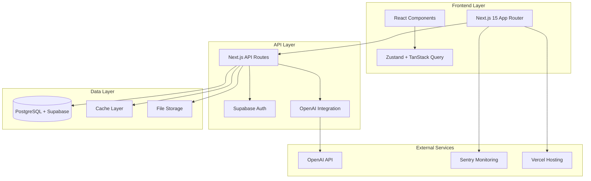
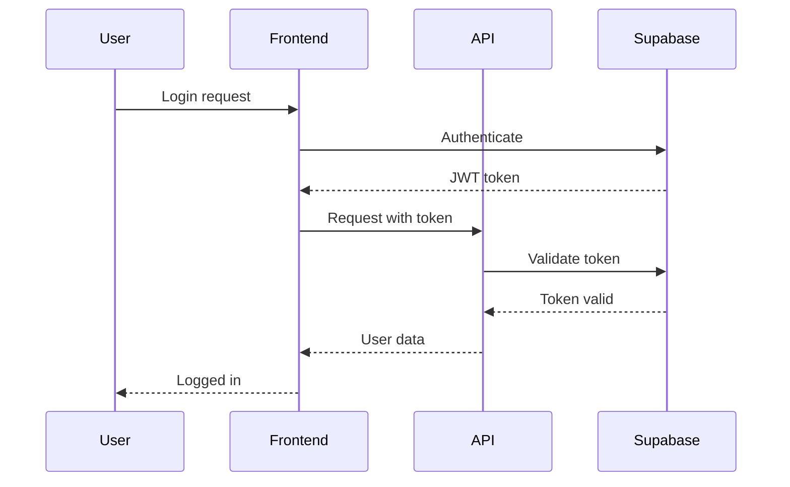
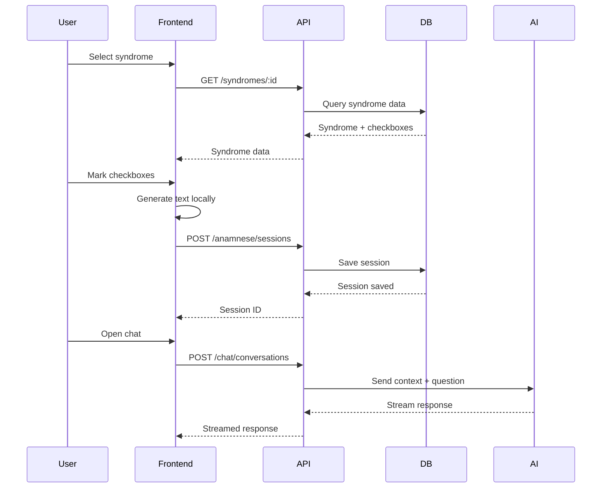
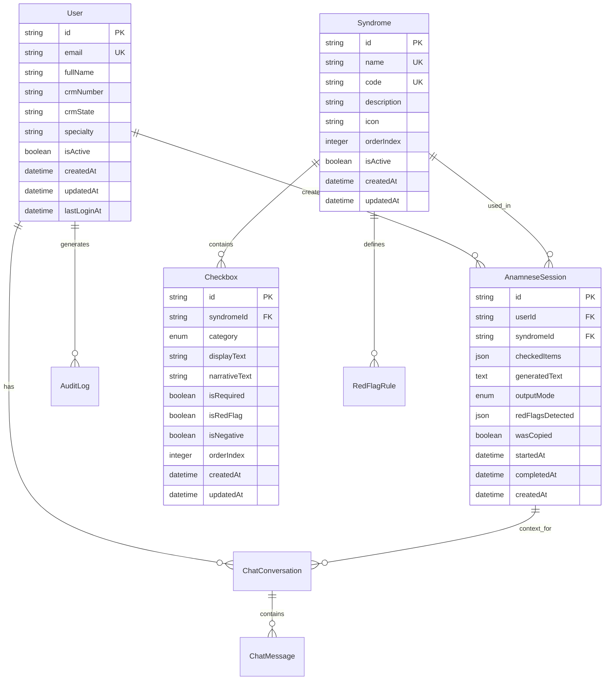

# Visão Geral do Sistema WellWave

## Arquitetura de Alto Nível

## Componentes Principais

### Frontend Layer

**Next.js 15 com App Router**
- Server Components por padrão
- Client Components apenas quando necessário
- Streaming de dados com Suspense

**React 19**
- Concurrent features
- Server Actions para mutações
- Optimistic updates

**State Management**
- Zustand para estado do cliente
- TanStack Query para estado do servidor
- React Context para tema e autenticação

### API Layer

**Next.js API Routes**
- Endpoints RESTful
- Middleware para autenticação
- Rate limiting implementado

**Autenticação**
- Supabase Auth com JWT
- Row Level Security (RLS)
- Session management

**Integração com IA**
- Vercel AI SDK
- OpenAI GPT-4
- Streaming responses

### Data Layer

**PostgreSQL via Supabase**
- Schema com Prisma ORM
- Migrations versionadas
- Índices otimizados

**Cache Strategy**
- Next.js Data Cache
- Client-side caching com TanStack
- Edge caching para dados públicos

**File Storage**
- Supabase Storage
- Uploads de arquivos médicos
- CDN para assets estáticos

## Fluxos de Dados

### Fluxo de Autenticação

### Fluxo de Anamnese

## Modelo de Dados

### Entidades Principais

## Padrões Arquiteturais

### 1. Server-First Architecture
- Server Components como padrão
- Client Components apenas quando necessário
- Redução do bundle size

### 2. API Gateway Pattern
- Next.js API Routes como gateway
- Middleware centralizado
- Rate limiting e autenticação

### 3. Repository Pattern
- Abstração com Prisma
- Facilita testes
- Isola lógica de negócio

### 4. CQRS (Command Query Responsibility Segregation)
- Queries otimizadas para leitura
- Commands para escrita
- Separação clara de responsabilidades

## Considerações de Escalabilidade

### Horizontal Scaling
- Serverless functions no Vercel
- Auto-scaling automático
- Load balancing embutido

### Database Scaling
- Connection pooling com PgBouncer
- Read replicas quando necessário
- Índices otimizados

### Caching Strategy
- Múltiplos níveis de cache
- Cache invalidação inteligente
- Edge caching para conteúdo estático

## Segurança

### Autenticação e Autorização
- JWT tokens com expiração
- Row Level Security (RLS)
- Rate limiting por usuário

### Proteção de Dados
- Criptografia AES-256 em repouso
- TLS 1.3 em trânsito
- Sensitive data nunca em logs

### Auditoria
- Audit logs para todas as ações
- Rastreamento completo
- Conformidade LGPD

## Performance

### Frontend Optimization
- Code splitting automático
- Lazy loading de componentes
- Bundle optimization

### Backend Optimization
- Queries otimizadas com Prisma
- Connection pooling
- Response caching

### Monitoring
- Sentry para errors
- Performance monitoring
- Custom metrics

## Deploy e Infraestrutura

### Ambientes
- **Development:** Local + Vercel Preview
- **Staging:** Vercel com dados de teste
- **Production:** Vercel + Supabase Pro

### CI/CD
- GitHub Actions para automação
- Deploy automático em merge
- Rollback automático

### Backup e Recovery
- Backups diários automáticos
- Point-in-time recovery
- Testes de restore regulares

## Tecnologias e Ferramentas

### Frontend Stack
- **Framework:** Next.js 15 (App Router)
- **UI Library:** React 19 + Tailwind CSS
- **Components:** shadcn/ui + Radix UI
- **State:** Zustand + TanStack Query
- **Animations:** Framer Motion

### Backend Stack
- **Runtime:** Node.js 18+
- **Framework:** Next.js API Routes
- **Database:** PostgreSQL via Supabase
- **ORM:** Prisma
- **Auth:** Supabase Auth

### DevOps Stack
- **Hosting:** Vercel
- **Database:** Supabase
- **Monitoring:** Sentry
- **CI/CD:** GitHub Actions
- **Package Manager:** pnpm

## Próximos Passos

### Melhorias de Arquitetura
1. Implementar Redis para caching distribuído
2. Adotar microservices para escalabilidade
3. Implementar GraphQL para otimização de queries
4. Adicionar message queue para processamento assíncrono

### Otimizações de Performance
1. Implementar edge functions para globalização
2. Otimizar bundle size
3. Adicionar service workers para offline
4. Implementar database sharding se necessário

### Melhorias de Segurança
1. Implementar 2FA para autenticação
2. Adicionar WAF para proteção
3. Implementar rate limiting avançado
4. Adicionar security scanning automatizado

## Referencias

- [Data flow](data-flow.md)
- [Security](security.md)
- [Performance](performance.md)
- [Scalability](scalability.md)
