# Apple Liquid Glass 2026 - Análise e Plano de Implementação

## 📋 Resumo Executivo

Este documento detalha as alterações necessárias para replicar com precisão o estilo **Apple Liquid Glass 2026** no dashboard atual do WellWave. O sistema já possui uma base sólida de glassmorphism, mas requer refinamentos para estar totalmente alinhado com as diretrizes do iOS 26.

## 🎯 Objetivos

- Replicar o visual premium e refinado do Apple Liquid Glass 2026
- Melhorar transparência, efeitos de profundidade e reflexos
- Implementar animações sutis e micro-interações
- Ajustar tipografia, espaçamento e gradientes
- Garantir acessibilidade e performance otimizada

---

## 📊 Análise do Estado Atual

### ✅ Pontos Fortes

1. **Sistema de Glass Morphism Completo**
   - Componente `GlassCard` com múltiplas variantes
   - Backdrop-blur e saturate implementados
   - Sombras multi-camadas já presentes

2. **Efeitos de Profundidade**
   - Sombras com múltiplas camadas
   - Sistema de elevação com níveis definidos
   - Specular highlights e rim lights

3. **Animações com Framer Motion**
   - Spring animations implementadas
   - Transições suaves entre estados
   - Efeitos de hover e tap

4. **Tipografia Apple**
   - SF Pro Display configurado
   - Pesos e tracking apropriados
   - Sistema de cores consistente

5. **Scroll-Responsive Glass**
   - Hook `useScrollGlass` implementado
   - Header com blur dinâmico
   - Transparência adaptativa

### ⚠️ Gaps Identificados

1. **Transparência**
   - Opacidade pode ser ajustada para melhor legibilidade
   - Falta variante mais transparente para backgrounds ricos

2. **Efeitos de Profundidade**
   - Sombras podem ser mais sutis e realistas
   - Falta efeito de "inner glow" para cards
   - Specular highlight pode ser mais intenso

3. **Reflexos**
   - Rim light pode ser mais dinâmico
   - Falta efeito de "caustics" (refração de luz através do vidro)
   - Specular highlight pode ter animação sutil

4. **Animações**
   - Falta micro-interações (haptic feedback visual)
   - Animações de entrada podem ser mais refinadas
   - Falta efeito de "shimmer" em hover

5. **Tipografia**
   - Tracking pode ser ajustado para títulos
   - Falta sistema de "display numbers" ultra-thin
   - Weights podem seguir mais estritamente o iOS 26

6. **Espaçamento**
   - Sistema de espaçamento não está totalmente padronizado
   - Grid pode usar espaçamento de 8px base
   - Padding pode ser mais consistente

7. **Gradients**
   - Gradientes podem ser mais sutis
   - Falta gradientes de background mais sofisticados
   - Cores podem ser mais alinhadas com Apple 2026

8. **Elementos de Interface**
   - Inputs podem ter efeitos de glass mais refinados
   - Botões podem ter estados mais definidos
   - Badges e pills podem ser mais sofisticados

---

## 🎨 Especificação Detalhada das Alterações

### 1. Transparência Aprimorada

#### Estado Atual
```css
/* Variante regular */
backdrop-filter: blur(40px) saturate(180%);
background: rgba(255, 255, 255, 0.25);
border: 1px solid rgba(255, 255, 255, 0.30);
```

#### Alterações Necessárias
```css
/* Apple Liquid Glass 2026 - Variante Regular */
backdrop-filter: blur(40px) saturate(200%);
-webkit-backdrop-filter: blur(40px) saturate(200%);
background: linear-gradient(
  135deg,
  rgba(255, 255, 255, 0.28) 0%,
  rgba(255, 255, 255, 0.18) 50%,
  rgba(255, 255, 255, 0.22) 100%
);
border: 1px solid rgba(255, 255, 255, 0.35);
box-shadow:
  0 8px 32px rgba(0, 0, 0, 0.1),
  0 2px 8px rgba(0, 0, 0, 0.04),
  inset 0 1px 1px rgba(255, 255, 255, 0.6);

/* Variante Clear - para backgrounds ricos */
backdrop-filter: blur(40px) saturate(200%);
background: rgba(255, 255, 255, 0.15);
border: 1px solid rgba(255, 255, 255, 0.25);
```

#### Propriedades CSS
- `backdrop-filter`: blur(40px) → blur(50px) para mais profundidade
- `saturate`: 180% → 200% para cores mais vibrantes
- `background`: Gradiente linear em vez de cor sólida
- `border`: 0.30 → 0.35 para mais definição

---

### 2. Efeitos de Profundidade Aprimorados

#### Sombras Multi-Camadas
```css
/* Apple Liquid Glass 2026 - Sombras Premium */
.glass-card-2026 {
  /* Camada 1 - Sombra externa principal */
  box-shadow:
    0 20px 60px -15px rgba(0, 0, 0, 0.15),
    0 8px 24px -8px rgba(0, 0, 0, 0.08),
    0 0 0 1px rgba(255, 255, 255, 0.6) inset,
    0 2px 0 rgba(255, 255, 255, 0.8) inset;
}

/* Dark mode */
.dark .glass-card-2026 {
  box-shadow:
    0 20px 60px -15px rgba(0, 0, 0, 0.4),
    0 8px 24px -8px rgba(0, 0, 0, 0.25),
    0 0 0 1px rgba(255, 255, 255, 0.12) inset,
    0 2px 0 rgba(255, 255, 255, 0.15) inset;
}
```

#### Inner Glow
```css
/* Novo efeito de brilho interno */
.glass-card-2026::before {
  content: '';
  position: absolute;
  inset: 0;
  border-radius: inherit;
  background: radial-gradient(
    ellipse 100% 50% at 50% 0%,
    rgba(255, 255, 255, 0.15) 0%,
    transparent 70%
  );
  pointer-events: none;
  z-index: 5;
  opacity: 0.6;
}
```

---

### 3. Reflexos Aprimorados

#### Specular Highlight Dinâmico
```css
/* Apple Liquid Glass 2026 - Specular Highlight */
.specular-2026 {
  position: relative;
}

.specular-2026::after {
  content: '';
  position: absolute;
  top: 0;
  left: 5%;
  right: 5%;
  height: 55%;
  background: radial-gradient(
    ellipse 100% 60% at 50% 0%,
    rgba(255, 255, 255, 0.8) 0%,
    rgba(255, 255, 255, 0.4) 30%,
    rgba(255, 255, 255, 0.15) 50%,
    transparent 75%
  );
  pointer-events: none;
  z-index: 30;
  border-radius: inherit;
  opacity: 0.85;
  transition: opacity 0.5s cubic-bezier(0.25, 1, 0.5, 1);
  animation: specular-shimmer 8s ease-in-out infinite;
}

@keyframes specular-shimmer {
  0%, 100% {
    opacity: 0.85;
  }
  50% {
    opacity: 1;
  }
}
```

#### Rim Light Aprimorado
```css
/* Apple Liquid Glass 2026 - Rim Light */
.rim-light-2026::before {
  content: '';
  position: absolute;
  inset: 0;
  border-radius: inherit;
  padding: 1.5px;
  background: conic-gradient(
    from 45deg at 50% 50%,
    rgba(255, 255, 255, 1) 0deg,
    rgba(255, 255, 255, 0.7) 45deg,
    rgba(255, 255, 255, 0.4) 90deg,
    rgba(255, 255, 255, 0.15) 135deg,
    rgba(255, 255, 255, 0.25) 180deg,
    rgba(255, 255, 255, 0.5) 225deg,
    rgba(255, 255, 255, 0.8) 270deg,
    rgba(255, 255, 255, 0.95) 315deg,
    rgba(255, 255, 255, 1) 360deg
  );
  -webkit-mask:
    linear-gradient(#fff 0 0) content-box,
    linear-gradient(#fff 0 0);
  -webkit-mask-composite: xor;
  mask-composite: exclude;
  pointer-events: none;
  z-index: 50;
  opacity: 0.9;
  filter: blur(0.5px);
}
```

#### Caustics Effect (Novo)
```css
/* Apple Liquid Glass 2026 - Caustics Effect */
.caustics-2026::before {
  content: '';
  position: absolute;
  inset: 0;
  background:
    radial-gradient(ellipse 35% 25% at 15% 85%, rgba(255, 255, 255, 0.12) 0%, transparent 50%),
    radial-gradient(ellipse 30% 20% at 75% 75%, rgba(255, 255, 255, 0.1) 0%, transparent 50%),
    radial-gradient(ellipse 25% 30% at 90% 25%, rgba(255, 255, 255, 0.08) 0%, transparent 50%),
    radial-gradient(ellipse 20% 15% at 30% 20%, rgba(255, 255, 255, 0.06) 0%, transparent 50%);
  pointer-events: none;
  z-index: 5;
  border-radius: inherit;
  animation: caustics-shimmer 10s ease-in-out infinite;
}

@keyframes caustics-shimmer {
  0%, 100% {
    opacity: 0.5;
    transform: scale(1) translate(0, 0);
  }
  25% {
    opacity: 0.8;
    transform: scale(1.02) translate(2px, -2px);
  }
  50% {
    opacity: 0.6;
    transform: scale(0.98) translate(-1px, 1px);
  }
  75% {
    opacity: 0.9;
    transform: scale(1.01) translate(1px, 2px);
  }
}
```

---

### 4. Animações Sutis

#### Micro-Interações
```css
/* Haptic Feedback Visual */
@keyframes haptic-light {
  0% { transform: scale(1); }
  30% { transform: scale(0.97); }
  70% { transform: scale(1.02); }
  100% { transform: scale(1); }
}

@keyframes haptic-medium {
  0% { transform: scale(1); }
  25% { transform: scale(0.95); }
  65% { transform: scale(1.03); }
  100% { transform: scale(1); }
}

@keyframes haptic-heavy {
  0% { transform: scale(1); }
  20% { transform: scale(0.92); }
  50% { transform: scale(1.05); }
  80% { transform: scale(0.98); }
  100% { transform: scale(1); }
}

.animate-haptic-light {
  animation: haptic-light 0.2s cubic-bezier(0.25, 1, 0.5, 1);
}

.animate-haptic-medium {
  animation: haptic-medium 0.25s cubic-bezier(0.25, 1, 0.5, 1);
}

.animate-haptic-heavy {
  animation: haptic-heavy 0.35s cubic-bezier(0.25, 1, 0.5, 1);
}
```

#### Shimmer Effect
```css
/* Shimmer em hover */
.shimmer-effect::after {
  content: '';
  position: absolute;
  inset: 0;
  background: linear-gradient(
    90deg,
    transparent 0%,
    rgba(255, 255, 255, 0) 20%,
    rgba(255, 255, 255, 0.3) 50%,
    rgba(255, 255, 255, 0) 80%,
    transparent 100%
  );
  background-size: 200% 100%;
  background-position: 200% 0;
  transition: background-position 1s cubic-bezier(0.16, 1, 0.3, 1);
  pointer-events: none;
  z-index: 10;
}

.shimmer-effect:hover::after {
  background-position: -100% 0;
}
```

#### Animações de Entrada Refinadas
```css
/* Stagger Fade In */
@keyframes stagger-fade-in {
  from {
    opacity: 0;
    transform: translateY(20px) scale(0.95);
  }
  to {
    opacity: 1;
    transform: translateY(0) scale(1);
  }
}

.stagger-child {
  animation: stagger-fade-in 0.6s cubic-bezier(0.34, 1.56, 0.64, 1) backwards;
}

.stagger-child:nth-child(1) { animation-delay: 0.1s; }
.stagger-child:nth-child(2) { animation-delay: 0.2s; }
.stagger-child:nth-child(3) { animation-delay: 0.3s; }
.stagger-child:nth-child(4) { animation-delay: 0.4s; }
```

---

### 5. Tipografia iOS 26

#### Sistema de Fontes
```css
/* Apple Liquid Glass 2026 - Tipografia */
:root {
  /* Fontes Apple */
  --font-display: 'SF Pro Display', -apple-system, BlinkMacSystemFont, sans-serif;
  --font-text: 'SF Pro Text', -apple-system, BlinkMacSystemFont, sans-serif;
  --font-mono: 'SF Mono', 'Fira Code', Monaco, Consolas, monospace;
  
  /* Pesos iOS 26 */
  --font-weight-ultralight: 100;
  --font-weight-light: 200;
  --font-weight-regular: 400;
  --font-weight-medium: 500;
  --font-weight-semibold: 600;
  --font-weight-bold: 700;
  --font-weight-heavy: 800;
  
  /* Tracking iOS 26 */
  --tracking-tight: -0.04em;
  --tracking-normal: 0;
  --tracking-wide: 0.1em;
  
  /* Line Heights */
  --line-height-tight: 1.1;
  --line-height-normal: 1.4;
  --line-height-relaxed: 1.6;
}

/* Aplicação */
.display-large {
  font-family: var(--font-display);
  font-weight: var(--font-weight-ultralight);
  font-size: 48px;
  letter-spacing: var(--tracking-tight);
  line-height: var(--line-height-tight);
}

.display-medium {
  font-family: var(--font-display);
  font-weight: var(--font-weight-ultralight);
  font-size: 36px;
  letter-spacing: var(--tracking-tight);
  line-height: var(--line-height-tight);
}

.display-small {
  font-family: var(--font-display);
  font-weight: var(--font-weight-regular);
  font-size: 28px;
  letter-spacing: var(--tracking-tight);
  line-height: var(--line-height-tight);
}

.headline-large {
  font-family: var(--font-display);
  font-weight: var(--font-weight-semibold);
  font-size: 24px;
  letter-spacing: -0.02em;
  line-height: var(--line-height-tight);
}

.title-large {
  font-family: var(--font-text);
  font-weight: var(--font-weight-semibold);
  font-size: 20px;
  letter-spacing: -0.01em;
  line-height: var(--line-height-normal);
}

.body-large {
  font-family: var(--font-text);
  font-weight: var(--font-weight-regular);
  font-size: 17px;
  letter-spacing: 0;
  line-height: var(--line-height-normal);
}

.body {
  font-family: var(--font-text);
  font-weight: var(--font-weight-regular);
  font-size: 15px;
  letter-spacing: 0;
  line-height: var(--line-height-normal);
}

.body-small {
  font-family: var(--font-text);
  font-weight: var(--font-weight-regular);
  font-size: 13px;
  letter-spacing: 0;
  line-height: var(--line-height-normal);
}

.caption-large {
  font-family: var(--font-text);
  font-weight: var(--font-weight-medium);
  font-size: 12px;
  letter-spacing: 0.02em;
  line-height: var(--line-height-tight);
  text-transform: uppercase;
}

.caption {
  font-family: var(--font-text);
  font-weight: var(--font-weight-medium);
  font-size: 11px;
  letter-spacing: 0.02em;
  line-height: var(--line-height-tight);
  text-transform: uppercase;
}

.label-large {
  font-family: var(--font-text);
  font-weight: var(--font-weight-medium);
  font-size: 15px;
  letter-spacing: 0.01em;
  line-height: var(--line-height-normal);
}

.label {
  font-family: var(--font-text);
  font-weight: var(--font-weight-medium);
  font-size: 13px;
  letter-spacing: 0.01em;
  line-height: var(--line-height-normal);
}
```

---

### 6. Espaçamento e Grid

#### Sistema de Espaçamento 8px Base
```css
/* Apple Liquid Glass 2026 - Espaçamento */
:root {
  /* Espaçamento base de 8px */
  --space-1: 8px;
  --space-2: 16px;
  --space-3: 24px;
  --space-4: 32px;
  --space-5: 40px;
  --space-6: 48px;
  --space-8: 64px;
  --space-10: 80px;
  --space-12: 96px;
  
  /* Padding */
  --padding-xs: 8px;
  --padding-sm: 12px;
  --padding-md: 16px;
  --padding-lg: 24px;
  --padding-xl: 32px;
  --padding-2xl: 40px;
  
  /* Border Radius iOS 26 */
  --radius-xs: 8px;
  --radius-sm: 12px;
  --radius-md: 16px;
  --radius-lg: 24px;
  --radius-xl: 32px;
  --radius-2xl: 40px;
}

/* Aplicação */
.glass-card-2026 {
  padding: var(--padding-lg);
  border-radius: var(--radius-lg);
}

.glass-pill-2026 {
  padding: var(--padding-xs) var(--padding-md);
  border-radius: var(--radius-xl);
}

.glass-button-2026 {
  padding: var(--padding-sm) var(--padding-lg);
  border-radius: var(--radius-md);
}
```

#### Grid System
```css
/* Apple Liquid Glass 2026 - Grid */
.grid-2026 {
  display: grid;
  gap: var(--space-3);
  grid-template-columns: repeat(auto-fit, minmax(280px, 1fr));
}

.grid-2026-sm {
  display: grid;
  gap: var(--space-2);
  grid-template-columns: repeat(auto-fit, minmax(240px, 1fr));
}

.grid-2026-lg {
  display: grid;
  gap: var(--space-4);
  grid-template-columns: repeat(auto-fit, minmax(320px, 1fr));
}

/* Responsive */
@media (max-width: 768px) {
  .grid-2026 {
    grid-template-columns: 1fr;
    gap: var(--space-2);
  }
}

@media (max-width: 640px) {
  .grid-2026 {
    gap: var(--space-2);
  }
  
  .grid-2026-sm {
    grid-template-columns: 1fr;
  }
}
```

---

### 7. Cores e Gradientes

#### Paleta Apple 2026
```css
/* Apple Liquid Glass 2026 - Cores */
:root {
  /* Blue System */
  --color-blue-50: #F0F7FF;
  --color-blue-100: #E0EFFF;
  --color-blue-200: #BADAFF;
  --color-blue-300: #7CB9FF;
  --color-blue-400: #3E98FF;
  --color-blue-500: #007AFF;
  --color-blue-600: #0062CC;
  --color-blue-700: #004A99;
  --color-blue-800: #003266;
  --color-blue-900: #001933;
  
  /* Green System */
  --color-green-50: #F2FFF9;
  --color-green-100: #E6FFF3;
  --color-green-200: #C2FFE6;
  --color-green-300: #7AFFC7;
  --color-green-400: #33FFA8;
  --color-green-500: #34C759;
  --color-green-600: #2AAD4F;
  --color-green-700: #21873D;
  --color-green-800: #17612C;
  --color-green-900: #0D3B1A;
  
  /* Purple System */
  --color-purple-50: #F5E1FF;
  --color-purple-100: #ECD4FF;
  --color-purple-200: #D4A8FF;
  --color-purple-300: #BD7AFF;
  --color-purple-400: #AF52DE;
  --color-purple-500: #BF5AF2;
  --color-purple-600: #A855F7;
  --color-purple-700: #8B3CE0;
  --color-purple-800: #6E2AC9;
  --color-purple-900: #4F1AA8;
  
  /* Orange System */
  --color-orange-50: #FFF7ED;
  --color-orange-100: #FFEDD5;
  --color-orange-200: #FED7AA;
  --color-orange-300: #FDBA74;
  --color-orange-400: #FB923C;
  --color-orange-500: #FF9500;
  --color-orange-600: #EA580C;
  --color-orange-700: #C2410C;
  --color-orange-800: #9A3412;
  --color-orange-900: #7C2D12;
  
  /* Red System */
  --color-red-50: #FEF2F2;
  --color-red-100: #FEE2E2;
  --color-red-200: #FECACA;
  --color-red-300: #FCA5A5;
  --color-red-400: #F87171;
  --color-red-500: #FF3B30;
  --color-red-600: #DC2626;
  --color-red-700: #B91C1C;
  --color-red-800: #991B1B;
  --color-red-900: #7F1D1D;
  
  /* Gray System */
  --color-gray-50: #F9FAFB;
  --color-gray-100: #F3F4F6;
  --color-gray-200: #E5E7EB;
  --color-gray-300: #D1D5DB;
  --color-gray-400: #9CA3AF;
  --color-gray-500: #6B7280;
  --color-gray-600: #4B5563;
  --color-gray-700: #374151;
  --color-gray-800: #1F2937;
  --color-gray-900: #111827;
}
```

#### Gradientes de Background
```css
/* Apple Liquid Glass 2026 - Background Gradientes */
.bg-gradient-2026 {
  background: linear-gradient(
    180deg,
    #F5F9FF 0%,
    #E8F4FF 30%,
    #D9E8FE 60%,
    #C8DDFD 100%
  );
}

.bg-gradient-2026-dark {
  background: linear-gradient(
    180deg,
    #0F172A 0%,
    #1E293B 30%,
    #1E3A5F 60%,
    #1E4976 100%
  );
}

/* Animated Background Blobs */
.animated-blob-1 {
  background: radial-gradient(
    circle at 50% 50%,
    rgba(59, 130, 246, 0.4) 0%,
    rgba(59, 130, 246, 0) 70%
  );
}

.animated-blob-2 {
  background: radial-gradient(
    circle at 50% 50%,
    rgba(20, 184, 166, 0.4) 0%,
    rgba(20, 184, 166, 0) 70%
  );
}

.animated-blob-3 {
  background: radial-gradient(
    circle at 50% 50%,
    rgba(139, 92, 246, 0.35) 0%,
    rgba(139, 92, 246, 0) 70%
  );
}
```

---

### 8. Elementos de Interface

#### Inputs Glass Aprimorados
```css
/* Apple Liquid Glass 2026 - Inputs */
.input-glass-2026 {
  backdrop-filter: blur(40px) saturate(200%);
  -webkit-backdrop-filter: blur(40px) saturate(200%);
  background: rgba(255, 255, 255, 0.55);
  border: 1.5px solid rgba(255, 255, 255, 0.5);
  border-radius: var(--radius-md);
  padding: var(--padding-sm) var(--padding-md);
  box-shadow:
    0 25px 50px -12px rgba(0, 0, 0, 0.1),
    inset 0 1px 0 rgba(255, 255, 255, 0.9);
  transition: all 0.3s cubic-bezier(0.25, 1, 0.5, 1);
}

.input-glass-2026:hover {
  background: rgba(255, 255, 255, 0.65);
  transform: scale(1.005);
  box-shadow:
    0 25px 50px -12px rgba(0, 0, 0, 0.15),
    inset 0 1px 0 rgba(255, 255, 255, 0.95);
}

.input-glass-2026:focus {
  outline: none;
  box-shadow:
    0 25px 50px -12px rgba(0, 0, 0, 0.15),
    inset 0 1px 0 rgba(255, 255, 255, 0.95),
    0 0 0 3px rgba(0, 122, 255, 0.2),
    0 0 20px rgba(0, 122, 255, 0.15);
}

/* Dark mode */
.dark .input-glass-2026 {
  background: rgba(30, 41, 59, 0.65);
  border-color: rgba(255, 255, 255, 0.12);
  box-shadow:
    0 25px 50px -12px rgba(0, 0, 0, 0.3),
    inset 0 1px 0 rgba(255, 255, 255, 0.1);
}

.dark .input-glass-2026:focus {
  box-shadow:
    0 25px 50px -12px rgba(0, 0, 0, 0.35),
    inset 0 1px 0 rgba(255, 255, 255, 0.15),
    0 0 0 3px rgba(0, 122, 255, 0.3),
    0 0 25px rgba(0, 122, 255, 0.25);
}
```

#### Botões Glass Aprimorados
```css
/* Apple Liquid Glass 2026 - Botões */
.button-glass-2026 {
  backdrop-filter: blur(40px) saturate(200%);
  -webkit-backdrop-filter: blur(40px) saturate(200%);
  background: rgba(255, 255, 255, 0.45);
  border: 1px solid rgba(255, 255, 255, 0.4);
  border-radius: var(--radius-lg);
  padding: var(--padding-sm) var(--padding-lg);
  box-shadow:
    0 4px 16px rgba(0, 0, 0, 0.06),
    inset 0 1px 0 rgba(255, 255, 255, 0.5);
  transition: all 0.3s cubic-bezier(0.25, 1, 0.5, 1);
}

.button-glass-2026:hover {
  background: rgba(255, 255, 255, 0.6);
  transform: translateY(-2px);
  box-shadow:
    0 12px 32px rgba(0, 0, 0, 0.12),
    inset 0 1px 0 rgba(255, 255, 255, 0.6);
}

.button-glass-2026:active {
  transform: translateY(0) scale(0.98);
  box-shadow:
    0 2px 8px rgba(0, 0, 0, 0.04),
    inset 0 1px 0 rgba(255, 255, 255, 0.4);
}

/* Primary Button */
.button-glass-2026-primary {
  background: linear-gradient(
    135deg,
    rgba(0, 122, 255, 0.8) 0%,
    rgba(0, 122, 255, 0.6) 100%
  );
  border-color: rgba(0, 122, 255, 0.3);
  color: white;
}

.button-glass-2026-primary:hover {
  background: linear-gradient(
    135deg,
    rgba(0, 122, 255, 0.9) 0%,
    rgba(0, 122, 255, 0.7) 100%
  );
  box-shadow:
    0 12px 32px rgba(0, 122, 255, 0.3),
    0 4px 16px rgba(0, 122, 255, 0.15),
    inset 0 1px 0 rgba(255, 255, 255, 0.3);
}
```

#### Badges e Pills Aprimorados
```css
/* Apple Liquid Glass 2026 - Badges */
.badge-glass-2026 {
  backdrop-filter: blur(40px) saturate(200%);
  -webkit-backdrop-filter: blur(40px) saturate(200%);
  background: rgba(255, 255, 255, 0.7);
  border: 1px solid rgba(255, 255, 255, 0.5);
  border-radius: var(--radius-xl);
  padding: var(--padding-xs) var(--padding-md);
  box-shadow:
    0 4px 12px rgba(0, 0, 0, 0.05),
    inset 0 1px 0 rgba(255, 255, 255, 0.7);
}

/* Variantes de cor */
.badge-glass-2026-blue {
  background: rgba(0, 122, 255, 0.15);
  border-color: rgba(0, 122, 255, 0.3);
  color: var(--color-blue-600);
}

.badge-glass-2026-green {
  background: rgba(52, 199, 89, 0.15);
  border-color: rgba(52, 199, 89, 0.3);
  color: var(--color-green-600);
}

.badge-glass-2026-purple {
  background: rgba(175, 82, 222, 0.15);
  border-color: rgba(175, 82, 222, 0.3);
  color: var(--color-purple-600);
}

.badge-glass-2026-orange {
  background: rgba(255, 149, 0, 0.15);
  border-color: rgba(255, 149, 0, 0.3);
  color: var(--color-orange-600);
}

.badge-glass-2026-red {
  background: rgba(255, 59, 48, 0.15);
  border-color: rgba(255, 59, 48, 0.3);
  color: var(--color-red-600);
}
```

---

## 🏗️ Diagrama de Arquitetura

```mermaid
graph TB
    A[Apple Liquid Glass 2026 Design System] --> B[Transparency Layer]
    A --> C[Depth Effects Layer]
    A --> D[Reflections Layer]
    A --> E[Animations Layer]
    A --> F[Typography Layer]
    A --> G[Spacing & Grid Layer]
    A --> H[Colors & Gradients Layer]
    A --> I[Interface Elements Layer]
    
    B --> B1[Backdrop Blur 50px]
    B --> B2[Saturate 200%]
    B --> B3[Linear Gradient Background]
    B --> B4[Opacity 0.15-0.35]
    
    C --> C1[Multi-layer Shadows]
    C --> C2[Inner Glow Effect]
    C --> C3[Elevation Levels]
    C --> C4[Inset Highlights]
    
    D --> D1[Specular Highlight]
    D --> D2[Rim Light]
    D --> D3[Caustics Effect]
    D --> D4[Shimmer Animation]
    
    E --> E1[Haptic Feedback]
    E --> E2[Stagger Fade In]
    E --> E3[Spring Animations]
    E --> E4[Micro-interactions]
    
    F --> F1[SF Pro Display]
    F --> F2[Ultra-light Weight]
    F --> F3[Tight Tracking]
    F --> F4[Display Numbers]
    
    G --> G1[8px Base Spacing]
    G --> G2[Responsive Grid]
    G --> G3[Consistent Padding]
    G --> G4[iOS 26 Radius]
    
    H --> H1[Apple 2026 Palette]
    H --> H2[Background Gradients]
    H --> H3[Animated Blobs]
    H --> H4[Semantic Colors]
    
    I --> I1[Glass Inputs]
    I --> I2[Glass Buttons]
    I --> I3[Glass Badges]
    I --> I4[Glass Pills]
```



---

## 🛠️ Recomendações Técnicas

### Frameworks e Bibliotecas

#### CSS
- **Tailwind CSS 4**: Já em uso, manter e expandir utilitários
- **CSS Custom Properties**: Para valores dinâmicos de blur, opacidade, etc.
- **CSS Modules**: Para componentes isolados (opcional)

#### JavaScript/TypeScript
- **Framer Motion**: Já em uso, expandir para micro-interações
- **React Spring**: Alternativa para animações mais complexas
- **Zustand**: Para estado global do tema

#### Performance
- **CSS Contain & Paint**: Para evitar layout thrashing
- **Will-change**: Para animações otimizadas
- **GPU Acceleration**: Para transformações e opacidade

### Otimizações de Performance

#### CSS
```css
/* Otimização de renderização */
.glass-card-2026 {
  /* GPU acceleration */
  transform: translateZ(0);
  backface-visibility: hidden;
  -webkit-backface-visibility: hidden;
  
  /* Contain layout */
  contain: layout style paint;
  
  /* Will-change para animações */
  will-change: transform, opacity;
}

.glass-card-2026:hover {
  will-change: transform, opacity, box-shadow;
}
```

#### JavaScript
```typescript
// Otimização de animações
import { motion, useReducedMotion } from 'framer-motion';

const GlassCard = ({ children, ...props }) => {
  const prefersReducedMotion = useReducedMotion();
  
  return (
    <motion.div
      initial={prefersReducedMotion ? undefined : { opacity: 0, scale: 0.98, y: 10 }}
      animate={prefersReducedMotion ? undefined : { opacity: 1, scale: 1, y: 0 }}
      transition={{
        duration: prefersReducedMotion ? 0 : 0.6,
        ease: [0.25, 1, 0.5, 1]
      }}
      {...props}
    >
      {children}
    </motion.div>
  );
};
```

### Acessibilidade

#### Preferências do Usuário
```css
/* Reduced Motion */
@media (prefers-reduced-motion: reduce) {
  .glass-card-2026,
  .button-glass-2026,
  .input-glass-2026 {
    transition: none !important;
    animation: none !important;
  }
  
  .animated-blob,
  .shimmer-effect::after {
    animation: none !important;
  }
}

/* Reduced Transparency */
@media (prefers-reduced-transparency: reduce) {
  .glass-card-2026,
  .button-glass-2026,
  .input-glass-2026,
  .badge-glass-2026 {
    backdrop-filter: none !important;
    -webkit-backdrop-filter: none !important;
    background: var(--color-background) !important;
    border: 1px solid var(--color-border) !important;
  }
  
  .specular-2026::after,
  .rim-light-2026::before,
  .caustics-2026::before {
    display: none !important;
  }
}

/* High Contrast */
@media (prefers-contrast: more) {
  .glass-card-2026,
  .button-glass-2026,
  .input-glass-2026 {
    background: var(--color-background) !important;
    border: 2px solid var(--color-foreground) !important;
  }
  
  .text-secondary {
    color: var(--color-foreground) !important;
    opacity: 1 !important;
  }
}
```

#### Fallbacks
```css
/* Fallback para navegadores sem backdrop-filter */
@supports not (backdrop-filter: blur(1px)) {
  .glass-card-2026 {
    background: rgba(255, 255, 255, 0.95);
    border: 1px solid rgba(0, 0, 0, 0.1);
  }
  
  .dark .glass-card-2026 {
    background: rgba(30, 30, 30, 0.95);
    border: 1px solid rgba(255, 255, 255, 0.2);
  }
}
```

---

## 📋 Plano de Implementação

### Fase 1: Fundação CSS
1. Atualizar variáveis CSS globais
2. Criar novas classes utilitárias
3. Implementar sistema de espaçamento 8px
4. Definir paleta de cores Apple 2026

### Fase 2: Componentes Base
1. Atualizar componente `GlassCard`
2. Criar componente `GlassInput`
3. Criar componente `GlassButton`
4. Criar componente `GlassBadge`

### Fase 3: Efeitos Visuais
1. Implementar specular highlight dinâmico
2. Adicionar efeito de caustics
3. Melhorar rim light
4. Adicionar inner glow

### Fase 4: Animações
1. Implementar haptic feedback visual
2. Adicionar shimmer effect
3. Criar stagger fade in
4. Otimizar animações existentes

### Fase 5: Tipografia
1. Implementar sistema de fontes iOS 26
2. Aplicar pesos e tracking corretos
3. Criar classes de display numbers
4. Atualizar textos existentes

### Fase 6: Layout e Grid
1. Implementar sistema de grid responsivo
2. Aplicar espaçamento consistente
3. Atualizar layouts existentes
4. Testar breakpoints

### Fase 7: Acessibilidade
1. Implementar preferências do usuário
2. Adicionar fallbacks para navegadores antigos
3. Testar com leitor de tela
4. Validar contraste WCAG

### Fase 8: Otimização
1. Implementar CSS contain e paint
2. Adicionar will-change onde apropriado
3. Otimizar animações com useReducedMotion
4. Testar performance com Lighthouse

---

## 🔍 Checklist de Validação

### Visual
- [ ] Transparência está alinhada com iOS 26
- [ ] Sombras são sutis e realistas
- [ ] Reflexos são dinâmicos e sutis
- [ ] Animações são suaves e não distraem
- [ ] Tipografia segue HIG do iOS 26
- [ ] Espaçamento é consistente
- [ ] Cores seguem paleta Apple 2026

### Técnico
- [ ] CSS é otimizado (contain, paint)
- [ ] Animações usam will-change
- [ ] GPU acceleration está ativada
- [ ] Fallbacks funcionam corretamente
- [ ] Acessibilidade está implementada
- [ ] Performance é aceitável (Lighthouse > 90)
- [ ] Código é limpo e mantível

### Funcional
- [ ] Todos os componentes funcionam corretamente
- [ ] Estados (hover, active, focus) são claros
- [ ] Feedback visual é imediato
- [ ] Responsividade funciona em todos os breakpoints
- [ ] Dark mode está implementado
- [ ] Reduzed motion respeita preferências

---

## 📚 Referências

### Apple Human Interface Guidelines
- [iOS 26 Design Guidelines](https://developer.apple.com/design/human-interface-guidelines/ios)
- [macOS Sonoma Design Guidelines](https://developer.apple.com/design/human-interface-guidelines/macos)
- [Material Design Guidelines](https://developer.apple.com/design/human-interface-guidelines/material)

### Artigos e Recursos
- [Apple Design Resources](https://developer.apple.com/design/resources/)
- [SF Pro Display](https://developer.apple.com/fonts/)
- [Color System](https://developer.apple.com/design/human-interface-guidelines/color)

### Bibliotecas
- [Framer Motion](https://www.framer.com/motion)
- [Tailwind CSS](https://tailwindcss.com/)
- [Radix UI](https://www.radix-ui.com/)

---

## 🎯 Conclusão

O sistema atual do WellWave já possui uma base sólida de glassmorphism, mas requer refinamentos para estar totalmente alinhado com o estilo Apple Liquid Glass 2026. As alterações propostas focam em:

1. **Transparência mais refinada** com gradientes lineares
2. **Efeitos de profundidade mais realistas** com sombras multi-camadas
3. **Reflexos dinâmicos** com specular highlights e caustics
4. **Animações sutis** com micro-interações e haptic feedback
5. **Tipografia iOS 26** com SF Pro Display e pesos corretos
6. **Espaçamento consistente** com sistema de 8px base
7. **Cores Apple 2026** com paleta completa e gradientes
8. **Elementos de interface refinados** com inputs, botões e badges

Com a implementação dessas alterações, o dashboard terá um visual premium e refinado que replica com precisão o estilo Apple Liquid Glass 2026.
