# Plano de Correção de Discrepâncias Visuais - Apple Liquid Glass 2026

## Problemas Identificados

### 1. Incompatibilidade de Tipos
- **Componente**: [`GlassPanel.tsx`](components/glass/GlassPanel.tsx)
- **Problema**: Usa `GlassMaterialVariant` ('regular', 'clear', 'elevated', 'medical', 'subtle')
- **Esperado**: Hooks esperam `GlassVariant` ('default', 'clear', 'elevated', 'subtle', 'medical')
- **Impacto**: Classes retornadas pelos hooks não correspondem aos valores usados no componente

### 2. Inconsistência de Valores CSS
- **Arquivo tokens.ts**: Define blur como '50px' e saturate como '200%'
- **Arquivo globals.css**: Define blur como 40px e saturate como 180%
- **Impacto**: Efeitos de vidro inconsistentes entre diferentes partes do código

### 3. Classes CSS Dinâmicas Não Funcionam
- **Problema**: Hooks retornam classes como `backdrop-blur-[50px] saturate-[200%]`
- **Causa**: Tailwind CSS 4 não reconhece classes com valores entre colchetes
- **Impacto**: Efeitos de glassmorphism não são aplicados

### 4. Efeitos Visuais Não Aplicados
- **Efeitos ausentes**: Specular highlight, rim light, inner glow, noise texture
- **Causa**: Classes CSS não estão definidas ou não estão sendo aplicadas corretamente
- **Impacto**: Falta de profundidade e realismo nos componentes de vidro

### 5. Tipografia e Espaçamento Incorretos
- **Problema**: Não seguem o padrão Apple iOS 2026
- **Causa**: Fontes incorretas, tamanhos errados, espaçamento não segue escala de 8px
- **Impacto**: Visual não corresponde ao design system Apple

## Plano de Correção

### Fase 1: Corrigir Incompatibilidade de Tipos
- [ ] Atualizar tipo `GlassMaterialVariant` no componente `GlassPanel.tsx` para usar valores compatíveis com `GlassVariant`
- [ ] Mapear 'regular' → 'default', 'clear' → 'clear', 'elevated' → 'elevated', 'medical' → 'medical', 'subtle' → 'subtle'
- [ ] Atualizar todos os componentes que usam `GlassMaterialVariant` para usar `GlassVariant`

### Fase 2: Alinhar Valores CSS
- [ ] Atualizar valores em `globals.css` para usar blur de 50px e saturate de 200%
- [ ] Atualizar variáveis CSS globais para corresponder aos valores definidos em `tokens.ts`
- [ ] Validar que todos os valores estão alinhados entre `tokens.ts` e `globals.css`

### Fase 3: Criar Classes CSS Funcionais
- [ ] Criar classes CSS para backdrop-blur com valores dinâmicos
- [ ] Criar classes CSS para saturate com valores dinâmicos
- [ ] Criar classes CSS para opacidade com valores dinâmicos
- [ ] Atualizar Tailwind CSS 4 para suportar classes com valores entre colchetes

### Fase 4: Implementar Efeitos Visuais
- [ ] Criar classes CSS para specular highlight
- [ ] Criar classes CSS para rim light
- [ ] Criar classes CSS para inner glow
- [ ] Criar classes CSS para noise texture
- [ ] Aplicar efeitos visuais em todos os componentes de vidro

### Fase 5: Corrigir Tipografia
- [ ] Atualizar fontes para usar SF Pro Display
- [ ] Corrigir tamanhos de fonte para seguir escala iOS 2026 (base 8px)
- [ ] Corrigir pesos de fonte para seguir padrão Apple
- [ ] Atualizar line-height para seguir escala de 4px

### Fase 6: Corrigir Espaçamento
- [ ] Atualizar espaçamento para seguir escala de 8px
- [ ] Corrigir padding e margin em todos os componentes
- [ ] Validar que espaçamento está consistente em toda a aplicação

### Fase 7: Implementar Animações
- [ ] Criar animações de hover scale
- [ ] Criar animações de tap scale
- [ ] Criar animações de micro-interações
- [ ] Aplicar animações em todos os componentes interativos

### Fase 8: Testar Correções
- [ ] Testar componentes em light mode
- [ ] Testar componentes em dark mode
- [ ] Validar que efeitos de vidro estão funcionando
- [ ] Validar que animações estão funcionando
- [ ] Validar que tipografia e espaçamento estão corretos

## Especificações Técnicas

### Valores Corretos Apple Liquid Glass 2026

#### Blur e Saturate
```css
/* Valores padrão Apple Liquid Glass 2026 */
--liquid-glass-blur: 50px;
--liquid-glass-saturate: 200%;
```

#### Opacidade
```css
/* Valores de opacidade para diferentes variantes */
--liquid-glass-bg-default: rgba(255, 255, 255, 0.28);
--liquid-glass-bg-subtle: rgba(255, 255, 255, 0.20);
--liquid-glass-bg-clear: rgba(255, 255, 255, 0.12);
--liquid-glass-bg-elevated: rgba(255, 255, 255, 0.40);
--liquid-glass-bg-medical: rgba(255, 255, 255, 0.32);

/* Dark mode */
--liquid-glass-bg-dark-default: rgba(30, 41, 59, 0.72);
--liquid-glass-bg-dark-subtle: rgba(30, 41, 59, 0.60);
--liquid-glass-bg-dark-clear: rgba(30, 41, 59, 0.40);
--liquid-glass-bg-dark-elevated: rgba(30, 41, 59, 0.80);
--liquid-glass-bg-dark-medical: rgba(30, 41, 59, 0.72);
```

#### Tipografia iOS 2026
```css
/* Fontes SF Pro */
--font-sans: 'SF Pro Display', -apple-system, BlinkMacSystemFont, "Segoe UI", sans-serif;
--font-body: 'SF Pro Text', -apple-system, BlinkMacSystemFont, "Segoe UI", sans-serif;

/* Tamanhos de fonte - escala de 8px */
--text-xs: 11px;
--text-sm: 12px;
--text-base: 14px;
--text-md: 16px;
--text-lg: 18px;
--text-xl: 20px;
--text-2xl: 24px;
--text-3xl: 28px;
--text-4xl: 32px;

/* Pesos de fonte */
--font-regular: 400;
--font-medium: 500;
--font-semibold: 600;
--font-bold: 700;

/* Line-height - escala de 4px */
--leading-tight: 1.25;
--leading-normal: 1.5;
--leading-relaxed: 1.75;
--leading-loose: 2;
```

#### Espaçamento iOS 2026
```css
/* Espaçamento - escala de 8px */
--spacing-0: 0;
--spacing-1: 4px;
--spacing-2: 8px;
--spacing-3: 12px;
--spacing-4: 16px;
--spacing-5: 20px;
--spacing-6: 24px;
--spacing-8: 32px;
--spacing-10: 40px;
--spacing-12: 48px;
--spacing-16: 64px;
--spacing-20: 80px;
--spacing-24: 96px;
```

#### Efeitos Visuais
```css
/* Specular highlight */
--specular-default: rgba(255, 255, 255, 0.6);
--specular-subtle: rgba(255, 255, 255, 0.4);
--specular-clear: rgba(255, 255, 255, 0.2);
--specular-elevated: rgba(255, 255, 255, 0.8);

/* Inner glow */
--inner-glow-default: rgba(255, 255, 255, 0.1);
--inner-glow-subtle: rgba(255, 255, 255, 0.05);
--inner-glow-clear: rgba(255, 255, 255, 0.05);
--inner-glow-elevated: rgba(255, 255, 255, 0.15);

/* Rim light */
--rim-light-default: rgba(255, 255, 255, 0.6);
--rim-light-subtle: rgba(255, 255, 255, 0.4);
--rim-light-clear: rgba(255, 255, 255, 0.2);
--rim-light-elevated: rgba(255, 255, 255, 0.8);
```

#### Animações
```css
/* Duração */
--duration-fast: 150ms;
--duration-normal: 200ms;
--duration-slow: 300ms;

/* Easing */
--ease-default: cubic-bezier(0.25, 1, 0.5, 1);
--ease-spring: cubic-bezier(0.34, 1.56, 0.64, 1);

/* Scale */
--scale-hover: 1.02;
--scale-tap: 0.95;
```

### Classes CSS para Tailwind 4

```css
/* Backdrop blur dinâmico */
.backdrop-blur-50px {
  backdrop-filter: blur(50px) saturate(200%);
  -webkit-backdrop-filter: blur(50px) saturate(200%);
}

.backdrop-blur-40px {
  backdrop-filter: blur(40px) saturate(150%);
  -webkit-backdrop-filter: blur(40px) saturate(150%);
}

.backdrop-blur-60px {
  backdrop-filter: blur(60px) saturate(200%);
  -webkit-backdrop-filter: blur(60px) saturate(200%);
}

/* Opacidade dinâmica */
.bg-opacity-0.28 {
  background-color: rgba(255, 255, 255, 0.28);
}

.bg-opacity-0.20 {
  background-color: rgba(255, 255, 255, 0.20);
}

.bg-opacity-0.12 {
  background-color: rgba(255, 255, 255, 0.12);
}

.bg-opacity-0.40 {
  background-color: rgba(255, 255, 255, 0.40);
}

.bg-opacity-0.32 {
  background-color: rgba(255, 255, 255, 0.32);
}

/* Dark mode */
.dark .bg-opacity-0.72 {
  background-color: rgba(30, 41, 59, 0.72);
}

.dark .bg-opacity-0.60 {
  background-color: rgba(30, 41, 59, 0.60);
}

.dark .bg-opacity-0.40 {
  background-color: rgba(30, 41, 59, 0.40);
}

.dark .bg-opacity-0.80 {
  background-color: rgba(30, 41, 59, 0.80);
}

/* Specular highlight */
.specular-highlight {
  position: relative;
}

.specular-highlight::after {
  content: '';
  position: absolute;
  top: 0;
  left: 5%;
  right: 5%;
  height: 45%;
  background: radial-gradient(
    ellipse 100% 60% at 50% 0%,
    var(--specular-default) 0%,
    rgba(255, 255, 255, 0.25) 35%,
    transparent 70%
  );
  pointer-events: none;
  z-index: 20;
  border-radius: inherit;
  opacity: 0.8;
  transition: opacity 0.5s cubic-bezier(0.25, 1, 0.5, 1);
}

.specular-highlight:hover::after {
  opacity: 1;
}

/* Rim light */
.rim-light {
  position: relative;
}

.rim-light::before {
  content: '';
  position: absolute;
  inset: 0;
  border-radius: inherit;
  padding: 1.5px;
  background: conic-gradient(
    from 45deg at 50% 50%,
    var(--rim-light-default) 0deg,
    rgba(255, 255, 255, 0.5) 45deg,
    rgba(255, 255, 255, 0.2) 90deg,
    rgba(255, 255, 255, 0.1) 135deg,
    rgba(255, 255, 255, 0.3) 180deg,
    rgba(255, 255, 255, 0.5) 225deg,
    rgba(255, 255, 255, 0.8) 270deg,
    rgba(255, 255, 255, 0.4) 315deg,
    var(--rim-light-default) 360deg
  );
  -webkit-mask: linear-gradient(#fff 0 0) content-box, linear-gradient(#fff 0 0);
  -webkit-mask-composite: xor;
  mask-composite: exclude;
  pointer-events: none;
  z-index: 30;
}

/* Inner glow */
.inner-glow {
  box-shadow:
    inset 0 1px 1px var(--inner-glow-default),
    inset 0 -1px 1px rgba(0, 0, 0, 0.05),
    inset 1px 0 1px rgba(255, 255, 255, 0.3),
    inset -1px 0 1px rgba(0, 0, 0, 0.03);
}

.dark .inner-glow {
  box-shadow:
    inset 0 1px 1px rgba(255, 255, 255, 0.15),
    inset 0 -1px 1px rgba(0, 0, 0, 0.2),
    inset 1px 0 1px rgba(255, 255, 255, 0.08),
    inset -1px 0 1px rgba(0, 0, 0, 0.1);
}

/* Noise texture */
.noise-texture {
  position: absolute;
  inset: 0;
  z-index: -1;
  opacity: 0.02;
  background-image: url("data:image/svg+xml,%3Csvg viewBox='0 0 200 200' xmlns='http://www.w3.org/2000/svg'%3E%3Cfilter id='noiseFilter'%3E%3CfeTurbulence type='fractalNoise' baseFrequency='0.65' numOctaves='3' stitchTiles='stitch'/%3E%3C/filter%3E%3Crect width='100%25' height='100%25' filter='url(%23noiseFilter)'/%3E%3C/svg%3E");
  pointer-events: none;
  mix-blend-mode: overlay;
}

/* Animações de hover */
.hover-scale {
  transition: transform 0.2s cubic-bezier(0.25, 1, 0.5, 1);
}

.hover-scale:hover {
  transform: scale(var(--scale-hover));
}

/* Animações de tap */
.tap-scale {
  transition: transform 0.1s cubic-bezier(0.25, 1, 0.5, 1);
}

.tap-scale:active {
  transform: scale(var(--scale-tap));
}
```

## Diagrama de Arquitetura

```mermaid
graph TD
    A[Problemas Identificados] --> B[Fase 1: Tipos]
    A --> C[Fase 2: Valores CSS]
    A --> D[Fase 3: Classes CSS]
    A --> E[Fase 4: Efeitos Visuais]
    A --> F[Fase 5: Tipografia]
    A --> G[Fase 6: Espaçamento]
    A --> H[Fase 7: Animações]
    A --> I[Fase 8: Testes]
    
    B --> B1[Atualizar GlassMaterialVariant]
    B --> B2[Mapear valores]
    B --> B3[Atualizar componentes]
    
    C --> C1[Atualizar globals.css]
    C --> C2[Atualizar variáveis CSS]
    C --> C3[Validar alinhamento]
    
    D --> D1[Criar classes blur]
    D --> D2[Criar classes saturate]
    D --> D3[Criar classes opacidade]
    D --> D4[Atualizar Tailwind CSS]
    
    E --> E1[Criar classes specular]
    E --> E2[Criar classes rim light]
    E --> E3[Criar classes inner glow]
    E --> E4[Criar classes noise]
    
    F --> F1[Atualizar fontes SF Pro]
    F --> F2[Corrigir tamanhos]
    F --> F3[Corrigir pesos]
    F --> F4[Atualizar line-height]
    
    G --> G1[Atualizar escala 8px]
    G --> G2[Corrigir padding]
    G --> G3[Corrigir margin]
    G --> G4[Validar consistência]
    
    H --> H1[Criar hover scale]
    H --> H2[Criar tap scale]
    H --> H3[Criar micro-interações]
    H --> H4[Aplicar em componentes]
    
    I --> I1[Testar light mode]
    I --> I2[Testar dark mode]
    I --> I3[Validar efeitos vidro]
    I --> I4[Validar animações]
    I --> I5[Validar tipografia]
```



## Checklist de Validação Final

- [ ] Efeitos de vidro (backdrop-blur, saturate) estão funcionando
- [ ] Transparências e opacidades seguem padrão Apple iOS 2026
- [ ] Animações sutis e micro-interações estão funcionando
- [ ] Tipografia usa SF Pro Display com tamanhos corretos
- [ ] Espaçamento segue escala de 8px do iOS 2026
- [ ] Cores seguem sistema Apple 2026
- [ ] Efeitos visuais (specular, rim light, inner glow) estão aplicados
- [ ] Componentes funcionam corretamente em light mode
- [ ] Componentes funcionam corretamente em dark mode
- [ ] Acessibilidade (WCAG 2.1, reduced motion, reduced transparency) está implementada
- [ ] Performance otimizada (GPU acceleration, CSS containment)
- [ ] Não há regressões visuais
- [ ] Visual corresponde ao design original

## Próximos Passos de Manutenção

1. **Monitorar performance**: Usar Chrome DevTools para identificar gargalos de performance
2. **Testar em diferentes navegadores**: Chrome, Firefox, Safari, Edge
3. **Testar em diferentes dispositivos**: Desktop, tablet, mobile
4. **Coletar feedback dos usuários**: Usar ferramentas de feedback para identificar problemas
5. **Atualizar documentação**: Manter documentação atualizada com as correções aplicadas
6. **Planejar melhorias contínuas**: Identificar áreas para melhorias futuras
