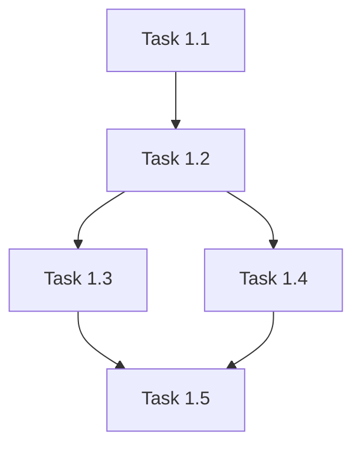

# Implementation Tasks: [Feature Name]

This document contains the detailed task breakdown for implementing [Feature Name].

## Task Organization

Tasks are organized by user story and implementation phase. Tasks marked with `[P]` can be executed in parallel.

## User Story 1: [Story Title]

### Phase: Setup
- [ ] **Task 1.1**: [Task description]
  - File: `path/to/file`
  - Dependencies: None
  - Estimated time: [X hours]

- [ ] **Task 1.2**: [Task description]
  - File: `path/to/file`
  - Dependencies: Task 1.1
  - Estimated time: [X hours]

### Phase: Core Implementation
- [ ] **Task 1.3**: [Task description]
  - File: `path/to/file`
  - Dependencies: Task 1.2
  - Estimated time: [X hours]

- [ ] **Task 1.4** [P]: [Task description]
  - File: `path/to/file`
  - Dependencies: Task 1.2
  - Estimated time: [X hours]

### Phase: Testing
- [ ] **Task 1.5**: Write unit tests
  - File: `path/to/test/file`
  - Dependencies: Task 1.3, Task 1.4
  - Estimated time: [X hours]

### Checkpoint
- [ ] All tests passing
- [ ] Code review completed
- [ ] Documentation updated

## User Story 2: [Story Title]

[Repeat structure above]

## Dependencies Graph

## Notes

- Tasks marked with `[P]` can be executed in parallel
- All tasks should include appropriate tests
- Follow TDD approach where specified

