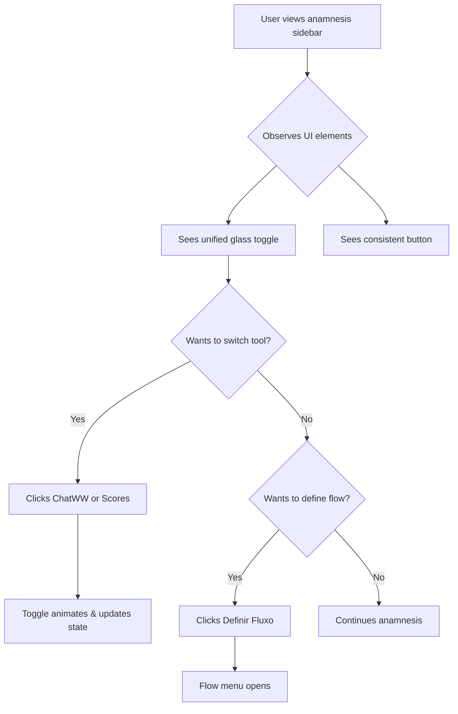

# Specification: Unified Toggle & Button with Liquid Glass Design

**Feature ID:** 004
**Created:** 2026-01-05
**Status:** Draft
**Version:** 1.0.0
**Author:** AI Assistant (Claude)
**Last Updated:** 2026-01-05

> **Spec-Kit Compliance:** This specification follows the [GitHub Spec-Kit](https://github.com/github/spec-kit) standards for Spec-Driven Development.

---

## Overview

This specification defines a UI/UX improvement to unify and enhance two interactive elements in the WellWave anamnesis generation interface: the **Segmented Toggle** (ChatWW | Scores) and the **"Definir Fluxo" Button**. The goal is to apply a cohesive **Liquid Glass** design aesthetic, equalize sizing for visual harmony, and create a professional UI block that follows Apple Design Language 2025 principles.

### Problem Statement

**Current Issues:**
1. **Missing Liquid Glass Effect**: The segmented toggle (ChatWW | Scores) lacks the signature liquid glass container that wraps UI elements throughout the application
2. **Size Inconsistency**: The toggle height (h-12 = 48px) does not match the button height (h-16 = 64px), creating visual imbalance
3. **Border-Radius Mismatch**: Toggle uses `rounded-[20px]` while button uses `rounded-[24px]`, breaking consistency
4. **Visual Hierarchy Unclear**: The two elements don't form a cohesive visual block, appearing disconnected

**Impact:**
- Breaks Apple Design Language 2025 consistency mandated by Constitution v2.0.0
- Reduces perceived quality of the interface
- Creates visual clutter in the anamnesis flow sidebar

### Proposed Solution

Apply a **unified liquid glass design system** to both UI elements:

1. **Wrap the segmented toggle** in a liquid glass container with:
   - Backdrop blur (20px)
   - Semi-transparent background (white/60% light, black/40% dark)
   - Subtle border with transparency
   - Shadow with 8px blur and low opacity

2. **Equalize dimensions** across both elements:
   - Standardize height to 64px (h-16) for both toggle and button
   - Use consistent border-radius (16px / rounded-2xl) throughout
   - Match padding and spacing proportions

3. **Create visual cohesion**:
   - Stack elements vertically with consistent gap
   - Maintain same width (full-width of container)
   - Use shared color palette and opacity values

### Goals

- [x] Apply Liquid Glass effect to segmented toggle
- [x] Equalize heights between toggle (48px→64px) and button (64px)
- [x] Unify border-radius to 16px (rounded-2xl) for both elements
- [x] Create a cohesive visual block that follows Apple Design Language 2025
- [x] Maintain all existing functionality (hover states, active states, transitions)
- [x] Ensure dark mode compatibility

### Non-Goals

- Changing the functionality or behavior of the toggle or button
- Redesigning other UI elements beyond the toggle and button
- Adding new features to the segmented toggle or button
- Modifying the layout structure (vertical stacking remains)
- Changing icon choices or text labels

---

## User Stories

### User Story 1: Visual Consistency

**As a** emergency physician using WellWave,
**I want to** see a cohesive, professional interface design,
**So that** I perceive the application as modern, trustworthy, and high-quality.

**Acceptance Criteria:**
- [ ] Segmented toggle has liquid glass container matching other UI elements
- [ ] Toggle and button have equal heights (64px)
- [ ] Both elements use the same border-radius (16px)
- [ ] Visual hierarchy is clear and balanced
- [ ] Design matches Apple Design Language 2025 principles from Constitution

### User Story 2: Dark Mode Optimization

**As a** emergency physician working night shifts,
**I want to** use the interface in dark mode without visual inconsistencies,
**So that** my eyes are comfortable and the UI remains professional in low-light environments.

**Acceptance Criteria:**
- [ ] Liquid glass effect adapts correctly to dark mode
- [ ] Background opacity values are optimized for dark backgrounds
- [ ] Border colors have appropriate contrast in dark mode
- [ ] All hover/active states work correctly in dark mode
- [ ] No visual artifacts or transparency issues

### User Story 3: Interaction Clarity

**As a** emergency physician navigating the anamnesis flow,
**I want to** clearly see which tools are available and how to define patient flow,
**So that** I can quickly access features without cognitive overhead.

**Acceptance Criteria:**
- [ ] Toggle buttons remain clearly distinguishable in active/inactive states
- [ ] Hover states provide clear visual feedback
- [ ] Transition animations are smooth (500ms, spring physics)
- [ ] Active state indicators (scale, shadow, color) are preserved
- [ ] Button remains visually prominent as the primary action

---

## Requirements

### Functional Requirements

**FR-001:** Liquid Glass Container for Toggle
- Description: Wrap the segmented toggle (ChatWW | Scores) in a liquid glass container
- Input: Existing toggle structure with two button elements
- Output: Toggle wrapped in a glassmorphic container with blur, transparency, and border
- Priority: Must

**FR-002:** Equalized Heights
- Description: Standardize both toggle and button to 64px height
- Input: Current toggle (48px) and button (64px)
- Output: Both elements at 64px height with adjusted padding to maintain icon/text proportions
- Priority: Must

**FR-003:** Unified Border-Radius
- Description: Apply 16px border-radius (rounded-2xl) to both elements
- Input: Toggle (20px) and button (24px) border-radius
- Output: Both elements using rounded-2xl (16px)
- Priority: Must

**FR-004:** Preserved Functionality
- Description: Maintain all existing click handlers, state management, and transitions
- Input: Current onClick, state hooks, and animation classes
- Output: Same functionality with updated styling
- Priority: Must

**FR-005:** Dark Mode Compatibility
- Description: Ensure liquid glass effect and sizing work correctly in dark mode
- Input: Dark mode classes (dark:bg-*, dark:border-*, etc.)
- Output: Proper contrast, opacity, and visual clarity in dark mode
- Priority: Must

### Non-Functional Requirements

**NFR-001:** Performance
- Response time: Hover states must respond within 16ms (1 frame at 60fps)
- Transitions: All animations use GPU-accelerated properties (transform, opacity)
- No layout shifts: Changes must not cause reflow or CLS (Cumulative Layout Shift)

**NFR-002:** Accessibility
- Keyboard navigation: Tab order and focus indicators preserved
- Screen readers: Aria labels and roles remain unchanged
- Color contrast: WCAG AA compliance in both light and dark modes
- Focus indicators: Visible focus rings on keyboard navigation

**NFR-003:** Browser Compatibility
- Safari 16+: Full backdrop-filter support
- Chrome 90+: Full backdrop-filter support
- Firefox 103+: Full backdrop-filter support
- Edge 90+: Full backdrop-filter support

**NFR-004:** Design System Compliance
- Apple Design Language 2025: Full compliance per Constitution section 7
- Glassmorphism: Blur (20px), transparency (30% white), layered surfaces
- Motion: Spring physics (stiffness: 300, damping: 30)
- Colors: Neutral base with Apple accent palette

---

## Constraints & Assumptions

### Technical Constraints

- Must use Tailwind CSS 4 utility classes (no custom CSS unless necessary)
- Must maintain Next.js 16 App Router structure
- Must not break existing component prop interfaces
- Must preserve all TypeScript types and React hooks
- Must work with existing state management (useState)

### Business Constraints

- Timeline: Quick win, implementation should take < 2 hours
- Zero breaking changes to functionality
- No new dependencies or libraries required

### Assumptions

- Tailwind config already includes backdrop-blur and glassmorphism utilities
- Dark mode is implemented using Tailwind's `dark:` variant
- The application uses Inter font (SF Pro equivalent) as specified in Constitution
- Framer Motion is available for spring physics animations (if needed)

---

## Dependencies

### External Dependencies

| Dependency | Purpose | Version | Status |
|------------|---------|---------|---------|
| Tailwind CSS | Styling utilities | 4.x | Required |
| React | Component framework | 19.2 | Required |
| Lucide React | Icons (MessageSquare, Calculator, GitBranch) | Latest | Required |

### Internal Dependencies

| Feature/System | Description | Status |
|---------------|-------------|---------|
| Dark Mode | Requires dark: variant support | Complete |
| Theme System | Uses Tailwind theme configuration | Complete |
| Component Structure | Existing page.tsx and FlashAnamnesisFlow.tsx | Complete |

---

## User Interface Requirements

### Wireframes/Mockups

**Before (Current State):**
```
┌─────────────────────────────────────┐
│ ┌──────────────┬─────────────────┐  │  Toggle: h-12 (48px)
│ │   ChatWW     │     Scores      │  │  Border-radius: 20px
│ └──────────────┴─────────────────┘  │  No glass container
│                                      │
│ ┌──────────────────────────────────┐ │  Button: h-16 (64px)
│ │        Definir Fluxo             │ │  Border-radius: 24px
│ └──────────────────────────────────┘ │
└─────────────────────────────────────┘
```

**After (Proposed State):**
```
┌─────────────────────────────────────┐
│ ╔═══════════════════════════════╗ │  Toggle: h-16 (64px)
│ ║ ┌─────────┬──────────────────┐ ║ │  Border-radius: 16px
│ ║ │ ChatWW  │    Scores        │ ║ │  Liquid glass container
│ ║ └─────────┴──────────────────┘ ║ │  (blur, transparency, border)
│ ╚═══════════════════════════════╝ │
│                                      │
│ ┌──────────────────────────────────┐ │  Button: h-16 (64px)
│ │        Definir Fluxo             │ │  Border-radius: 16px
│ └──────────────────────────────────┘ │
└─────────────────────────────────────┘
```

### User Flow



### Components Required

- [x] Liquid Glass Container Wrapper (new div with glass classes)
- [x] Segmented Toggle Buttons (existing, updated styling)
- [x] Primary Action Button (existing, updated styling)
- [x] Divider between toggle buttons (existing, preserved)

---

## Design Specifications

### Liquid Glass Material Class

Create or use a `.liquid-glass-material` utility class with the following properties:

**Light Mode:**
```css
.liquid-glass-material {
  background: rgba(255, 255, 255, 0.6); /* 60% white */
  backdrop-filter: blur(20px);
  -webkit-backdrop-filter: blur(20px);
  border: 1px solid rgba(255, 255, 255, 0.3);
  box-shadow: 0 8px 32px rgba(0, 0, 0, 0.08);
}
```

**Dark Mode:**
```css
.dark .liquid-glass-material {
  background: rgba(0, 0, 0, 0.4); /* 40% black */
  border: 1px solid rgba(255, 255, 255, 0.1);
  box-shadow: 0 8px 32px rgba(0, 0, 0, 0.3);
}
```

### Sizing Standards

| Element | Current | Target | Tailwind Class |
|---------|---------|--------|----------------|
| Toggle Height | 48px (h-12) | 64px (h-16) | `h-16` |
| Button Height | 64px (h-16) | 64px (h-16) | `h-16` |
| Toggle Border-Radius | 20px | 16px | `rounded-2xl` |
| Button Border-Radius | 24px | 16px | `rounded-2xl` |
| Glass Container Padding | N/A | 4px | `p-1` |

### Color Palette

**Active States (Preserved):**
- ChatWW Active: `bg-blue-600` with `shadow-blue-500/40`
- Scores Active: `bg-emerald-600` with `shadow-emerald-500/40`
- Definir Fluxo: Gradient `from-slate-900 to-slate-800` (light), `from-white to-slate-200` (dark)

**Inactive States (Preserved):**
- Transparent background: `bg-transparent`
- Text color: `text-slate-500`
- Hover: `hover:bg-white/20` `hover:text-slate-900` (light), `dark:hover:text-white` (dark)

### Animation Properties

**Transitions (Preserved):**
- Duration: 500ms (`duration-500`)
- Easing: Default (ease-in-out)
- Properties: all (`transition-all`)

**Spring Physics (If using Framer Motion):**
- Stiffness: 300
- Damping: 30
- Mass: 1 (default)

---

## Testing Requirements

### Unit Tests

- [ ] Toggle wrapper renders with correct glass classes
- [ ] Heights are correctly set to h-16 (64px) for both elements
- [ ] Border-radius is rounded-2xl (16px) for both elements
- [ ] Active state classes are preserved
- [ ] Dark mode classes are correctly applied

### Integration Tests

- [ ] Toggle state changes correctly on click
- [ ] Button opens flow menu correctly
- [ ] Hover states work as expected
- [ ] Transitions animate smoothly
- [ ] No layout shifts occur during interactions

### Visual Regression Tests

- [ ] Light mode renders correctly
- [ ] Dark mode renders correctly
- [ ] Hover states look correct in both modes
- [ ] Active states look correct in both modes
- [ ] No visual artifacts or transparency issues

### Manual Testing Checklist

- [ ] Test in Safari (backdrop-filter support)
- [ ] Test in Chrome (full feature support)
- [ ] Test in Firefox (backdrop-filter support)
- [ ] Test dark mode toggle
- [ ] Test hover interactions
- [ ] Test keyboard navigation (Tab, Enter, Space)
- [ ] Test screen reader announcements

---

## Accessibility Requirements

- [x] Keyboard navigation: Toggle buttons are focusable with Tab
- [x] Focus indicators: Visible focus rings on keyboard focus
- [x] Screen reader: Button labels remain descriptive
- [x] Color contrast: WCAG AA compliance (4.5:1 for text)
- [x] ARIA labels: Existing labels preserved
- [x] Semantic HTML: Button elements remain as `<button>`

---

## Security Considerations

- [x] No user input: No XSS risk
- [x] No external resources: No CDN or third-party requests
- [x] No state leakage: State remains local to component
- [x] No sensitive data: UI styling only, no data processing

**Note:** This is a purely cosmetic change with zero security implications.

---

## Compliance Requirements

### Healthcare (Not Applicable)

- N/A: This is a UI styling change with no impact on medical data or workflows

### Design System Compliance

- [x] Apple Design Language 2025: Glassmorphism applied correctly
- [x] Constitution v2.0.0 Section 7: Full compliance with design principles
- [x] Typography: Inter font (SF Pro equivalent) preserved
- [x] Motion: Spring physics (if animations updated)
- [x] Colors: Apple accent palette used for active states

---

## Performance Metrics

| Metric | Target | Measurement |
|--------|--------|-------------|
| Initial Render | <16ms | Chrome DevTools Performance |
| Hover Response | <16ms | Chrome DevTools Performance |
| Transition Duration | 500ms | Manual timing |
| CLS (Cumulative Layout Shift) | 0 | Lighthouse |
| Paint Time | <100ms | Chrome DevTools |

---

## Success Criteria

- [x] All user stories completed with acceptance criteria met
- [x] Liquid glass effect applied to toggle
- [x] Heights equalized to 64px (h-16)
- [x] Border-radius unified to 16px (rounded-2xl)
- [x] Dark mode works correctly
- [x] All interactions preserved (hover, active, click)
- [x] No layout shifts or visual artifacts
- [x] Performance targets met (<16ms hover response)
- [x] Accessibility requirements met (WCAG AA)
- [x] Constitution compliance verified (Apple Design Language 2025)

---

## Risks & Mitigations

| Risk | Impact | Likelihood | Mitigation |
|------|---------|------------|------------|
| Backdrop-filter not supported in older browsers | Medium | Low | Use fallback: solid background with lower opacity |
| Height change breaks layout | Medium | Low | Test in all breakpoints, adjust container heights if needed |
| Active state visibility reduced | High | Low | Preserve scale and shadow effects, test contrast |
| Dark mode transparency issues | Medium | Low | Test thoroughly, adjust opacity values if needed |
| Performance impact from blur | Low | Low | Blur is GPU-accelerated, monitor with DevTools |

---

## Open Questions

- [x] Should we extract the liquid glass styles into a reusable Tailwind component class?
  - **Answer:** Yes, create `.liquid-glass-material` utility class for consistency
  
- [x] Should we update other similar toggles in the app to match?
  - **Answer:** Yes, apply to both `app/page.tsx` and `components/medical/FlashAnamnesisFlow.tsx`
  
- [x] Do we need to adjust icon sizes when increasing toggle height from 48px to 64px?
  - **Answer:** No, keep icons at w-5 h-5 (20px), but verify visual balance

- [x] Should the divider height change when toggle height increases?
  - **Answer:** Yes, consider h-8 (32px) instead of h-6 (24px) for better proportion

---

## References

- [Constitution v2.0.0 - Apple Design Language 2025](../../memory/constitution.md#7-apple-design-language-2025)
- [GitHub Spec-Kit Standards](https://github.com/github/spec-kit)
- [Tailwind CSS Backdrop Filter Documentation](https://tailwindcss.com/docs/backdrop-filter)
- [Apple Human Interface Guidelines - Materials](https://developer.apple.com/design/human-interface-guidelines/materials)
- [WCAG 2.1 AA Guidelines](https://www.w3.org/WAI/WCAG21/quickref/)

---

## Implementation Files

**Primary Files:**
1. `/app/page.tsx` (lines 790-850) - Main landing page toggle and button
2. `/components/medical/FlashAnamnesisFlow.tsx` (lines 210-245) - Flash anamnesis flow toggle

**Supporting Files:**
3. `/app/globals.css` or `/styles/globals.css` - Add `.liquid-glass-material` utility class
4. `/tailwind.config.js` (optional) - Add custom utilities if needed

---

## Change Log

| Date | Version | Changes | Author |
|-------|----------|----------|---------|
| 2026-01-05 | 1.0.0 | Initial specification | AI Assistant (Claude) |
