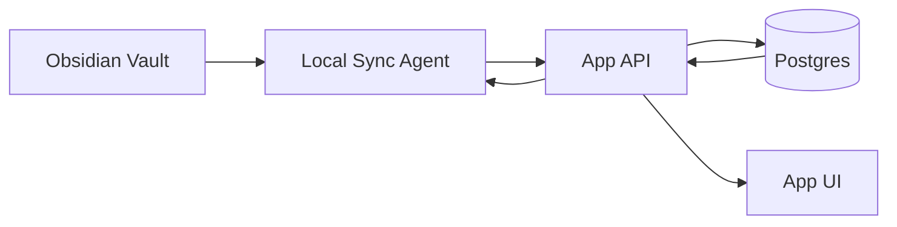

# Implementation Plan: ps-complaints-ebm-sync

**Feature ID:** 005
**Based on Spec:** [spec.md](./spec.md) v1.0.0
**Created:** 2026-01-05
**Status:** Approved
**Author:** Codex
**Last Updated:** 2026-01-05

> **Spec-Kit Compliance:** This plan follows the [GitHub Spec-Kit](https://github.com/github/spec-kit) standards and was generated using `/speckit.plan`.

---

## Executive Summary

Deliver a DB-backed complaint catalog with EBM references and a local sync agent that keeps Obsidian and the app in near real-time alignment. The initial scope uses the existing 72 complaints and seeds high-risk references first.

### Scope Summary

- **In Scope:** DB canonical data, sync agent, conflict handling, validation, EBM references seeding, app reads from API.
- **Out of Scope:** Full EHR/FHIR integration, extensive admin UI, paid-source ingestion automation.

### Estimated Effort

- **Development:** 10-15 days
- **Testing:** 4-6 days
- **Documentation:** 2-3 days
- **Total:** 16-24 days

### Risk Assessment

- **Overall Risk:** Medium
- **Key Risk:** Sync conflicts and operational reliability of local agent
- **Mitigation:** Hash-based conflict detection, audit trail, robust retry/backoff

---

## Technology Stack

### Frontend

| Technology | Purpose | Version | Rationale |
|------------|---------|---------|-----------|
| Next.js | App framework | Existing | App Router + RSC |
| React | UI | Existing | Current UI stack |
| TypeScript | Language | Existing | Type safety |
| TanStack Query | Server state | Existing | Caching + revalidation |

### Backend

| Technology | Purpose | Version | Rationale |
|------------|---------|---------|-----------|
| Next.js API Routes | API | Existing | Minimal change |
| Prisma | ORM | Existing | Type-safe DB access |
| PostgreSQL (Supabase) | DB | Existing | Realtime + stable |

### Local Sync Agent

| Tool | Purpose | Version | Rationale |
|------|---------|---------|-----------|
| Node + tsx | Runtime | Existing | Reuse scripts/sync |
| chokidar | File watcher | Existing | Reliable FS watch |
| Supabase Realtime or polling | DB changes | Existing | Vercel-friendly |

---

## Architecture

### Data Flow

### Source of Truth

- DB is canonical at runtime.
- Obsidian is the primary editor for content, synced via agent.
- TS files become generated artifacts or legacy fallbacks only.

---

## Data Model

- Use `chief_complaints` and `chief_complaint_groups` as canonical tables.
- Store EBM content and sync metadata in `chief_complaints.additional_data`.
- Use `ComplaintExtendedContentEBM` and `EBMCitation` for structure.

---

## API Design

| Method | Endpoint | Description | Auth |
|--------|----------|-------------|------|
| GET | /api/complaints | List complaints + filters | Yes |
| GET | /api/complaints/:id | Complaint details with EBM | Yes |
| PUT | /api/complaints/:id | Update complaint content | Yes |
| GET | /api/complaints/changes | Delta feed for sync agent | Yes |

---

## Implementation Plan

### Phase 1: Foundations

- Define DB canonical schema usage and JSON structure in `additional_data`.
- Create API contracts for list/detail/update/changes.
- Add validation pipeline (frontmatter + EBM schema) as shared utilities.

### Phase 2: Sync Agent

- Rework `scripts/sync/watch.ts` into a persistent local agent.
- Implement Obsidian -> DB sync using existing parser.
- Implement DB -> Obsidian sync using changes feed.
- Add conflict detection (hash + timestamps) and conflict note behavior.

### Phase 3: App Integration

- Replace runtime use of `lib/data/complaintsData.ts` with API data.
- Surface EBM references and last review on complaint detail screens.
- Add sync status indicators (lastSync + source).

### Phase 4: Content Seeding

- Import baseline 72 complaints into DB.
- Apply references for high-risk complaints using `references-sources.md`.
- Expand Brazilian references for remaining high-risk complaints.

### Phase 5: Testing + Validation

- Unit tests for parser + validation rules.
- Integration tests for sync flows and conflict handling.
- E2E tests for edit -> sync -> UI visibility.

---

## Testing Strategy

- Unit: markdown parser, EBM validator, hash conflict logic.
- Integration: API endpoints + DB writes, sync agent loop.
- E2E: Obsidian edit -> DB -> UI, and API update -> Obsidian.

---

## Documentation

- Update `docs/OBSIDIAN_SYNC.md` to reflect DB canonical + sync agent.
- Add operational guide for running the local agent.

---

## Dependencies

- Obsidian vault available locally.
- Supabase DB available with appropriate credentials.
- Agreement on allowed references (Brazil + international).

---

## Open Questions

- Confirm DB is canonical (default assumption).
- Decide polling vs Supabase realtime for DB change feed.
- Define conflict resolution policy (manual vs auto).
