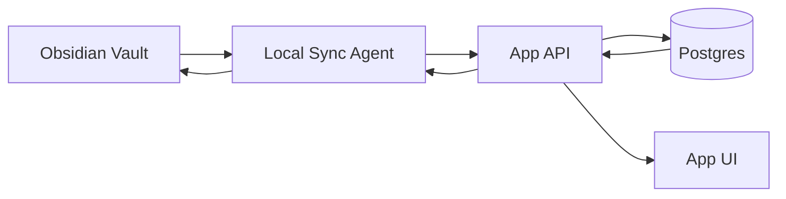

# Specification: ps-complaints-ebm-sync

**Feature ID:** 005
**Created:** 2026-01-05
**Status:** Approved
**Version:** 1.0.0
**Author:** Codex
**Last Updated:** 2026-01-05

> **Spec-Kit Compliance:** This specification follows the [GitHub Spec-Kit](https://github.com/github/spec-kit) standards for Spec-Driven Development.

---

## Overview

This feature delivers a unified pronto-socorro complaint catalog with Brazilian EBM references and bidirectional sync between Obsidian (content editing) and the app (runtime). The app runs on Vercel, while the Obsidian vault lives on a local machine, so a local sync agent is required for near real-time updates.

### Problem Statement

- Complaint data is split across static TypeScript files and Obsidian notes.
- Sync is manual (push/pull scripts) and error-prone.
- EBM references are incomplete or missing for many complaints.
- Changes on one side do not reliably propagate to the other.

### Proposed Solution

- Make the app consume complaint data from DB/API, not static TS files.
- Store structured EBM content using existing types (ComplaintExtendedContentEBM).
- Run a local sync agent that watches Obsidian and pushes updates to DB, and pulls DB changes to Obsidian.
- Add conflict detection (hash + timestamps) and validation gates.

### Goals

- [ ] Canonical complaint catalog for pronto-socorro (start with current 72 + fill missing groups).
- [ ] Structured EBM references for each high-risk complaint, with Brazilian guideline sources.
- [ ] Bidirectional sync with conflict handling and audit trail.
- [ ] App displays complaint details and references from the DB.

### Non-Goals

- Building a full EHR integration or FHIR export in this phase.
- Replacing clinical review or physician sign-off.
- Rewriting the entire UI beyond required references/sync status.

---

## User Stories

### User Story 1

**As a** content editor,
**I want to** update complaint content in Obsidian,
**So that** the app reflects changes within minutes.

**Acceptance Criteria:**
- [ ] Obsidian change updates DB and app within a defined sync window.
- [ ] Validation errors are surfaced with actionable messages.

### User Story 2

**As a** clinical admin,
**I want to** update complaint metadata in the app/admin API,
**So that** Obsidian stays in sync.

**Acceptance Criteria:**
- [ ] API updates propagate to Obsidian via the local agent.
- [ ] Conflicts are detected and do not silently overwrite.

### User Story 3

**As a** clinician,
**I want to** see EBM references and last review info for a complaint,
**So that** I can trust the content.

**Acceptance Criteria:**
- [ ] App displays citations (source, year, URL/PMID/DOI) for complaints.
- [ ] Last review date is visible and audited.

---

## Requirements

### Functional Requirements

**FR-001:** Canonical complaint catalog
- Description: Store all complaints in DB/API as the runtime source of truth.
- Input: Existing complaint data from `lib/data/*` and Obsidian notes.
- Output: DB-backed complaint list and detail endpoints.
- Priority: Must

**FR-002:** Structured EBM content
- Description: Store EBM fields using `ComplaintExtendedContentEBM` and `EBMCitation`.
- Input: Obsidian markdown + frontmatter.
- Output: Structured JSON persisted in DB and rendered in the app.
- Priority: Must

**FR-003:** Bidirectional sync agent
- Description: Local watcher pushes Obsidian updates to DB and pulls DB updates to Obsidian.
- Input: File system events + DB change feed.
- Output: Synced notes and DB records with `lastSync` and `contentHash`.
- Priority: Must

**FR-004:** Conflict detection
- Description: Detect concurrent edits and block silent overwrites.
- Input: `contentHash`, `updated_at`, `lastSync`.
- Output: Conflict status or `*-CONFLICT.md` note.
- Priority: Must

**FR-005:** Validation gates
- Description: Validate group codes, risk levels, ICD-10, and EBM schema.
- Input: Obsidian notes and DB records.
- Output: Validation report + CI gate.
- Priority: Must

**FR-006:** App consumption via API
- Description: Replace runtime use of `lib/data/complaintsData.ts` with API/DB data.
- Input: API list/detail endpoints.
- Output: App screens load complaint data and references.
- Priority: Must

### Non-Functional Requirements

**NFR-001:** Performance
- Sync latency: < 5 minutes for local agent
- Complaint list API: < 300ms (p95)

**NFR-002:** Security
- Auth required for write endpoints
- Audit logs for complaint updates

**NFR-003:** Reliability
- Sync agent restarts without data loss
- Idempotent updates based on hash/timestamp

**NFR-004:** Compliance
- LGPD and CFM documentation standards preserved
- References must be traceable (URL/PMID/DOI)

---

## Constraints & Assumptions

### Technical Constraints
- App runs on Vercel; it cannot access a local Obsidian vault directly.
- Obsidian vault lives on a local Mac (iCloud path).
- Sync agent must run locally and communicate with DB/API.

### Business Constraints
- References must prioritize Brazilian sources and SUS/RENAME compatibility.

### Assumptions
- A local machine can run the sync agent continuously.
- The DB (Supabase/Postgres) is available for updates and change feeds.

---

## Dependencies

### External Dependencies

| Dependency | Purpose | Version | Status |
|------------|---------|---------|---------|
| Obsidian Vault | Source/editable content | N/A | Required |
| Supabase/Postgres | Canonical runtime data | Existing | Required |
| MCP Obsidian server | Optional automation | Latest | Optional |

### Internal Dependencies

| Feature/System | Description | Status |
|---------------|-------------|--------|
| `scripts/sync/*` | Existing sync utilities | In place |
| `lib/types/medical.ts` | EBM types | In place |
| `prisma/schema.prisma` | `chief_complaints` tables | In place |

---

## User Interface Requirements

- Complaint detail view should show EBM references and last review date.
- Admin UI or API for complaint edits (minimal UI ok for phase 1).
- Sync status indicator for editors (last sync + source).

---

## Data Requirements

### Data Model

- Use existing Prisma models: `chief_complaints`, `chief_complaint_groups`.
- Store structured EBM content in `chief_complaints.additional_data` as JSON.
- Add sync metadata in JSON: `contentHash`, `lastSyncedAt`, `syncSource`.

### Data Flow

### Validation Rules

- Reuse `scripts/sync/validate.ts` for frontmatter validation.
- Reuse `scripts/sync/utils/ebm-validator.ts` for EBM schema validation.

### Initial Catalog Snapshot

- Baseline: `lib/data/allComplaints.ts` (72 complaints across 14 groups).
- Missing groups to add: ORL, OFT, ENV, and protocol entries (`PROTO_*`).

---

## API Requirements

| Method | Endpoint | Description | Auth |
|--------|----------|-------------|------|
| GET | /api/complaints | List complaints with filters | Yes |
| GET | /api/complaints/:id | Complaint details incl. EBM | Yes |
| PUT | /api/complaints/:id | Update complaint content | Yes |
| GET | /api/complaints/changes | Delta feed for sync agent | Yes |

---

## Error Handling

| Scenario | HTTP Status | Message | Action |
|----------|-------------|---------|--------|
| Invalid frontmatter | 400 | Validation failed | Return field errors |
| Conflict detected | 409 | Conflict | Require manual merge |
| Sync agent offline | 503 | Sync unavailable | Retry + alert |

---

## Testing Requirements

- Unit: markdown parser + EBM validation rules
- Integration: API + DB write/read + conflict handling
- E2E: Obsidian change -> DB -> UI, and reverse

---

## Compliance Requirements

- LGPD data handling and audit logging
- CFM documentation structure preserved in templates
- RENAME/SUS compatibility for meds where applicable

---

## Performance Metrics

- Sync latency: < 5 minutes
- Complaint list API p95: < 300ms
- Conflict rate tracked per month

---

## Risks & Mitigations

| Risk | Impact | Likelihood | Mitigation |
|------|--------|------------|------------|
| Sync agent not running | High | Medium | Health check + alerts |
| Conflicting edits | Medium | Medium | Hash + manual merge workflow |
| Missing references | Medium | High | Prioritize high-risk complaints first |

---

## Open Questions

- Should DB or Obsidian be the canonical source for conflict resolution?
- Which complaint list is the target: top 50 or full coverage?
- Can we use paid sources (UpToDate/DynaMed) or only public guidelines?
- Do we need an admin UI in the app for edits in phase 1?

---

## References

- `docs/OBSIDIAN_SYNC.md`
- `docs/PILOT_WORKFLOW.md`
- `lib/types/medical.ts`
- `specs/005-ps-complaints-ebm-sync/references-sources.md`
- `scripts/sync/`
- `prisma/schema.prisma`

---

## Change Log

| Date | Version | Changes | Author |
|-------|----------|----------|---------|
| 2026-01-05 | 1.0.0 | Initial specification | Codex |
