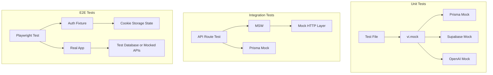

# Implementation Plan: Test Coverage Improvement

**Feature ID:** 007
**Based on Spec:** [spec.md](./spec.md) v1.0.0
**Created:** 2026-01-08
**Status:** Draft
**Author:** Development Team
**Last Updated:** 2026-01-08

> **Spec-Kit Compliance:** This plan follows the [GitHub Spec-Kit](https://github.com/github/spec-kit) standards and was generated using `/speckit.plan`.

---

## Executive Summary

This plan details the implementation strategy to improve test coverage from ~4% to 70%+ for critical paths. The implementation is divided into 4 phases, each building upon the previous.

### Scope Summary

- **In Scope:**
  - E2E authentication fixture for Playwright
  - Unit tests for auth, red flags, complaint search, validation
  - Integration tests for all 8 API routes
  - Component tests for 15+ critical React components
  - Test infrastructure (mocks, fixtures, utilities)

- **Out of Scope:**
  - Visual regression testing
  - Performance/load testing
  - Testing static data files
  - 100% coverage target

### Risk Assessment

- **Overall Risk:** Medium
- **Key Risk:** E2E auth fixture complexity may cause delays
- **Mitigation:** Start with simpler cookie-based approach, iterate

---

## Technology Stack

### Testing Infrastructure

| Technology | Purpose | Version | Status |
|------------|---------|---------|--------|
| Vitest | Unit/Integration testing | 4.0.16 | ✅ Installed |
| Playwright | E2E testing | 1.57.0 | ✅ Installed |
| @testing-library/react | Component testing | 16.3.1 | ✅ Installed |
| @testing-library/jest-dom | DOM matchers | 6.9.1 | ✅ Installed |
| msw | API mocking | 2.x | ⬜ To Install |
| jest-mock-extended | Prisma mocking | Latest | ⬜ To Install |

### Existing Configuration

| File | Purpose | Status |
|------|---------|--------|
| `vitest.config.ts` | Vitest configuration | ✅ Configured |
| `playwright.config.ts` | E2E configuration | ✅ Configured |
| `tests/setup.ts` | Test setup | ✅ Exists |

---

## Architecture

### Test Directory Structure

```
tests/
├── setup.ts                         # Global test setup (exists)
├── fixtures/
│   ├── auth.ts                      # E2E auth fixture (NEW)
│   ├── database.ts                  # DB test utilities (NEW)
│   └── test-data.ts                 # Reusable test data (NEW)
├── mocks/
│   ├── prisma.ts                    # Prisma client mock (NEW)
│   ├── supabase.ts                  # Supabase mock (NEW)
│   └── openai.ts                    # AI response mocks (NEW)
├── unit/
│   ├── citations.test.ts            # (EXISTS - 26 tests)
│   ├── context.test.ts              # (EXISTS - 19 tests)
│   ├── generate-narrative.test.ts   # (EXISTS - 21 tests)
│   ├── guardrails.test.ts           # (EXISTS - 15 tests)
│   ├── auth/
│   │   └── actions.test.ts          # Auth module tests (NEW)
│   ├── anamnese/
│   │   ├── red-flag-detector.test.ts    # Red flag tests (NEW)
│   │   └── narrative-templates.test.ts  # Template tests (NEW)
│   ├── services/
│   │   ├── complaintSearch.test.ts      # Search tests (NEW)
│   │   └── extraction.test.ts           # Extraction tests (NEW)
│   └── validation/
│       ├── complaints.test.ts       # Complaint schema tests (NEW)
│       └── ebm.test.ts              # EBM schema tests (NEW)
├── integration/
│   └── api/
│       ├── chat.test.ts             # Chat API tests (NEW)
│       ├── complaints.test.ts       # Complaints API tests (NEW)
│       └── health.test.ts           # Health check tests (NEW)
├── components/
│   ├── auth/
│   │   ├── login-form.test.tsx      # Login form tests (NEW)
│   │   └── register-form.test.tsx   # Register form tests (NEW)
│   ├── chat/
│   │   ├── chat-interface.test.tsx  # Chat UI tests (NEW)
│   │   └── message-bubble.test.tsx  # Message tests (NEW)
│   └── medical/
│       ├── red-flag-alert.test.tsx      # Alert tests (NEW)
│       └── heart-score-calculator.test.tsx # Calc tests (NEW)
└── e2e/
    ├── home.spec.ts                 # (EXISTS - 4 tests)
    ├── auth.spec.ts                 # (EXISTS - 6 tests, enhance)
    ├── anamnese.spec.ts             # (EXISTS - 7 skipped, implement)
    ├── chat.spec.ts                 # (EXISTS - 6 skipped, implement)
    └── complaint-ebm-flow.spec.ts   # (EXISTS - partial)
```

### Mocking Strategy



---

## Implementation Phases

### Phase 1: Test Infrastructure & E2E Auth [P]

**Goal:** Set up test infrastructure and unblock 13 skipped E2E tests

**Duration:** Phase 1

#### 1.1 Install Dependencies

```bash
pnpm add -D msw jest-mock-extended @faker-js/faker
```

#### 1.2 Create Prisma Mock

```typescript
// tests/mocks/prisma.ts
import { PrismaClient } from '@prisma/client'
import { mockDeep, mockReset, DeepMockProxy } from 'jest-mock-extended'
import { beforeEach, vi } from 'vitest'

export type MockPrismaClient = DeepMockProxy<PrismaClient>

export const prismaMock = mockDeep<PrismaClient>()

vi.mock('@/lib/db/prisma', () => ({
  prisma: prismaMock,
}))

beforeEach(() => {
  mockReset(prismaMock)
})
```

#### 1.3 Create Supabase Mock

```typescript
// tests/mocks/supabase.ts
import { vi } from 'vitest'

export const mockUser = {
  id: 'test-user-id',
  email: 'test@example.com',
  role: 'authenticated',
  app_metadata: {},
  user_metadata: { name: 'Test User' },
  aud: 'authenticated',
  created_at: new Date().toISOString(),
}

export const mockSession = {
  access_token: 'test-access-token',
  refresh_token: 'test-refresh-token',
  expires_in: 3600,
  token_type: 'bearer',
  user: mockUser,
}

export const supabaseMock = {
  auth: {
    getUser: vi.fn().mockResolvedValue({ data: { user: mockUser }, error: null }),
    getSession: vi.fn().mockResolvedValue({ data: { session: mockSession }, error: null }),
    signInWithPassword: vi.fn(),
    signUp: vi.fn(),
    signOut: vi.fn(),
    resetPasswordForEmail: vi.fn(),
    updateUser: vi.fn(),
  },
  from: vi.fn(() => ({
    select: vi.fn().mockReturnThis(),
    insert: vi.fn().mockReturnThis(),
    update: vi.fn().mockReturnThis(),
    delete: vi.fn().mockReturnThis(),
    eq: vi.fn().mockReturnThis(),
    single: vi.fn(),
    order: vi.fn().mockReturnThis(),
    limit: vi.fn().mockReturnThis(),
  })),
}

vi.mock('@/lib/supabase/server', () => ({
  createClient: vi.fn(() => supabaseMock),
}))

vi.mock('@/lib/supabase/client', () => ({
  createClient: vi.fn(() => supabaseMock),
}))
```

#### 1.4 Create E2E Auth Fixture

```typescript
// tests/fixtures/auth.ts
import { test as base, Page, BrowserContext } from '@playwright/test'

// Test user data
const TEST_USER = {
  id: 'e2e-test-user-id',
  email: 'e2e-test@wavewell.com',
  name: 'E2E Test User',
}

// Supabase auth token structure
const createAuthToken = () => ({
  access_token: `e2e-test-token-${Date.now()}`,
  refresh_token: `e2e-refresh-token-${Date.now()}`,
  expires_in: 3600,
  expires_at: Math.floor(Date.now() / 1000) + 3600,
  token_type: 'bearer',
  user: {
    id: TEST_USER.id,
    aud: 'authenticated',
    role: 'authenticated',
    email: TEST_USER.email,
    email_confirmed_at: new Date().toISOString(),
    phone: '',
    confirmed_at: new Date().toISOString(),
    last_sign_in_at: new Date().toISOString(),
    app_metadata: { provider: 'email', providers: ['email'] },
    user_metadata: { name: TEST_USER.name },
    identities: [],
    created_at: new Date().toISOString(),
    updated_at: new Date().toISOString(),
  },
})

type AuthFixtures = {
  authenticatedContext: BrowserContext
  authenticatedPage: Page
}

export const test = base.extend<AuthFixtures>({
  authenticatedContext: async ({ browser }, use) => {
    const authToken = createAuthToken()

    const context = await browser.newContext({
      storageState: {
        cookies: [
          {
            name: 'sb-localhost-auth-token',
            value: JSON.stringify(authToken),
            domain: 'localhost',
            path: '/',
            httpOnly: true,
            secure: false,
            sameSite: 'Lax',
            expires: Math.floor(Date.now() / 1000) + 3600,
          },
        ],
        origins: [
          {
            origin: 'http://localhost:3000',
            localStorage: [
              {
                name: 'sb-localhost-auth-token',
                value: JSON.stringify(authToken),
              },
            ],
          },
        ],
      },
    })

    await use(context)
    await context.close()
  },

  authenticatedPage: async ({ authenticatedContext }, use) => {
    const page = await authenticatedContext.newPage()
    await use(page)
  },
})

export { expect } from '@playwright/test'
export { TEST_USER }
```

#### 1.5 Update E2E Tests to Use Auth Fixture

```typescript
// tests/e2e/anamnese.spec.ts
import { test, expect, TEST_USER } from '../fixtures/auth'

test.describe('Anamnese Flow - Authenticated', () => {
  test('should display syndrome selection page', async ({ authenticatedPage }) => {
    await authenticatedPage.goto('/anamnese')
    await expect(authenticatedPage.getByText(/selecione/i)).toBeVisible()
  })

  test('should display checkboxes for selected syndrome', async ({ authenticatedPage }) => {
    await authenticatedPage.goto('/anamnese')
    await authenticatedPage.click('[data-testid="syndrome-dor-toracica"]')
    await expect(authenticatedPage.getByRole('checkbox')).toHaveCount(greaterThan(0))
  })

  test('should generate narrative from checkboxes', async ({ authenticatedPage }) => {
    await authenticatedPage.goto('/anamnese')
    await authenticatedPage.click('[data-testid="syndrome-dor-toracica"]')
    await authenticatedPage.click('[data-testid="checkbox-dor-precordial"]')
    await authenticatedPage.click('[data-testid="generate-narrative"]')
    await expect(authenticatedPage.getByTestId('narrative-output')).toBeVisible()
  })

  test('should detect and display red flags', async ({ authenticatedPage }) => {
    await authenticatedPage.goto('/anamnese')
    await authenticatedPage.click('[data-testid="syndrome-dor-toracica"]')
    await authenticatedPage.click('[data-testid="checkbox-dor-intensa"]')
    await expect(authenticatedPage.getByTestId('red-flag-alert')).toBeVisible()
  })

  // ... remaining tests
})
```

**Deliverables:**
- [ ] `tests/mocks/prisma.ts` - Prisma mock utility
- [ ] `tests/mocks/supabase.ts` - Supabase mock utility
- [ ] `tests/mocks/openai.ts` - OpenAI mock utility
- [ ] `tests/fixtures/auth.ts` - E2E auth fixture
- [ ] `tests/fixtures/test-data.ts` - Reusable test data
- [ ] Updated `tests/e2e/anamnese.spec.ts` - 7 tests implemented
- [ ] Updated `tests/e2e/chat.spec.ts` - 6 tests implemented

---

### Phase 2: Critical Unit Tests

**Goal:** Add unit tests for high-risk business logic

**Duration:** Phase 2

#### 2.1 Authentication Module Tests

**Target:** `lib/auth/actions.ts` - 80%+ coverage

```typescript
// tests/unit/auth/actions.test.ts
import { describe, it, expect, vi, beforeEach } from 'vitest'
import { login, register, resetPassword, logout } from '@/lib/auth/actions'
import { supabaseMock, mockUser, mockSession } from '../../mocks/supabase'

describe('Authentication Actions', () => {
  beforeEach(() => {
    vi.clearAllMocks()
  })

  describe('login', () => {
    it('should validate email format', async () => {
      const result = await login({ email: 'invalid-email', password: 'password123' })
      expect(result.error).toContain('email')
    })

    it('should validate minimum password length', async () => {
      const result = await login({ email: 'test@test.com', password: '12' })
      expect(result.error).toContain('password')
    })

    it('should successfully login with valid credentials', async () => {
      supabaseMock.auth.signInWithPassword.mockResolvedValueOnce({
        data: { user: mockUser, session: mockSession },
        error: null,
      })

      const result = await login({
        email: 'test@test.com',
        password: 'validPassword123!',
      })

      expect(result.success).toBe(true)
      expect(supabaseMock.auth.signInWithPassword).toHaveBeenCalledWith({
        email: 'test@test.com',
        password: 'validPassword123!',
      })
    })

    it('should handle invalid credentials', async () => {
      supabaseMock.auth.signInWithPassword.mockResolvedValueOnce({
        data: { user: null, session: null },
        error: { message: 'Invalid login credentials' },
      })

      const result = await login({
        email: 'test@test.com',
        password: 'wrongpassword',
      })

      expect(result.success).toBe(false)
      expect(result.error).toContain('Invalid')
    })

    it('should enforce rate limiting after 5 failed attempts', async () => {
      supabaseMock.auth.signInWithPassword.mockResolvedValue({
        data: { user: null, session: null },
        error: { message: 'Invalid login credentials' },
      })

      // Attempt 5 failed logins
      for (let i = 0; i < 5; i++) {
        await login({ email: 'test@test.com', password: 'wrong' })
      }

      const result = await login({ email: 'test@test.com', password: 'wrong' })
      expect(result.error).toMatch(/rate limit|too many/i)
    })
  })

  describe('register', () => {
    it('should validate password strength', async () => {
      const result = await register({
        email: 'new@test.com',
        password: 'weak',
        confirmPassword: 'weak',
        name: 'Test User',
      })

      expect(result.error).toMatch(/password.*strong|senha.*forte/i)
    })

    it('should validate password confirmation match', async () => {
      const result = await register({
        email: 'new@test.com',
        password: 'StrongPass123!',
        confirmPassword: 'DifferentPass123!',
        name: 'Test User',
      })

      expect(result.error).toMatch(/match|coincidem/i)
    })

    it('should successfully register new user', async () => {
      supabaseMock.auth.signUp.mockResolvedValueOnce({
        data: { user: mockUser, session: mockSession },
        error: null,
      })

      const result = await register({
        email: 'new@test.com',
        password: 'StrongPass123!',
        confirmPassword: 'StrongPass123!',
        name: 'New User',
      })

      expect(result.success).toBe(true)
    })

    it('should handle existing email', async () => {
      supabaseMock.auth.signUp.mockResolvedValueOnce({
        data: { user: null, session: null },
        error: { message: 'User already registered' },
      })

      const result = await register({
        email: 'existing@test.com',
        password: 'StrongPass123!',
        confirmPassword: 'StrongPass123!',
        name: 'Test User',
      })

      expect(result.success).toBe(false)
      expect(result.error).toMatch(/already|já existe/i)
    })
  })

  describe('resetPassword', () => {
    it('should send reset email for valid email', async () => {
      supabaseMock.auth.resetPasswordForEmail.mockResolvedValueOnce({
        data: {},
        error: null,
      })

      const result = await resetPassword({ email: 'test@test.com' })
      expect(result.success).toBe(true)
    })

    it('should validate email format', async () => {
      const result = await resetPassword({ email: 'invalid' })
      expect(result.error).toContain('email')
    })
  })

  describe('logout', () => {
    it('should successfully logout', async () => {
      supabaseMock.auth.signOut.mockResolvedValueOnce({ error: null })

      const result = await logout()
      expect(result.success).toBe(true)
      expect(supabaseMock.auth.signOut).toHaveBeenCalled()
    })
  })
})
```

#### 2.2 Red Flag Detection Tests

**Target:** `lib/anamnese/red-flag-detector.ts` - 90%+ coverage

```typescript
// tests/unit/anamnese/red-flag-detector.test.ts
import { describe, it, expect } from 'vitest'
import {
  detectRedFlags,
  getRedFlagConfig,
  matchRedFlagPattern,
  categorizeRedFlag,
} from '@/lib/anamnese/red-flag-detector'

describe('Red Flag Detector', () => {
  describe('detectRedFlags', () => {
    describe('Cardiac Red Flags', () => {
      it('should detect "dor torácica intensa" as high-severity cardiac', () => {
        const result = detectRedFlags(['dor torácica intensa'])

        expect(result).toContainEqual(
          expect.objectContaining({
            category: 'cardiac',
            severity: 'high',
            pattern: expect.stringMatching(/dor.*torác/i),
          })
        )
      })

      it('should detect "dor precordial irradiando para braço esquerdo"', () => {
        const result = detectRedFlags(['dor precordial irradiando para braço esquerdo'])

        expect(result).toContainEqual(
          expect.objectContaining({
            category: 'cardiac',
            severity: 'high',
          })
        )
      })

      it('should detect "sudorese fria" with cardiac context', () => {
        const result = detectRedFlags(['sudorese fria', 'dor torácica'])

        expect(result.some(rf => rf.severity === 'high')).toBe(true)
      })
    })

    describe('Neurological Red Flags', () => {
      it('should detect "cefaleia de início súbito"', () => {
        const result = detectRedFlags(['cefaleia de início súbito'])

        expect(result).toContainEqual(
          expect.objectContaining({
            category: 'neurological',
            severity: 'high',
          })
        )
      })

      it('should detect "pior dor de cabeça da vida"', () => {
        const result = detectRedFlags(['pior dor de cabeça da vida'])

        expect(result).toContainEqual(
          expect.objectContaining({
            category: 'neurological',
            severity: 'critical',
          })
        )
      })

      it('should detect "déficit neurológico focal"', () => {
        const result = detectRedFlags(['fraqueza em hemicorpo direito'])

        expect(result).toContainEqual(
          expect.objectContaining({
            category: 'neurological',
          })
        )
      })
    })

    describe('Respiratory Red Flags', () => {
      it('should detect "dispneia súbita"', () => {
        const result = detectRedFlags(['dispneia de início súbito'])

        expect(result).toContainEqual(
          expect.objectContaining({
            category: 'respiratory',
            severity: 'high',
          })
        )
      })

      it('should detect "hemoptise"', () => {
        const result = detectRedFlags(['tosse com sangue'])

        expect(result.length).toBeGreaterThan(0)
      })
    })

    describe('False Positive Prevention', () => {
      it('should NOT flag "dor muscular leve após exercício"', () => {
        const result = detectRedFlags(['dor muscular leve após exercício'])

        expect(result.filter(rf => rf.severity === 'high')).toHaveLength(0)
      })

      it('should NOT flag "cefaleia tensional habitual"', () => {
        const result = detectRedFlags(['cefaleia tensional habitual sem alterações'])

        expect(result.filter(rf => rf.category === 'neurological' && rf.severity === 'high'))
          .toHaveLength(0)
      })

      it('should NOT flag benign symptoms without context', () => {
        const result = detectRedFlags(['cansaço leve', 'sono ruim'])

        expect(result.filter(rf => rf.severity === 'high')).toHaveLength(0)
      })
    })
  })

  describe('EBM Complaint Coverage', () => {
    const ebmComplaints = [
      'Dor Torácica',
      'Dispneia',
      'Cefaleia',
      'Dor Abdominal',
      'Síncope',
      'Palpitações',
      'Tosse',
      'Febre',
      'Lombalgia',
      'Dor Cervical',
      // Add all 48 complaints
    ]

    ebmComplaints.forEach((complaint) => {
      it(`should have red flag configuration for "${complaint}"`, () => {
        const config = getRedFlagConfig(complaint)

        expect(config).toBeDefined()
        expect(config.patterns).toBeDefined()
        expect(config.patterns.length).toBeGreaterThan(0)
      })
    })
  })

  describe('matchRedFlagPattern', () => {
    it('should match exact patterns', () => {
      const result = matchRedFlagPattern('dor torácica', 'dor torácica')
      expect(result).toBe(true)
    })

    it('should match patterns with variations', () => {
      const result = matchRedFlagPattern('dor toracica', 'dor torácica')
      expect(result).toBe(true) // Should handle accent normalization
    })

    it('should match partial patterns', () => {
      const result = matchRedFlagPattern(
        'paciente refere dor torácica intensa',
        'dor torácica'
      )
      expect(result).toBe(true)
    })
  })

  describe('categorizeRedFlag', () => {
    it('should categorize cardiac symptoms correctly', () => {
      expect(categorizeRedFlag('dor torácica')).toBe('cardiac')
      expect(categorizeRedFlag('precordialgia')).toBe('cardiac')
    })

    it('should categorize neurological symptoms correctly', () => {
      expect(categorizeRedFlag('cefaleia súbita')).toBe('neurological')
      expect(categorizeRedFlag('déficit focal')).toBe('neurological')
    })
  })
})
```

#### 2.3 Complaint Search Service Tests

```typescript
// tests/unit/services/complaintSearch.test.ts
import { describe, it, expect, beforeEach } from 'vitest'
import {
  searchComplaints,
  filterComplaintsByCategory,
  sortComplaints,
  normalizeSearchQuery,
} from '@/lib/services/complaintSearchService'

describe('Complaint Search Service', () => {
  describe('searchComplaints', () => {
    it('should find exact match', () => {
      const results = searchComplaints('Dor Torácica')

      expect(results[0].name).toBe('Dor Torácica')
      expect(results[0].score).toBe(1) // Perfect match
    })

    it('should find with typos using fuzzy matching', () => {
      const results = searchComplaints('Dor Toracica') // Missing accent

      expect(results[0].name).toBe('Dor Torácica')
    })

    it('should find by synonym', () => {
      const results = searchComplaints('chest pain')

      expect(results).toContainEqual(
        expect.objectContaining({ name: 'Dor Torácica' })
      )
    })

    it('should find by partial match', () => {
      const results = searchComplaints('dor')

      expect(results.length).toBeGreaterThan(1)
      expect(results.every(r => r.name.toLowerCase().includes('dor'))).toBe(true)
    })

    it('should return empty array for no matches', () => {
      const results = searchComplaints('xyznonexistent123')

      expect(results).toHaveLength(0)
    })

    it('should handle empty query', () => {
      const results = searchComplaints('')

      expect(results).toHaveLength(0)
    })

    it('should handle special characters', () => {
      const results = searchComplaints('dor (torácica)')

      expect(results.length).toBeGreaterThan(0)
    })

    it('should be case-insensitive', () => {
      const results1 = searchComplaints('DOR TORÁCICA')
      const results2 = searchComplaints('dor torácica')

      expect(results1[0].name).toBe(results2[0].name)
    })
  })

  describe('filterComplaintsByCategory', () => {
    it('should filter by single category', () => {
      const results = filterComplaintsByCategory(['cardiovascular'])

      expect(results.every(r => r.category === 'cardiovascular')).toBe(true)
    })

    it('should filter by multiple categories', () => {
      const results = filterComplaintsByCategory(['cardiovascular', 'neurological'])

      expect(
        results.every(r =>
          r.category === 'cardiovascular' || r.category === 'neurological'
        )
      ).toBe(true)
    })

    it('should return all complaints for empty filter', () => {
      const results = filterComplaintsByCategory([])

      expect(results.length).toBeGreaterThan(0)
    })
  })

  describe('sortComplaints', () => {
    it('should sort by name alphabetically', () => {
      const complaints = [
        { name: 'Cefaleia' },
        { name: 'Dor Abdominal' },
        { name: 'Anemia' },
      ]

      const sorted = sortComplaints(complaints, 'name', 'asc')

      expect(sorted.map(c => c.name)).toEqual(['Anemia', 'Cefaleia', 'Dor Abdominal'])
    })

    it('should sort by relevance score', () => {
      const complaints = [
        { name: 'A', score: 0.5 },
        { name: 'B', score: 0.9 },
        { name: 'C', score: 0.7 },
      ]

      const sorted = sortComplaints(complaints, 'score', 'desc')

      expect(sorted.map(c => c.name)).toEqual(['B', 'C', 'A'])
    })
  })

  describe('normalizeSearchQuery', () => {
    it('should remove accents', () => {
      expect(normalizeSearchQuery('torácica')).toBe('toracica')
    })

    it('should lowercase', () => {
      expect(normalizeSearchQuery('DOR')).toBe('dor')
    })

    it('should trim whitespace', () => {
      expect(normalizeSearchQuery('  dor  ')).toBe('dor')
    })
  })
})
```

#### 2.4 Validation Schema Tests

```typescript
// tests/unit/validation/complaints.test.ts
import { describe, it, expect } from 'vitest'
import {
  complaintQuerySchema,
  complaintIdSchema,
  ebmContentSchema,
} from '@/lib/validation/complaints'

describe('Complaint Validation Schemas', () => {
  describe('complaintQuerySchema', () => {
    it('should accept valid query', () => {
      const result = complaintQuerySchema.safeParse({
        search: 'dor',
        category: 'cardiovascular',
        limit: 10,
      })

      expect(result.success).toBe(true)
    })

    it('should reject invalid category', () => {
      const result = complaintQuerySchema.safeParse({
        category: 'invalid-category',
      })

      expect(result.success).toBe(false)
    })

    it('should enforce limit boundaries', () => {
      const result = complaintQuerySchema.safeParse({
        limit: 1000, // Too high
      })

      expect(result.success).toBe(false)
    })

    it('should provide defaults', () => {
      const result = complaintQuerySchema.safeParse({})

      expect(result.success).toBe(true)
      if (result.success) {
        expect(result.data.limit).toBeDefined()
      }
    })
  })

  describe('complaintIdSchema', () => {
    it('should accept valid UUID', () => {
      const result = complaintIdSchema.safeParse('550e8400-e29b-41d4-a716-446655440000')
      expect(result.success).toBe(true)
    })

    it('should accept valid slug', () => {
      const result = complaintIdSchema.safeParse('dor-toracica')
      expect(result.success).toBe(true)
    })

    it('should reject empty string', () => {
      const result = complaintIdSchema.safeParse('')
      expect(result.success).toBe(false)
    })
  })
})
```

**Deliverables:**
- [ ] `tests/unit/auth/actions.test.ts` - 20+ test cases
- [ ] `tests/unit/anamnese/red-flag-detector.test.ts` - 30+ test cases
- [ ] `tests/unit/services/complaintSearch.test.ts` - 15+ test cases
- [ ] `tests/unit/validation/complaints.test.ts` - 10+ test cases
- [ ] `tests/unit/validation/ebm.test.ts` - 10+ test cases

---

### Phase 3: API Route Integration Tests

**Goal:** Test all 8 API routes with mocked dependencies

**Duration:** Phase 3

#### 3.1 Chat API Tests

```typescript
// tests/integration/api/chat.test.ts
import { describe, it, expect, beforeEach, vi } from 'vitest'
import { createMocks } from 'node-mocks-http'
import { prismaMock } from '../../mocks/prisma'
import { supabaseMock, mockUser } from '../../mocks/supabase'

// Import handlers
import { GET as getConversations, POST as createConversation }
  from '@/app/api/chat/conversations/route'
import { DELETE as deleteConversation }
  from '@/app/api/chat/conversations/[id]/route'
import { GET as getMessages, POST as sendMessage }
  from '@/app/api/chat/conversations/[id]/messages/route'

describe('Chat API', () => {
  beforeEach(() => {
    vi.clearAllMocks()
    // Setup authenticated user
    supabaseMock.auth.getUser.mockResolvedValue({
      data: { user: mockUser },
      error: null
    })
  })

  describe('GET /api/chat/conversations', () => {
    it('should return user conversations', async () => {
      const mockConversations = [
        { id: '1', title: 'Test 1', userId: mockUser.id, createdAt: new Date() },
        { id: '2', title: 'Test 2', userId: mockUser.id, createdAt: new Date() },
      ]

      prismaMock.conversation.findMany.mockResolvedValue(mockConversations)

      const { req, res } = createMocks({ method: 'GET' })
      await getConversations(req)

      expect(res._getStatusCode()).toBe(200)
      const data = JSON.parse(res._getData())
      expect(data).toHaveLength(2)
    })

    it('should return 401 for unauthenticated user', async () => {
      supabaseMock.auth.getUser.mockResolvedValue({
        data: { user: null },
        error: { message: 'Not authenticated' }
      })

      const { req, res } = createMocks({ method: 'GET' })
      await getConversations(req)

      expect(res._getStatusCode()).toBe(401)
    })
  })

  describe('POST /api/chat/conversations', () => {
    it('should create new conversation', async () => {
      const newConversation = {
        id: 'new-id',
        title: 'New Conversation',
        userId: mockUser.id,
        createdAt: new Date(),
      }

      prismaMock.conversation.create.mockResolvedValue(newConversation)

      const { req, res } = createMocks({
        method: 'POST',
        body: { title: 'New Conversation' },
      })

      await createConversation(req)

      expect(res._getStatusCode()).toBe(201)
      expect(JSON.parse(res._getData())).toMatchObject({
        id: 'new-id',
        title: 'New Conversation',
      })
    })

    it('should validate title is required', async () => {
      const { req, res } = createMocks({
        method: 'POST',
        body: {},
      })

      await createConversation(req)

      expect(res._getStatusCode()).toBe(400)
    })
  })

  describe('DELETE /api/chat/conversations/[id]', () => {
    it('should delete conversation', async () => {
      prismaMock.conversation.findUnique.mockResolvedValue({
        id: 'conv-1',
        userId: mockUser.id,
      })
      prismaMock.conversation.delete.mockResolvedValue({})

      const { req, res } = createMocks({
        method: 'DELETE',
      })

      await deleteConversation(req, { params: { id: 'conv-1' } })

      expect(res._getStatusCode()).toBe(200)
    })

    it('should return 404 for non-existent conversation', async () => {
      prismaMock.conversation.findUnique.mockResolvedValue(null)

      const { req, res } = createMocks({
        method: 'DELETE',
      })

      await deleteConversation(req, { params: { id: 'non-existent' } })

      expect(res._getStatusCode()).toBe(404)
    })

    it('should return 403 for unauthorized deletion', async () => {
      prismaMock.conversation.findUnique.mockResolvedValue({
        id: 'conv-1',
        userId: 'different-user-id', // Not the current user
      })

      const { req, res } = createMocks({
        method: 'DELETE',
      })

      await deleteConversation(req, { params: { id: 'conv-1' } })

      expect(res._getStatusCode()).toBe(403)
    })
  })

  describe('POST /api/chat/conversations/[id]/messages', () => {
    it('should send message and receive AI response', async () => {
      prismaMock.conversation.findUnique.mockResolvedValue({
        id: 'conv-1',
        userId: mockUser.id,
      })
      prismaMock.message.create.mockResolvedValue({
        id: 'msg-1',
        content: 'What are red flags for chest pain?',
        role: 'user',
      })

      // Mock AI response
      vi.mock('@/lib/ai/config', () => ({
        generateResponse: vi.fn().mockResolvedValue({
          content: 'Red flags for chest pain include...',
          citations: [],
        }),
      }))

      const { req, res } = createMocks({
        method: 'POST',
        body: { content: 'What are red flags for chest pain?' },
      })

      await sendMessage(req, { params: { id: 'conv-1' } })

      expect(res._getStatusCode()).toBe(200)
      const data = JSON.parse(res._getData())
      expect(data).toHaveProperty('response')
    })

    it('should validate message content', async () => {
      const { req, res } = createMocks({
        method: 'POST',
        body: { content: '' }, // Empty content
      })

      await sendMessage(req, { params: { id: 'conv-1' } })

      expect(res._getStatusCode()).toBe(400)
    })
  })
})
```

#### 3.2 Complaints API Tests

```typescript
// tests/integration/api/complaints.test.ts
import { describe, it, expect, beforeEach, vi } from 'vitest'
import { createMocks } from 'node-mocks-http'
import { prismaMock } from '../../mocks/prisma'

import { GET as getComplaints } from '@/app/api/complaints/route'
import { GET as getComplaint } from '@/app/api/complaints/[id]/route'

describe('Complaints API', () => {
  describe('GET /api/complaints', () => {
    it('should return paginated complaints', async () => {
      prismaMock.complaint.findMany.mockResolvedValue([
        { id: '1', name: 'Dor Torácica', category: 'cardiovascular' },
        { id: '2', name: 'Cefaleia', category: 'neurological' },
      ])
      prismaMock.complaint.count.mockResolvedValue(48)

      const { req, res } = createMocks({
        method: 'GET',
        query: { page: '1', limit: '10' },
      })

      await getComplaints(req)

      expect(res._getStatusCode()).toBe(200)
      const data = JSON.parse(res._getData())
      expect(data.data).toHaveLength(2)
      expect(data.meta.total).toBe(48)
    })

    it('should filter by category', async () => {
      prismaMock.complaint.findMany.mockResolvedValue([
        { id: '1', name: 'Dor Torácica', category: 'cardiovascular' },
      ])

      const { req, res } = createMocks({
        method: 'GET',
        query: { category: 'cardiovascular' },
      })

      await getComplaints(req)

      expect(prismaMock.complaint.findMany).toHaveBeenCalledWith(
        expect.objectContaining({
          where: expect.objectContaining({
            category: 'cardiovascular',
          }),
        })
      )
    })

    it('should search by name', async () => {
      const { req, res } = createMocks({
        method: 'GET',
        query: { search: 'dor' },
      })

      await getComplaints(req)

      expect(prismaMock.complaint.findMany).toHaveBeenCalledWith(
        expect.objectContaining({
          where: expect.objectContaining({
            name: expect.objectContaining({
              contains: 'dor',
            }),
          }),
        })
      )
    })
  })

  describe('GET /api/complaints/[id]', () => {
    it('should return complaint with EBM content', async () => {
      prismaMock.complaint.findUnique.mockResolvedValue({
        id: '1',
        name: 'Dor Torácica',
        category: 'cardiovascular',
        ebmContent: {
          redFlags: ['Dor intensa', 'Irradiação para braço'],
          differentialDiagnosis: ['IAM', 'Angina'],
          calculators: ['HEART Score'],
        },
      })

      const { req, res } = createMocks({ method: 'GET' })
      await getComplaint(req, { params: { id: '1' } })

      expect(res._getStatusCode()).toBe(200)
      const data = JSON.parse(res._getData())
      expect(data.ebmContent.redFlags).toHaveLength(2)
    })

    it('should return 404 for non-existent complaint', async () => {
      prismaMock.complaint.findUnique.mockResolvedValue(null)

      const { req, res } = createMocks({ method: 'GET' })
      await getComplaint(req, { params: { id: 'non-existent' } })

      expect(res._getStatusCode()).toBe(404)
    })
  })
})
```

#### 3.3 Health Check API Test

```typescript
// tests/integration/api/health.test.ts
import { describe, it, expect } from 'vitest'
import { createMocks } from 'node-mocks-http'
import { GET } from '@/app/api/health/route'

describe('Health API', () => {
  describe('GET /api/health', () => {
    it('should return healthy status', async () => {
      const { req, res } = createMocks({ method: 'GET' })
      await GET(req)

      expect(res._getStatusCode()).toBe(200)
      const data = JSON.parse(res._getData())
      expect(data.status).toBe('healthy')
    })

    it('should include timestamp', async () => {
      const { req, res } = createMocks({ method: 'GET' })
      await GET(req)

      const data = JSON.parse(res._getData())
      expect(data.timestamp).toBeDefined()
    })
  })
})
```

**Deliverables:**
- [ ] `tests/integration/api/chat.test.ts` - 15+ test cases
- [ ] `tests/integration/api/complaints.test.ts` - 10+ test cases
- [ ] `tests/integration/api/health.test.ts` - 3+ test cases

---

### Phase 4: Component Tests

**Goal:** Add unit tests for critical React components

**Duration:** Phase 4

#### 4.1 Authentication Form Tests

```typescript
// tests/components/auth/login-form.test.tsx
import { render, screen, fireEvent, waitFor } from '@testing-library/react'
import userEvent from '@testing-library/user-event'
import { describe, it, expect, vi } from 'vitest'
import { LoginForm } from '@/components/auth/login-form'

// Mock Next.js router
vi.mock('next/navigation', () => ({
  useRouter: () => ({
    push: vi.fn(),
    refresh: vi.fn(),
  }),
}))

describe('LoginForm', () => {
  it('should render email and password fields', () => {
    render(<LoginForm />)

    expect(screen.getByLabelText(/email/i)).toBeInTheDocument()
    expect(screen.getByLabelText(/senha|password/i)).toBeInTheDocument()
    expect(screen.getByRole('button', { name: /entrar|login/i })).toBeInTheDocument()
  })

  it('should show validation error for invalid email', async () => {
    const user = userEvent.setup()
    render(<LoginForm />)

    await user.type(screen.getByLabelText(/email/i), 'invalid-email')
    await user.click(screen.getByRole('button', { name: /entrar|login/i }))

    await waitFor(() => {
      expect(screen.getByText(/email.*inválido|invalid.*email/i)).toBeInTheDocument()
    })
  })

  it('should show validation error for short password', async () => {
    const user = userEvent.setup()
    render(<LoginForm />)

    await user.type(screen.getByLabelText(/email/i), 'test@example.com')
    await user.type(screen.getByLabelText(/senha|password/i), '12')
    await user.click(screen.getByRole('button', { name: /entrar|login/i }))

    await waitFor(() => {
      expect(screen.getByText(/senha.*curta|password.*short/i)).toBeInTheDocument()
    })
  })

  it('should call onSubmit with valid credentials', async () => {
    const onSubmit = vi.fn().mockResolvedValue({ success: true })
    const user = userEvent.setup()

    render(<LoginForm onSubmit={onSubmit} />)

    await user.type(screen.getByLabelText(/email/i), 'test@example.com')
    await user.type(screen.getByLabelText(/senha|password/i), 'password123')
    await user.click(screen.getByRole('button', { name: /entrar|login/i }))

    await waitFor(() => {
      expect(onSubmit).toHaveBeenCalledWith({
        email: 'test@example.com',
        password: 'password123',
      })
    })
  })

  it('should show loading state during submission', async () => {
    const onSubmit = vi.fn().mockImplementation(
      () => new Promise(resolve => setTimeout(resolve, 100))
    )
    const user = userEvent.setup()

    render(<LoginForm onSubmit={onSubmit} />)

    await user.type(screen.getByLabelText(/email/i), 'test@example.com')
    await user.type(screen.getByLabelText(/senha|password/i), 'password123')
    await user.click(screen.getByRole('button', { name: /entrar|login/i }))

    expect(screen.getByRole('button')).toBeDisabled()
  })

  it('should display error message on failed login', async () => {
    const onSubmit = vi.fn().mockResolvedValue({
      success: false,
      error: 'Credenciais inválidas'
    })
    const user = userEvent.setup()

    render(<LoginForm onSubmit={onSubmit} />)

    await user.type(screen.getByLabelText(/email/i), 'test@example.com')
    await user.type(screen.getByLabelText(/senha|password/i), 'wrongpassword')
    await user.click(screen.getByRole('button', { name: /entrar|login/i }))

    await waitFor(() => {
      expect(screen.getByText(/credenciais inválidas/i)).toBeInTheDocument()
    })
  })

  it('should have link to registration page', () => {
    render(<LoginForm />)

    expect(screen.getByRole('link', { name: /cadastr|register/i })).toBeInTheDocument()
  })

  it('should have link to forgot password', () => {
    render(<LoginForm />)

    expect(screen.getByRole('link', { name: /esquec|forgot/i })).toBeInTheDocument()
  })
})
```

#### 4.2 Medical Calculator Tests

```typescript
// tests/components/medical/heart-score-calculator.test.tsx
import { render, screen, fireEvent } from '@testing-library/react'
import userEvent from '@testing-library/user-event'
import { describe, it, expect } from 'vitest'
import { HeartScoreCalculator } from '@/components/medical/HeartScoreCalculator'

describe('HeartScoreCalculator', () => {
  it('should render all HEART score criteria', () => {
    render(<HeartScoreCalculator />)

    // History
    expect(screen.getByText(/história|history/i)).toBeInTheDocument()
    // ECG
    expect(screen.getByText(/ecg/i)).toBeInTheDocument()
    // Age
    expect(screen.getByText(/idade|age/i)).toBeInTheDocument()
    // Risk factors
    expect(screen.getByText(/fatores de risco|risk factors/i)).toBeInTheDocument()
    // Troponin
    expect(screen.getByText(/troponina|troponin/i)).toBeInTheDocument()
  })

  it('should calculate score of 0 for all low-risk selections', async () => {
    const user = userEvent.setup()
    render(<HeartScoreCalculator />)

    // Select all 0-point options
    await user.click(screen.getByLabelText(/slightly suspicious|pouco suspeita/i))
    await user.click(screen.getByLabelText(/normal ecg|ecg normal/i))
    await user.click(screen.getByLabelText(/<45/i))
    await user.click(screen.getByLabelText(/no.*factors|sem.*fatores/i))
    await user.click(screen.getByLabelText(/normal troponin|troponina normal/i))

    expect(screen.getByTestId('heart-score')).toHaveTextContent('0')
    expect(screen.getByText(/baixo risco|low risk/i)).toBeInTheDocument()
  })

  it('should calculate score of 10 for all high-risk selections', async () => {
    const user = userEvent.setup()
    render(<HeartScoreCalculator />)

    // Select all 2-point options
    await user.click(screen.getByLabelText(/highly suspicious|altamente suspeita/i))
    await user.click(screen.getByLabelText(/significant st|alteração st/i))
    await user.click(screen.getByLabelText(/≥65|>=65/i))
    await user.click(screen.getByLabelText(/≥3.*factors|>=3.*fatores/i))
    await user.click(screen.getByLabelText(/≥3x|>=3x|elevated/i))

    expect(screen.getByTestId('heart-score')).toHaveTextContent('10')
    expect(screen.getByText(/alto risco|high risk/i)).toBeInTheDocument()
  })

  it('should show moderate risk for score 4-6', async () => {
    const user = userEvent.setup()
    render(<HeartScoreCalculator />)

    // Select mix of options to get score of 5
    await user.click(screen.getByLabelText(/moderately suspicious|moderadamente/i)) // 1
    await user.click(screen.getByLabelText(/repolarization|repolarização/i)) // 1
    await user.click(screen.getByLabelText(/45-64/i)) // 1
    await user.click(screen.getByLabelText(/1-2.*factors|1-2.*fatores/i)) // 1
    await user.click(screen.getByLabelText(/1-3x/i)) // 1

    expect(screen.getByTestId('heart-score')).toHaveTextContent('5')
    expect(screen.getByText(/risco moderado|moderate risk/i)).toBeInTheDocument()
  })

  it('should reset calculator when reset button clicked', async () => {
    const user = userEvent.setup()
    render(<HeartScoreCalculator />)

    // Make some selections
    await user.click(screen.getByLabelText(/highly suspicious|altamente/i))
    expect(screen.getByTestId('heart-score')).not.toHaveTextContent('0')

    // Reset
    await user.click(screen.getByRole('button', { name: /reset|limpar/i }))

    expect(screen.getByTestId('heart-score')).toHaveTextContent('0')
  })

  it('should call onCalculate callback with score', async () => {
    const onCalculate = vi.fn()
    const user = userEvent.setup()

    render(<HeartScoreCalculator onCalculate={onCalculate} />)

    await user.click(screen.getByLabelText(/highly suspicious|altamente/i))

    expect(onCalculate).toHaveBeenCalledWith(expect.objectContaining({
      score: expect.any(Number),
      risk: expect.any(String),
    }))
  })
})
```

#### 4.3 Red Flag Alert Component Tests

```typescript
// tests/components/medical/red-flag-alert.test.tsx
import { render, screen } from '@testing-library/react'
import { describe, it, expect } from 'vitest'
import { AutoRedFlagAlert } from '@/components/medical/AutoRedFlagAlert'

describe('AutoRedFlagAlert', () => {
  it('should not render when no red flags', () => {
    render(<AutoRedFlagAlert redFlags={[]} />)

    expect(screen.queryByRole('alert')).not.toBeInTheDocument()
  })

  it('should render alert when red flags present', () => {
    const redFlags = [
      { id: '1', text: 'Dor torácica intensa', severity: 'high', category: 'cardiac' },
    ]

    render(<AutoRedFlagAlert redFlags={redFlags} />)

    expect(screen.getByRole('alert')).toBeInTheDocument()
    expect(screen.getByText(/dor torácica intensa/i)).toBeInTheDocument()
  })

  it('should show critical styling for critical severity', () => {
    const redFlags = [
      { id: '1', text: 'Pior cefaleia da vida', severity: 'critical', category: 'neurological' },
    ]

    render(<AutoRedFlagAlert redFlags={redFlags} />)

    const alert = screen.getByRole('alert')
    expect(alert).toHaveClass('bg-red-600') // or whatever critical styling class
  })

  it('should show high styling for high severity', () => {
    const redFlags = [
      { id: '1', text: 'Dispneia súbita', severity: 'high', category: 'respiratory' },
    ]

    render(<AutoRedFlagAlert redFlags={redFlags} />)

    const alert = screen.getByRole('alert')
    expect(alert).toHaveClass('bg-red-500') // or high severity class
  })

  it('should display multiple red flags', () => {
    const redFlags = [
      { id: '1', text: 'Dor torácica', severity: 'high', category: 'cardiac' },
      { id: '2', text: 'Sudorese', severity: 'medium', category: 'cardiac' },
      { id: '3', text: 'Náusea', severity: 'medium', category: 'gastrointestinal' },
    ]

    render(<AutoRedFlagAlert redFlags={redFlags} />)

    expect(screen.getByText(/dor torácica/i)).toBeInTheDocument()
    expect(screen.getByText(/sudorese/i)).toBeInTheDocument()
    expect(screen.getByText(/náusea/i)).toBeInTheDocument()
  })

  it('should group red flags by category', () => {
    const redFlags = [
      { id: '1', text: 'Dor torácica', severity: 'high', category: 'cardiac' },
      { id: '2', text: 'Palpitações', severity: 'medium', category: 'cardiac' },
      { id: '3', text: 'Cefaleia súbita', severity: 'high', category: 'neurological' },
    ]

    render(<AutoRedFlagAlert redFlags={redFlags} />)

    expect(screen.getByText(/cardíaco|cardiac/i)).toBeInTheDocument()
    expect(screen.getByText(/neurológico|neurological/i)).toBeInTheDocument()
  })

  it('should be dismissible', async () => {
    const onDismiss = vi.fn()
    const redFlags = [
      { id: '1', text: 'Test flag', severity: 'medium', category: 'other' },
    ]

    render(<AutoRedFlagAlert redFlags={redFlags} onDismiss={onDismiss} />)

    const dismissButton = screen.getByRole('button', { name: /fechar|dismiss|close/i })
    await fireEvent.click(dismissButton)

    expect(onDismiss).toHaveBeenCalled()
  })
})
```

**Deliverables:**
- [ ] `tests/components/auth/login-form.test.tsx` - 10+ test cases
- [ ] `tests/components/auth/register-form.test.tsx` - 10+ test cases
- [ ] `tests/components/chat/chat-interface.test.tsx` - 10+ test cases
- [ ] `tests/components/chat/message-bubble.test.tsx` - 5+ test cases
- [ ] `tests/components/medical/red-flag-alert.test.tsx` - 8+ test cases
- [ ] `tests/components/medical/heart-score-calculator.test.tsx` - 8+ test cases

---

## CI/CD Integration

### GitHub Actions Workflow

```yaml
# .github/workflows/test.yml
name: Test

on:
  push:
    branches: [main, develop]
  pull_request:
    branches: [main, develop]

jobs:
  unit-tests:
    runs-on: ubuntu-latest
    steps:
      - uses: actions/checkout@v4
      - uses: pnpm/action-setup@v2
        with:
          version: 9
      - uses: actions/setup-node@v4
        with:
          node-version: 20
          cache: 'pnpm'
      - run: pnpm install
      - run: pnpm test:unit
      - name: Upload coverage
        uses: codecov/codecov-action@v3
        with:
          files: ./coverage/lcov.info

  e2e-tests:
    runs-on: ubuntu-latest
    steps:
      - uses: actions/checkout@v4
      - uses: pnpm/action-setup@v2
        with:
          version: 9
      - uses: actions/setup-node@v4
        with:
          node-version: 20
          cache: 'pnpm'
      - run: pnpm install
      - run: pnpm exec playwright install --with-deps
      - run: pnpm build
      - run: pnpm test:e2e
      - uses: actions/upload-artifact@v3
        if: always()
        with:
          name: playwright-report
          path: playwright-report/
```

### Coverage Thresholds

```typescript
// vitest.config.ts (update)
export default defineConfig({
  test: {
    coverage: {
      provider: 'v8',
      reporter: ['text', 'json', 'html', 'lcov'],
      thresholds: {
        statements: 50,
        branches: 50,
        functions: 50,
        lines: 50,
        // Per-file thresholds for critical modules
        'lib/auth/actions.ts': {
          statements: 80,
          branches: 80,
        },
        'lib/anamnese/red-flag-detector.ts': {
          statements: 90,
          branches: 85,
        },
      },
    },
  },
})
```

---

## Success Metrics

| Metric | Current | Phase 1 | Phase 2 | Phase 3 | Phase 4 |
|--------|---------|---------|---------|---------|---------|
| Unit test coverage | 7.3% | 10% | 40% | 50% | 55% |
| Critical path coverage | ~10% | 15% | 60% | 70% | 75% |
| E2E tests passing | 50% | 100% | 100% | 100% | 100% |
| Skipped tests | 13 | 0 | 0 | 0 | 0 |
| Component tests | 0 | 0 | 0 | 0 | 51+ |
| API route tests | 0 | 0 | 0 | 28+ | 28+ |

---

## Risks & Mitigations

| Risk | Impact | Likelihood | Mitigation |
|------|--------|------------|------------|
| Auth fixture complexity | High | Medium | Start simple, iterate |
| Flaky E2E tests | Medium | High | Use stable selectors, proper waits |
| Mock maintenance burden | Medium | Medium | Centralize mocks, document patterns |
| Test runtime too slow | Medium | Medium | Parallel execution, selective tests |
| AI response mocking | Low | Low | Record/replay pattern |

---

## Next Steps

After this plan is approved:

1. **Tasks** - Run `/speckit.tasks` to generate detailed task breakdown
2. **Implement** - Run `/speckit.implement` to start implementation

---

## References

- [Specification](./spec.md)
- [Vitest Documentation](https://vitest.dev/)
- [Playwright Documentation](https://playwright.dev/)
- [Testing Library](https://testing-library.com/)
- [MSW Documentation](https://mswjs.io/)

---

## Change Log

| Date | Version | Changes | Author |
|------|---------|---------|--------|
| 2026-01-08 | 1.0.0 | Initial plan | Development Team |
