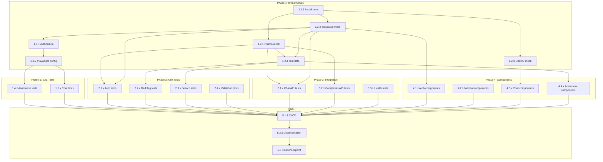

# Implementation Tasks: Test Coverage Improvement

**Feature ID:** 007
**Based on Plan:** [plan.md](./plan.md)
**Created:** 2026-01-08
**Status:** Draft
**Author:** Development Team
**Last Updated:** 2026-01-08

> **Spec-Kit Compliance:** This task breakdown follows the [GitHub Spec-Kit](https://github.com/github/spec-kit) standards and was generated using `/speckit.tasks`.

---

## Task Organization

Tasks are organized by implementation phase. Tasks marked with `[P]` can be executed in parallel.

**Execution Order:**
1. Execute tasks in the order they appear
2. Tasks with `[P]` can run in parallel with previous tasks
3. Respect dependencies between tasks
4. Mark tasks as complete with `[x]` when done

**Coverage Targets:**
- Phase 1: Unblock E2E tests (13 skipped → 0)
- Phase 2: Critical unit tests (7.3% → 40%)
- Phase 3: API integration tests (0% → 100% routes)
- Phase 4: Component tests (0 → 51+ tests)

---

## Phase 1: Test Infrastructure & E2E Authentication

**Goal:** Set up test infrastructure and unblock 13 skipped E2E tests

### 1.1 Setup: Install Dependencies

- [ ] **Task 1.1.1**: Install additional test dependencies
  - Command: `pnpm add -D msw jest-mock-extended @faker-js/faker node-mocks-http`
  - Dependencies: None
  - Acceptance: Dependencies in package.json, lockfile updated

### 1.2 Setup: Create Mock Utilities

- [ ] **Task 1.2.1**: Create Prisma mock utility
  - File: `tests/mocks/prisma.ts`
  - Dependencies: Task 1.1.1
  - Details:
    - Export `prismaMock` using jest-mock-extended
    - Auto-reset mocks in beforeEach
    - Mock `@/lib/db/prisma` module

- [ ] **Task 1.2.2** [P]: Create Supabase mock utility
  - File: `tests/mocks/supabase.ts`
  - Dependencies: Task 1.1.1
  - Details:
    - Export `supabaseMock` with auth methods
    - Export `mockUser` and `mockSession` fixtures
    - Mock `@/lib/supabase/server` and `@/lib/supabase/client`

- [ ] **Task 1.2.3** [P]: Create OpenAI mock utility
  - File: `tests/mocks/openai.ts`
  - Dependencies: Task 1.1.1
  - Details:
    - Mock AI SDK streaming responses
    - Provide predictable test responses
    - Handle citation generation

- [ ] **Task 1.2.4**: Create test data fixtures
  - File: `tests/fixtures/test-data.ts`
  - Dependencies: Task 1.2.1, Task 1.2.2
  - Details:
    - Reusable complaint test data
    - Conversation/message fixtures
    - Red flag test cases

### 1.3 Setup: Create E2E Auth Fixture

- [ ] **Task 1.3.1**: Create Playwright authentication fixture
  - File: `tests/fixtures/auth.ts`
  - Dependencies: Task 1.2.2
  - Details:
    - Export extended `test` with `authenticatedContext`
    - Export `authenticatedPage` fixture
    - Set Supabase auth cookies/localStorage
    - Export `TEST_USER` constant

- [ ] **Task 1.3.2**: Update Playwright config for fixtures
  - File: `playwright.config.ts`
  - Dependencies: Task 1.3.1
  - Details:
    - Add global setup if needed
    - Configure auth state storage
    - Set appropriate timeouts

### 1.4 Implementation: Anamnese E2E Tests

- [ ] **Task 1.4.1**: Implement "should display syndrome selection page"
  - File: `tests/e2e/anamnese.spec.ts`
  - Dependencies: Task 1.3.1
  - Details:
    - Use `authenticatedPage` fixture
    - Navigate to /anamnese
    - Assert syndrome list visible

- [ ] **Task 1.4.2** [P]: Implement "should display checkboxes for selected syndrome"
  - File: `tests/e2e/anamnese.spec.ts`
  - Dependencies: Task 1.3.1
  - Details:
    - Select a syndrome
    - Assert checkboxes rendered
    - Verify checkbox categories

- [ ] **Task 1.4.3** [P]: Implement "should generate narrative from checkboxes"
  - File: `tests/e2e/anamnese.spec.ts`
  - Dependencies: Task 1.3.1
  - Details:
    - Select checkboxes
    - Click generate
    - Assert narrative output

- [ ] **Task 1.4.4** [P]: Implement "should detect and display red flags"
  - File: `tests/e2e/anamnese.spec.ts`
  - Dependencies: Task 1.3.1
  - Details:
    - Select red flag checkbox
    - Assert red flag alert appears
    - Verify severity styling

- [ ] **Task 1.4.5** [P]: Implement "should switch between output modes"
  - File: `tests/e2e/anamnese.spec.ts`
  - Dependencies: Task 1.3.1
  - Details:
    - Toggle SUMMARY/DETAILED mode
    - Assert output format changes

- [ ] **Task 1.4.6** [P]: Implement "should copy text to clipboard"
  - File: `tests/e2e/anamnese.spec.ts`
  - Dependencies: Task 1.3.1
  - Details:
    - Generate narrative
    - Click copy button
    - Verify clipboard content (or success toast)

- [ ] **Task 1.4.7** [P]: Implement "should save session to history"
  - File: `tests/e2e/anamnese.spec.ts`
  - Dependencies: Task 1.3.1
  - Details:
    - Complete anamnese flow
    - Navigate to history
    - Assert session saved

### 1.5 Implementation: Chat E2E Tests

- [ ] **Task 1.5.1**: Implement "should display chat list"
  - File: `tests/e2e/chat.spec.ts`
  - Dependencies: Task 1.3.1
  - Details:
    - Navigate to /chat
    - Assert conversation list visible

- [ ] **Task 1.5.2** [P]: Implement "should create new conversation"
  - File: `tests/e2e/chat.spec.ts`
  - Dependencies: Task 1.3.1
  - Details:
    - Click new conversation
    - Assert new conversation created
    - Verify navigation to chat view

- [ ] **Task 1.5.3** [P]: Implement "should show medical disclaimer"
  - File: `tests/e2e/chat.spec.ts`
  - Dependencies: Task 1.3.1
  - Details:
    - Open chat
    - Assert disclaimer visible
    - Verify disclaimer content

- [ ] **Task 1.5.4** [P]: Implement "should send message and receive AI response"
  - File: `tests/e2e/chat.spec.ts`
  - Dependencies: Task 1.3.1, Task 1.2.3
  - Details:
    - Type message
    - Send message
    - Wait for AI response
    - Assert response visible

- [ ] **Task 1.5.5** [P]: Implement "should display typing indicator"
  - File: `tests/e2e/chat.spec.ts`
  - Dependencies: Task 1.3.1
  - Details:
    - Send message
    - Assert typing indicator appears
    - Assert indicator disappears after response

- [ ] **Task 1.5.6** [P]: Implement "should show citations"
  - File: `tests/e2e/chat.spec.ts`
  - Dependencies: Task 1.3.1
  - Details:
    - Send medical query
    - Assert citations displayed
    - Verify citation links

### 1.6 Checkpoint: Phase 1

- [ ] All 13 previously skipped tests now passing
- [ ] Mock utilities working correctly
- [ ] Auth fixture reliably authenticates
- [ ] No flaky tests
- [ ] `pnpm test:e2e` passes

---

## Phase 2: Critical Unit Tests

**Goal:** Add unit tests for high-risk business logic (40%+ coverage)

### 2.1 Authentication Module Tests

- [ ] **Task 2.1.1**: Create auth actions test file
  - File: `tests/unit/auth/actions.test.ts`
  - Dependencies: Task 1.2.1, Task 1.2.2
  - Details:
    - Import auth actions
    - Setup mocks
    - Create describe blocks for each function

- [ ] **Task 2.1.2**: Test login validation
  - File: `tests/unit/auth/actions.test.ts`
  - Dependencies: Task 2.1.1
  - Test cases:
    - [ ] Invalid email format
    - [ ] Minimum password length
    - [ ] Empty credentials
    - [ ] Valid credentials success
    - [ ] Invalid credentials error

- [ ] **Task 2.1.3** [P]: Test login rate limiting
  - File: `tests/unit/auth/actions.test.ts`
  - Dependencies: Task 2.1.1
  - Test cases:
    - [ ] Allow first 5 attempts
    - [ ] Block after 5 failed attempts
    - [ ] Reset after timeout

- [ ] **Task 2.1.4** [P]: Test register validation
  - File: `tests/unit/auth/actions.test.ts`
  - Dependencies: Task 2.1.1
  - Test cases:
    - [ ] Password strength requirements
    - [ ] Password confirmation match
    - [ ] Email uniqueness
    - [ ] Successful registration
    - [ ] Duplicate email error

- [ ] **Task 2.1.5** [P]: Test password reset
  - File: `tests/unit/auth/actions.test.ts`
  - Dependencies: Task 2.1.1
  - Test cases:
    - [ ] Valid email sends reset
    - [ ] Invalid email validation
    - [ ] Rate limiting on reset requests

- [ ] **Task 2.1.6** [P]: Test logout
  - File: `tests/unit/auth/actions.test.ts`
  - Dependencies: Task 2.1.1
  - Test cases:
    - [ ] Successful logout
    - [ ] Session cleanup

### 2.2 Red Flag Detection Tests

- [ ] **Task 2.2.1**: Create red flag detector test file
  - File: `tests/unit/anamnese/red-flag-detector.test.ts`
  - Dependencies: Task 1.2.4
  - Details:
    - Import red flag detector
    - Setup test data
    - Create describe blocks for each function

- [ ] **Task 2.2.2**: Test cardiac red flags
  - File: `tests/unit/anamnese/red-flag-detector.test.ts`
  - Dependencies: Task 2.2.1
  - Test cases:
    - [ ] "dor torácica intensa" detection
    - [ ] "irradiação para braço" detection
    - [ ] "sudorese fria" detection
    - [ ] Combined cardiac symptoms
    - [ ] Severity classification

- [ ] **Task 2.2.3** [P]: Test neurological red flags
  - File: `tests/unit/anamnese/red-flag-detector.test.ts`
  - Dependencies: Task 2.2.1
  - Test cases:
    - [ ] "cefaleia de início súbito" detection
    - [ ] "pior dor de cabeça da vida" detection
    - [ ] "déficit neurológico focal" detection
    - [ ] Severity: critical vs high

- [ ] **Task 2.2.4** [P]: Test respiratory red flags
  - File: `tests/unit/anamnese/red-flag-detector.test.ts`
  - Dependencies: Task 2.2.1
  - Test cases:
    - [ ] "dispneia súbita" detection
    - [ ] "hemoptise" detection
    - [ ] Oxygen saturation concerns

- [ ] **Task 2.2.5** [P]: Test false positive prevention
  - File: `tests/unit/anamnese/red-flag-detector.test.ts`
  - Dependencies: Task 2.2.1
  - Test cases:
    - [ ] "dor muscular leve" NOT flagged
    - [ ] "cefaleia tensional habitual" NOT flagged
    - [ ] Benign symptoms without context

- [ ] **Task 2.2.6**: Test EBM complaint coverage
  - File: `tests/unit/anamnese/red-flag-detector.test.ts`
  - Dependencies: Task 2.2.1
  - Test cases:
    - [ ] All 48 EBM complaints have config
    - [ ] Each config has patterns defined
    - [ ] No empty pattern arrays

- [ ] **Task 2.2.7** [P]: Test pattern matching utilities
  - File: `tests/unit/anamnese/red-flag-detector.test.ts`
  - Dependencies: Task 2.2.1
  - Test cases:
    - [ ] Exact pattern match
    - [ ] Accent normalization
    - [ ] Partial pattern match
    - [ ] Case insensitivity

### 2.3 Complaint Search Service Tests

- [ ] **Task 2.3.1**: Create complaint search test file
  - File: `tests/unit/services/complaintSearch.test.ts`
  - Dependencies: Task 1.2.4
  - Details:
    - Import search service
    - Setup complaint test data

- [ ] **Task 2.3.2**: Test search functionality
  - File: `tests/unit/services/complaintSearch.test.ts`
  - Dependencies: Task 2.3.1
  - Test cases:
    - [ ] Exact match search
    - [ ] Fuzzy match with typos
    - [ ] Synonym search
    - [ ] Partial match
    - [ ] No results for invalid query
    - [ ] Empty query handling

- [ ] **Task 2.3.3** [P]: Test filtering
  - File: `tests/unit/services/complaintSearch.test.ts`
  - Dependencies: Task 2.3.1
  - Test cases:
    - [ ] Single category filter
    - [ ] Multiple categories filter
    - [ ] Empty filter returns all

- [ ] **Task 2.3.4** [P]: Test sorting
  - File: `tests/unit/services/complaintSearch.test.ts`
  - Dependencies: Task 2.3.1
  - Test cases:
    - [ ] Sort by name ascending
    - [ ] Sort by name descending
    - [ ] Sort by relevance score

- [ ] **Task 2.3.5** [P]: Test query normalization
  - File: `tests/unit/services/complaintSearch.test.ts`
  - Dependencies: Task 2.3.1
  - Test cases:
    - [ ] Accent removal
    - [ ] Lowercase conversion
    - [ ] Whitespace trimming
    - [ ] Special character handling

### 2.4 Validation Schema Tests

- [ ] **Task 2.4.1**: Create complaints validation test file
  - File: `tests/unit/validation/complaints.test.ts`
  - Dependencies: None
  - Details:
    - Import Zod schemas
    - Test valid and invalid inputs

- [ ] **Task 2.4.2**: Test complaint query schema
  - File: `tests/unit/validation/complaints.test.ts`
  - Dependencies: Task 2.4.1
  - Test cases:
    - [ ] Valid query params
    - [ ] Invalid category rejection
    - [ ] Limit boundary enforcement
    - [ ] Default values applied

- [ ] **Task 2.4.3** [P]: Test complaint ID schema
  - File: `tests/unit/validation/complaints.test.ts`
  - Dependencies: Task 2.4.1
  - Test cases:
    - [ ] Valid UUID accepted
    - [ ] Valid slug accepted
    - [ ] Empty string rejected

- [ ] **Task 2.4.4**: Create EBM validation test file
  - File: `tests/unit/validation/ebm.test.ts`
  - Dependencies: None
  - Test cases:
    - [ ] Valid EBM content structure
    - [ ] Required fields validation
    - [ ] Red flags array validation
    - [ ] References format validation

### 2.5 Checkpoint: Phase 2

- [ ] Auth module has 80%+ coverage
- [ ] Red flag detector has 90%+ coverage
- [ ] Complaint search has 70%+ coverage
- [ ] Validation schemas have 100% coverage
- [ ] All unit tests passing
- [ ] `pnpm test:unit` passes
- [ ] Coverage report shows 40%+ overall

---

## Phase 3: API Route Integration Tests

**Goal:** Test all 8 API routes (100% route coverage)

### 3.1 Chat API Tests

- [ ] **Task 3.1.1**: Create chat API test file
  - File: `tests/integration/api/chat.test.ts`
  - Dependencies: Task 1.2.1, Task 1.2.2
  - Details:
    - Import route handlers
    - Setup node-mocks-http
    - Configure auth mocks

- [ ] **Task 3.1.2**: Test GET /api/chat/conversations
  - File: `tests/integration/api/chat.test.ts`
  - Dependencies: Task 3.1.1
  - Test cases:
    - [ ] Return user conversations
    - [ ] 401 for unauthenticated
    - [ ] Empty list for new user
    - [ ] Pagination parameters

- [ ] **Task 3.1.3** [P]: Test POST /api/chat/conversations
  - File: `tests/integration/api/chat.test.ts`
  - Dependencies: Task 3.1.1
  - Test cases:
    - [ ] Create new conversation
    - [ ] Title required validation
    - [ ] 401 for unauthenticated
    - [ ] Return created conversation

- [ ] **Task 3.1.4** [P]: Test DELETE /api/chat/conversations/[id]
  - File: `tests/integration/api/chat.test.ts`
  - Dependencies: Task 3.1.1
  - Test cases:
    - [ ] Delete own conversation
    - [ ] 404 for non-existent
    - [ ] 403 for other user's conversation
    - [ ] 401 for unauthenticated

- [ ] **Task 3.1.5** [P]: Test GET /api/chat/conversations/[id]/messages
  - File: `tests/integration/api/chat.test.ts`
  - Dependencies: Task 3.1.1
  - Test cases:
    - [ ] Return messages for conversation
    - [ ] 404 for non-existent conversation
    - [ ] 403 for other user's conversation
    - [ ] Message ordering (chronological)

- [ ] **Task 3.1.6** [P]: Test POST /api/chat/conversations/[id]/messages
  - File: `tests/integration/api/chat.test.ts`
  - Dependencies: Task 3.1.1, Task 1.2.3
  - Test cases:
    - [ ] Send message successfully
    - [ ] Receive AI response
    - [ ] Content required validation
    - [ ] Message length limits
    - [ ] 404 for non-existent conversation

### 3.2 Complaints API Tests

- [ ] **Task 3.2.1**: Create complaints API test file
  - File: `tests/integration/api/complaints.test.ts`
  - Dependencies: Task 1.2.1
  - Details:
    - Import route handlers
    - Setup Prisma mock

- [ ] **Task 3.2.2**: Test GET /api/complaints
  - File: `tests/integration/api/complaints.test.ts`
  - Dependencies: Task 3.2.1
  - Test cases:
    - [ ] Return paginated complaints
    - [ ] Filter by category
    - [ ] Search by name
    - [ ] Sort parameters
    - [ ] Default pagination

- [ ] **Task 3.2.3** [P]: Test GET /api/complaints/[id]
  - File: `tests/integration/api/complaints.test.ts`
  - Dependencies: Task 3.2.1
  - Test cases:
    - [ ] Return complaint with EBM content
    - [ ] 404 for non-existent
    - [ ] Include red flags
    - [ ] Include differential diagnoses

- [ ] **Task 3.2.4** [P]: Test GET /api/complaints/changes
  - File: `tests/integration/api/complaints.test.ts`
  - Dependencies: Task 3.2.1
  - Test cases:
    - [ ] Return changes since timestamp
    - [ ] Empty changes for up-to-date client
    - [ ] Timestamp parameter validation

### 3.3 Health API Tests

- [ ] **Task 3.3.1**: Create health API test file
  - File: `tests/integration/api/health.test.ts`
  - Dependencies: None

- [ ] **Task 3.3.2**: Test GET /api/health
  - File: `tests/integration/api/health.test.ts`
  - Dependencies: Task 3.3.1
  - Test cases:
    - [ ] Return healthy status
    - [ ] Include timestamp
    - [ ] Include version info

### 3.4 Checkpoint: Phase 3

- [ ] All 8 API routes have tests
- [ ] Auth middleware tested
- [ ] Error responses tested
- [ ] All integration tests passing
- [ ] `pnpm test:integration` passes

---

## Phase 4: Component Tests

**Goal:** Add unit tests for 15+ critical React components

### 4.1 Authentication Components

- [ ] **Task 4.1.1**: Create login form test file
  - File: `tests/components/auth/login-form.test.tsx`
  - Dependencies: Task 1.2.2
  - Details:
    - Mock Next.js router
    - Setup testing-library

- [ ] **Task 4.1.2**: Test LoginForm rendering
  - File: `tests/components/auth/login-form.test.tsx`
  - Dependencies: Task 4.1.1
  - Test cases:
    - [ ] Renders email field
    - [ ] Renders password field
    - [ ] Renders submit button
    - [ ] Renders register link
    - [ ] Renders forgot password link

- [ ] **Task 4.1.3** [P]: Test LoginForm validation
  - File: `tests/components/auth/login-form.test.tsx`
  - Dependencies: Task 4.1.1
  - Test cases:
    - [ ] Invalid email error
    - [ ] Short password error
    - [ ] Empty fields error

- [ ] **Task 4.1.4** [P]: Test LoginForm submission
  - File: `tests/components/auth/login-form.test.tsx`
  - Dependencies: Task 4.1.1
  - Test cases:
    - [ ] Calls onSubmit with credentials
    - [ ] Shows loading state
    - [ ] Displays error message
    - [ ] Disables button during submission

- [ ] **Task 4.1.5**: Create register form test file
  - File: `tests/components/auth/register-form.test.tsx`
  - Dependencies: Task 1.2.2

- [ ] **Task 4.1.6**: Test RegisterForm
  - File: `tests/components/auth/register-form.test.tsx`
  - Dependencies: Task 4.1.5
  - Test cases:
    - [ ] Renders all fields
    - [ ] Password strength validation
    - [ ] Password confirmation match
    - [ ] Terms acceptance required
    - [ ] Successful submission

### 4.2 Medical Components

- [ ] **Task 4.2.1**: Create HeartScoreCalculator test file
  - File: `tests/components/medical/heart-score-calculator.test.tsx`
  - Dependencies: None

- [ ] **Task 4.2.2**: Test HeartScoreCalculator rendering
  - File: `tests/components/medical/heart-score-calculator.test.tsx`
  - Dependencies: Task 4.2.1
  - Test cases:
    - [ ] Renders all 5 criteria
    - [ ] Each criterion has 3 options
    - [ ] Score display visible
    - [ ] Reset button present

- [ ] **Task 4.2.3** [P]: Test HeartScoreCalculator scoring
  - File: `tests/components/medical/heart-score-calculator.test.tsx`
  - Dependencies: Task 4.2.1
  - Test cases:
    - [ ] Score 0 for all low-risk
    - [ ] Score 10 for all high-risk
    - [ ] Score 4-6 shows moderate risk
    - [ ] Correct risk stratification

- [ ] **Task 4.2.4** [P]: Test HeartScoreCalculator reset
  - File: `tests/components/medical/heart-score-calculator.test.tsx`
  - Dependencies: Task 4.2.1
  - Test cases:
    - [ ] Reset clears selections
    - [ ] Reset returns score to 0

- [ ] **Task 4.2.5**: Create AutoRedFlagAlert test file
  - File: `tests/components/medical/red-flag-alert.test.tsx`
  - Dependencies: None

- [ ] **Task 4.2.6**: Test AutoRedFlagAlert
  - File: `tests/components/medical/red-flag-alert.test.tsx`
  - Dependencies: Task 4.2.5
  - Test cases:
    - [ ] Not rendered when no red flags
    - [ ] Rendered when red flags present
    - [ ] Critical severity styling
    - [ ] High severity styling
    - [ ] Multiple red flags displayed
    - [ ] Grouped by category
    - [ ] Dismissible

### 4.3 Chat Components

- [ ] **Task 4.3.1**: Create chat interface test file
  - File: `tests/components/chat/chat-interface.test.tsx`
  - Dependencies: Task 1.2.2, Task 1.2.3

- [ ] **Task 4.3.2**: Test ChatInterface rendering
  - File: `tests/components/chat/chat-interface.test.tsx`
  - Dependencies: Task 4.3.1
  - Test cases:
    - [ ] Renders message list
    - [ ] Renders input field
    - [ ] Renders send button
    - [ ] Shows disclaimer

- [ ] **Task 4.3.3** [P]: Test ChatInterface messaging
  - File: `tests/components/chat/chat-interface.test.tsx`
  - Dependencies: Task 4.3.1
  - Test cases:
    - [ ] Type message in input
    - [ ] Send on button click
    - [ ] Send on Enter key
    - [ ] Clear input after send
    - [ ] Disable input while loading

- [ ] **Task 4.3.4**: Create message bubble test file
  - File: `tests/components/chat/message-bubble.test.tsx`
  - Dependencies: None

- [ ] **Task 4.3.5**: Test MessageBubble
  - File: `tests/components/chat/message-bubble.test.tsx`
  - Dependencies: Task 4.3.4
  - Test cases:
    - [ ] User message styling
    - [ ] Assistant message styling
    - [ ] Renders message content
    - [ ] Renders timestamp
    - [ ] Renders citations when present

- [ ] **Task 4.3.6**: Create citation card test file
  - File: `tests/components/chat/citation-card.test.tsx`
  - Dependencies: None

- [ ] **Task 4.3.7**: Test CitationCard
  - File: `tests/components/chat/citation-card.test.tsx`
  - Dependencies: Task 4.3.6
  - Test cases:
    - [ ] Renders citation title
    - [ ] Renders authors
    - [ ] Renders journal/source
    - [ ] Link opens in new tab
    - [ ] PMID link correct

### 4.4 Anamnese Components

- [ ] **Task 4.4.1**: Create AnamnesisView test file
  - File: `tests/components/anamnesis/anamnesis-view.test.tsx`
  - Dependencies: Task 1.2.4

- [ ] **Task 4.4.2**: Test AnamnesisView
  - File: `tests/components/anamnesis/anamnesis-view.test.tsx`
  - Dependencies: Task 4.4.1
  - Test cases:
    - [ ] Renders syndrome selector
    - [ ] Renders checkboxes after selection
    - [ ] Renders narrative output
    - [ ] Mode toggle works
    - [ ] Generate button works

- [ ] **Task 4.4.3**: Create ComplaintDetailPanel test file
  - File: `tests/components/anamnesis/complaint-detail-panel.test.tsx`
  - Dependencies: Task 1.2.4

- [ ] **Task 4.4.4**: Test ComplaintDetailPanel
  - File: `tests/components/anamnesis/complaint-detail-panel.test.tsx`
  - Dependencies: Task 4.4.3
  - Test cases:
    - [ ] Renders complaint name
    - [ ] Renders EBM content tabs
    - [ ] Red flags tab content
    - [ ] Differential tab content
    - [ ] References tab content

### 4.5 Checkpoint: Phase 4

- [ ] 15+ components have tests
- [ ] All component tests passing
- [ ] No accessibility violations
- [ ] `pnpm test:components` passes

---

## Final Integration

### 5.1 CI/CD Integration

- [ ] **Task 5.1.1**: Create GitHub Actions workflow
  - File: `.github/workflows/test.yml`
  - Dependencies: All phases complete
  - Details:
    - Unit tests job
    - E2E tests job
    - Coverage upload
    - PR checks

- [ ] **Task 5.1.2**: Configure coverage thresholds
  - File: `vitest.config.ts`
  - Dependencies: Task 5.1.1
  - Details:
    - Overall: 50% minimum
    - Auth module: 80% minimum
    - Red flag detector: 90% minimum

### 5.2 Documentation

- [ ] **Task 5.2.1**: Create TESTING.md documentation
  - File: `TESTING.md`
  - Dependencies: All phases complete
  - Details:
    - Test architecture overview
    - Running tests locally
    - Writing new tests
    - Mock patterns
    - Troubleshooting

- [ ] **Task 5.2.2**: Update README with test commands
  - File: `README.md`
  - Dependencies: Task 5.2.1
  - Details:
    - Add test commands section
    - Coverage badge
    - CI status badge

### 5.3 Final Checkpoint

- [ ] All 13 previously skipped E2E tests passing
- [ ] Unit test coverage ≥ 50%
- [ ] Critical path coverage ≥ 70%
- [ ] All API routes have integration tests
- [ ] 15+ components have unit tests
- [ ] CI/CD pipeline passing
- [ ] Documentation complete
- [ ] No flaky tests

---

## Dependencies Graph

---

## Task Summary

| Phase | Total Tasks | Parallel Tasks | Key Deliverables |
|-------|-------------|----------------|------------------|
| Phase 1 | 19 | 13 | Mocks, fixtures, 13 E2E tests |
| Phase 2 | 22 | 15 | 85+ unit tests |
| Phase 3 | 12 | 8 | 28+ integration tests |
| Phase 4 | 18 | 10 | 51+ component tests |
| Final | 5 | 0 | CI/CD, docs |
| **Total** | **76** | **46** | **177+ tests** |

---

## Execution

To execute these tasks:

1. **Manual Execution**: Follow tasks in order, marking as complete
2. **Automated Execution**: Run `/speckit.implement` to execute automatically

The `/speckit.implement` command will:
- Validate prerequisites (constitution, spec, plan, tasks)
- Execute tasks in the correct order
- Respect dependencies
- Run parallel tasks when marked with `[P]`

---

## Related Documents

- [Specification](./spec.md) - Source specification
- [Implementation Plan](./plan.md) - Source plan
- [Project Constitution](../../memory/constitution.md)

---

## Change Log

| Date | Version | Changes | Author |
|------|---------|---------|--------|
| 2026-01-08 | 1.0.0 | Initial task breakdown | Development Team |
