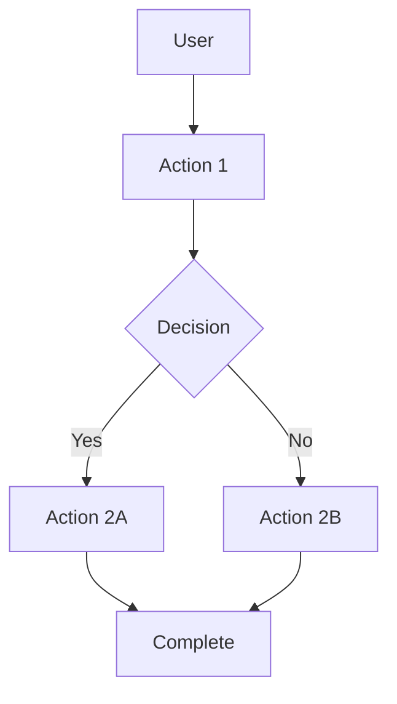
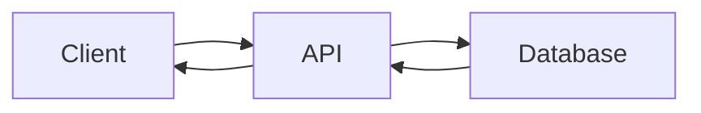

# Specification: {{FEATURE_NAME}}

**Feature ID:** {{FEATURE_NUMBER}}
**Created:** {{DATE}}
**Status:** Draft | In Review | Approved | Implemented
**Version:** 1.0.0
**Author:** [Author Name]
**Last Updated:** {{DATE}}

> **Spec-Kit Compliance:** This specification follows the [GitHub Spec-Kit](https://github.com/github/spec-kit) standards for Spec-Driven Development.

---

## Overview

Provide a brief overview of the feature being specified. This section should answer:

- What is the feature?
- Why is it needed?
- What problem does it solve?
- Who is it for?

### Problem Statement

Describe the current problem or limitation that this feature addresses.

### Proposed Solution

Describe the high-level solution approach.

### Goals

- [ ] Goal 1
- [ ] Goal 2
- [ ] Goal 3

### Non-Goals

List what is explicitly NOT in scope for this feature.

- Out of scope item 1
- Out of scope item 2

---

## User Stories

List user stories following the template:

> As a [user type], I want to [action], so that [benefit].

### User Story 1

**As a** [user type],
**I want to** [action],
**So that** [benefit].

**Acceptance Criteria:**
- [ ] Criteria 1
- [ ] Criteria 2
- [ ] Criteria 3

### User Story 2

**As a** [user type],
**I want to** [action],
**So that** [benefit].

**Acceptance Criteria:**
- [ ] Criteria 1
- [ ] Criteria 2
- [ ] Criteria 3

---

## Requirements

### Functional Requirements

Detailed list of functional requirements for the feature.

**FR-001:** [Requirement description]
- Description: [Detailed description]
- Input: [What is input?]
- Output: [What is output?]
- Priority: [Must/Should/Could/Won't]

**FR-002:** [Requirement description]
- Description: [Detailed description]
- Input: [What is input?]
- Output: [What is output?]
- Priority: [Must/Should/Could/Won't]

### Non-Functional Requirements

Quality attributes and constraints.

**NFR-001:** Performance
- Response time: < [X] seconds
- Throughput: [X] requests/second
- Resource limits: [CPU, memory, etc.]

**NFR-002:** Security
- Authentication: [Requirements]
- Authorization: [Requirements]
- Data protection: [Requirements]

**NFR-003:** Usability
- Accessibility: [WCAG 2.1 AA]
- Error messages: [User-friendly]
- Help/documentation: [Available]

**NFR-004:** Scalability
- Concurrent users: [X]
- Data volume: [Y]
- Peak load: [Z]

---

## Constraints & Assumptions

### Technical Constraints

- Technology stack limitations
- Third-party integrations
- Infrastructure constraints

### Business Constraints

- Budget constraints
- Timeline constraints
- Resource constraints

### Assumptions

- [Assumption 1]
- [Assumption 2]
- [Assumption 3]

---

## Dependencies

### External Dependencies

List any external APIs, services, or libraries this feature depends on.

| Dependency | Purpose | Version | Status |
|------------|---------|---------|---------|
| [Dependency] | [Purpose] | [Version] | [Required/Optional] |

### Internal Dependencies

List other features or systems this depends on.

| Feature/System | Description | Status |
|---------------|-------------|---------|
| [Feature] | [Description] | [In Progress/Complete] |

---

## User Interface Requirements

### Wireframes/Mockups

[Include wireframes or describe UI components]

### User Flow



### Components Required

List UI components needed for this feature.

- [ ] Component 1
- [ ] Component 2
- [ ] Component 3

---

## Data Requirements

### Data Model

```prisma
// Add your Prisma models here

model Example {
  id        String   @id @default(uuid())
  createdAt DateTime @default(now())
  updatedAt DateTime @updatedAt
}
```

### Data Flow



### Validation Rules

List validation rules for data.

- [Validation rule 1]
- [Validation rule 2]

---

## API Requirements

### Endpoints Required

List API endpoints needed.

| Method | Endpoint | Description | Auth Required |
|--------|-----------|-------------|---------------|
| GET | /api/endpoint | Description | Yes/No |
| POST | /api/endpoint | Description | Yes/No |
| PUT | /api/endpoint | Description | Yes/No |
| DELETE | /api/endpoint | Description | Yes/No |

### Request/Response Schemas

Define request and response formats.

#### Example Request
```json
{
  "field1": "value1",
  "field2": "value2"
}
```

#### Example Response
```json
{
  "id": "uuid",
  "field1": "value1",
  "createdAt": "2024-01-01T00:00:00Z"
}
```

---

## Error Handling

### Error Scenarios

List possible error scenarios and how to handle them.

| Scenario | HTTP Status | Error Message | User Action |
|----------|--------------|---------------|-------------|
| [Error 1] | 400 | [Message] | [Action] |
| [Error 2] | 401 | [Message] | [Action] |
| [Error 3] | 404 | [Message] | [Action] |

### Fallback Behavior

What happens when:
- API is down?
- Database is slow?
- Network error occurs?
- Third-party service is unavailable?

---

## Testing Requirements

### Unit Tests

- [ ] Test 1
- [ ] Test 2

### Integration Tests

- [ ] Test 1
- [ ] Test 2

### E2E Tests

- [ ] Test critical user flows
- [ ] Test edge cases

### Performance Tests

- [ ] Load test: [X] concurrent users
- [ ] Stress test: [Y] requests/second

---

## Accessibility Requirements

- [ ] Keyboard navigation
- [ ] Screen reader compatibility
- [ ] Color contrast (WCAG AA)
- [ ] Focus indicators
- [ ] ARIA labels
- [ ] Error messages accessible

---

## Internationalization (i18n)

- [ ] Strings externalized
- [ ] Right-to-left (RTL) support
- [ ] Date/time formatting
- [ ] Number/currency formatting
- [ ] Language switching

---

## Security Considerations

- [ ] Input validation
- [ ] Output encoding
- [ ] SQL injection prevention
- [ ] XSS prevention
- [ ] CSRF protection
- [ ] Rate limiting
- [ ] Audit logging

---

## Compliance Requirements

### Healthcare (if applicable)

- [ ] LGPD compliance
- [ ] CFM standards
- [ ] Medical record standards
- [ ] Audit trail required

### General

- [ ] GDPR compliance (if EU)
- [ ] PCI-DSS (if payments)
- [ ] HIPAA (if US healthcare)

---

## Performance Metrics

Define success metrics for this feature.

- Response time: < [X]ms
- Error rate: < [Y]%
- Throughput: [Z] requests/second
- User satisfaction: > [A]%

---

## Success Criteria

How will we know this feature is successful?

- [ ] All user stories completed
- [ ] All acceptance criteria met
- [ ] All tests passing
- [ ] Performance targets met
- [ ] Accessibility requirements met
- [ ] Security review completed
- [ ] Documentation complete

---

## Risks & Mitigations

| Risk | Impact | Likelihood | Mitigation |
|-------|---------|------------|------------|
| [Risk 1] | [High/Medium/Low] | [High/Medium/Low] | [Mitigation] |
| [Risk 2] | [High/Medium/Low] | [High/Medium/Low] | [Mitigation] |

---

## Open Questions

List questions that need to be answered before implementation.

- [ ] Question 1
- [ ] Question 2

---

## References

- [Related specs]
- [Technical documentation]
- [Design documents]
- [User research]
- [Competitor analysis]

---

## Change Log

| Date | Version | Changes | Author |
|-------|----------|----------|---------|
| {{DATE}} | 1.0.0 | Initial specification | [Author] |
