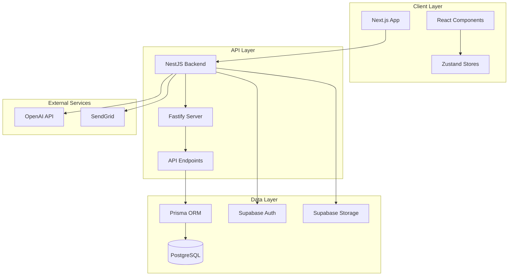
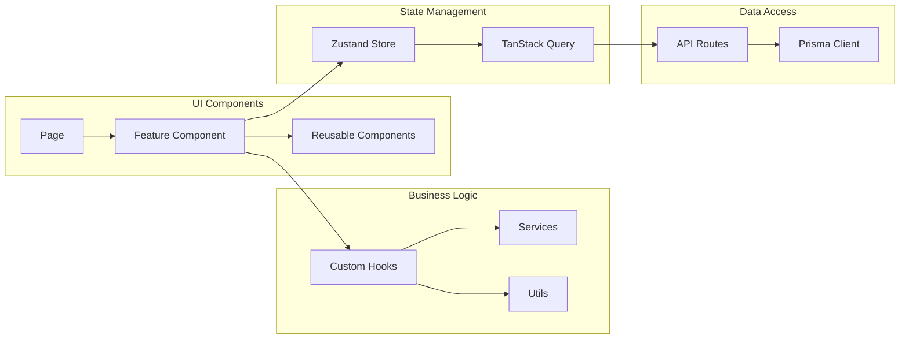
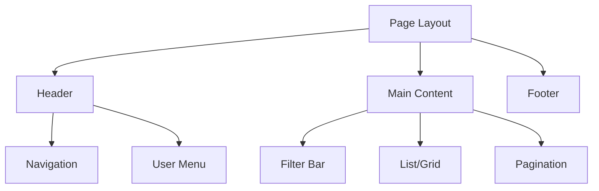

# Implementation Plan: {{FEATURE_NAME}}

**Feature ID:** {{FEATURE_NUMBER}}
**Based on Spec:** [spec.md](./spec.md) v1.0.0
**Created:** {{DATE}}
**Status:** Draft | In Review | Approved | In Progress
**Author:** [Author Name]
**Last Updated:** {{DATE}}

> **Spec-Kit Compliance:** This plan follows the [GitHub Spec-Kit](https://github.com/github/spec-kit) standards and was generated using `/speckit.plan`.

---

## Executive Summary

Provide high-level overview of implementation plan.

### Scope Summary

- **In Scope:** [Brief list of what will be implemented]
- **Out of Scope:** [Brief list of what will NOT be implemented]

### Estimated Effort

- **Development:** [X] days
- **Testing:** [Y] days
- **Documentation:** [Z] days
- **Total:** [X+Y+Z] days

### Risk Assessment

- **Overall Risk:** [Low/Medium/High]
- **Key Risk:** [Main risk]
- **Mitigation:** [How to mitigate]

---

## Technology Stack

### Frontend

| Technology | Purpose | Version | Rationale |
|------------|---------|---------|-----------|
| Next.js 15 | Framework | Latest | App Router, RSC support |
| React 19 | UI Library | Latest | Latest features |
| TypeScript | Language | 5.x | Type safety |
| Tailwind CSS | Styling | Latest | Utility-first CSS |
| shadcn/ui | Components | Latest | Pre-built components |
| Zustand | State Management | Latest | Simple, fast |
| TanStack Query | Server State | Latest | Caching, sync |

### Backend

| Technology | Purpose | Version | Rationale |
|------------|---------|---------|-----------|
| NestJS | Framework | Latest LTS | Modular, scalable |
| Fastify | Runtime | Latest | Performance |
| Prisma | ORM | Latest | Type-safe database |
| PostgreSQL | Database | 15+ | Reliable, feature-rich |
| Supabase | Backend Service | Latest | Auth, storage, real-time |

### Development Tools

| Tool | Purpose | Version |
|------|---------|---------|
| pnpm | Package Manager | 9.x |
| ESLint | Linting | Latest |
| Prettier | Formatting | Latest |
| Vitest | Unit Testing | Latest |
| Playwright | E2E Testing | Latest |
| TypeScript | Type Checking | 5.x |

---

## Architecture

### System Architecture



### Component Architecture



---

## Data Model

### Database Schema

```prisma
// Models for {{FEATURE_NAME}}

model FeatureExample {
  id          String   @id @default(uuid())
  name        String
  description String?
  createdAt   DateTime @default(now())
  updatedAt   DateTime @updatedAt

  @@map("feature_examples")
}
```

### TypeScript Types

```typescript
// Type definitions for {{FEATURE_NAME}}

export interface FeatureExample {
  id: string;
  name: string;
  description?: string;
  createdAt: Date;
  updatedAt: Date;
}

export interface CreateFeatureExampleInput {
  name: string;
  description?: string;
}

export interface UpdateFeatureExampleInput {
  name?: string;
  description?: string;
}

export interface FeatureExampleFilters {
  search?: string;
  sortBy?: 'name' | 'createdAt';
  sortOrder?: 'asc' | 'desc';
}
```

---

## API Design

### Endpoints

#### Feature Examples

| Method | Endpoint | Description | Auth | Response |
|--------|-----------|-------------|-------|----------|
| GET | /api/feature-examples | List all examples | Required | `FeatureExample[]` |
| GET | /api/feature-examples/:id | Get single example | Required | `FeatureExample` |
| POST | /api/feature-examples | Create example | Required | `FeatureExample` |
| PUT | /api/feature-examples/:id | Update example | Required | `FeatureExample` |
| DELETE | /api/feature-examples/:id | Delete example | Required | `void` |

### Request/Response Schemas

#### GET /api/feature-examples

**Query Parameters:**
```typescript
{
  search?: string;
  page?: number;
  limit?: number;
  sortBy?: string;
  sortOrder?: 'asc' | 'desc';
}
```

**Response:**
```typescript
{
  data: FeatureExample[];
  meta: {
    total: number;
    page: number;
    limit: number;
  };
}
```

#### POST /api/feature-examples

**Request Body:**
```typescript
{
  name: string;
  description?: string;
}
```

**Response:**
```typescript
{
  data: FeatureExample;
}
```

### Error Responses

| Status | Code | Message | Description |
|---------|-------|----------|-------------|
| 400 | VALIDATION_ERROR | Invalid input data |
| 401 | UNAUTHORIZED | Authentication required |
| 403 | FORBIDDEN | Insufficient permissions |
| 404 | NOT_FOUND | Resource not found |
| 409 | CONFLICT | Resource already exists |
| 500 | INTERNAL_ERROR | Server error |

---

## UI Design

### Page Structure

#### Main Page



### Components Required

- [ ] `FeatureList` - Main list component
- [ ] `FeatureItem` - Individual item component
- [ ] `FeatureForm` - Form component
- [ ] `FeatureFilter` - Filter component
- [ ] `FeaturePagination` - Pagination component
- [ ] `FeatureEmptyState` - Empty state component
- [ ] `FeatureLoading` - Loading skeleton

### Design System

Follow **Apple Design Language 2025**:
- Glassmorphism: blur(20px), transparency(30%)
- Border radius: 8px buttons, 12-20px cards
- Typography: Inter, weights 400-700
- Colors: Neutral base with #007AFF, #34C759, #FF3B30
- Motion: Spring physics (stiffness: 300, damping: 30)

---

## Implementation Plan

### Phase 1: Foundation [P]

**Goal:** Set up project structure and basic scaffolding

**Tasks:**
1. Create database schema migration
2. Generate Prisma client
3. Create TypeScript types
4. Set up API route structure
5. Create base UI components
6. Configure Zustand store
7. Set up TanStack Query cache

**Duration:** 2 days

### Phase 2: Backend Implementation [P]

**Goal:** Implement API endpoints and business logic

**Tasks:**
1. Create API routes (GET, POST, PUT, DELETE)
2. Implement CRUD operations
3. Add input validation (Zod)
4. Add error handling
5. Implement authentication middleware
6. Add logging
7. Write unit tests for API

**Duration:** 3 days

### Phase 3: Frontend Implementation

**Goal:** Build UI components and integrate with backend

**Tasks:**
1. Create page layouts
2. Build list component
3. Build form component
4. Build filter component
5. Integrate with TanStack Query
6. Handle loading and error states
7. Implement optimistic updates
8. Write unit tests for components

**Duration:** 4 days

### Phase 4: Integration & Polish

**Goal:** Integrate components and add polish

**Tasks:**
1. Connect UI to API
2. Implement real-time updates (if needed)
3. Add animations (Framer Motion)
4. Implement responsive design
5. Add accessibility features
6. Optimize performance
7. Test edge cases

**Duration:** 2 days

### Phase 5: Testing

**Goal:** Comprehensive testing coverage

**Tasks:**
1. Write integration tests
2. Write E2E tests (Playwright)
3. Performance testing
4. Accessibility testing
5. Cross-browser testing
6. Mobile testing

**Duration:** 2 days

### Phase 6: Documentation & Deployment

**Goal:** Complete documentation and deploy

**Tasks:**
1. Update README
2. Write API documentation
3. Create user guide
4. Update CHANGELOG
5. Deploy to staging
6. User acceptance testing
7. Deploy to production

**Duration:** 2 days

---

## Testing Strategy

### Unit Tests

**Tools:** Vitest, React Testing Library

**Coverage Targets:**
- Business logic: 90%
- Components: 80%
- Utilities: 100%

**Test Areas:**
- [ ] API handlers
- [ ] Business services
- [ ] Utility functions
- [ ] React components
- [ ] Custom hooks
- [ ] Zustand stores

### Integration Tests

**Tools:** Vitest, Supabase test database

**Test Scenarios:**
- [ ] API endpoints with real database
- [ ] Authentication flows
- [ ] Database migrations
- [ ] External API integrations

### E2E Tests

**Tools:** Playwright

**Test Flows:**
- [ ] Happy path user flows
- [ ] Error scenarios
- [ ] Navigation flows
- [ ] Form submissions
- [ ] Authentication

**Coverage:**
- [ ] Critical user paths: 100%
- [ ] Secondary features: 80%

### Performance Tests

**Metrics:**
- [ ] First Contentful Paint: < 1.5s
- [ ] Time to Interactive: < 3s
- [ ] API response time: < 200ms (p95)
- [ ] Bundle size: < 200KB

### Accessibility Tests

**Tools:** axe-core, WAVE

**Standards:**
- WCAG 2.1 AA
- Keyboard navigation
- Screen reader compatibility
- Color contrast

---

## Security Considerations

### Authentication & Authorization

- [ ] JWT token validation
- [ ] Role-based access control
- [ ] Session management
- [ ] Token refresh mechanism

### Data Protection

- [ ] Input sanitization
- [ ] SQL injection prevention (Prisma)
- [ ] XSS prevention
- [ ] CSRF protection
- [ ] Rate limiting
- [ ] Audit logging

### Healthcare Compliance

- [ ] LGPD compliance
- [ ] Data encryption at rest (AES-256)
- [ ] Data encryption in transit (TLS 1.3)
- [ ] Patient data access logging
- [ ] Data retention policies

---

## Deployment Strategy

### Environments

| Environment | Purpose | URL | Branch |
|------------|---------|------|---------|
| Development | Local dev | localhost:3000 | feature/* |
| Staging | Pre-production | staging.example.com | main |
| Production | Live | example.com | main |

### Deployment Process

1. **Development:**
   - Run locally with `pnpm dev`
   - Test database: Supabase dev project

2. **Staging:**
   - Vercel automatic deploy on main branch
   - Staging database
   - Test with staging data

3. **Production:**
   - Vercel production deploy
   - Production database (Supabase prod)
   - Run database migrations
   - Smoke tests
   - Monitor for errors (Sentry)

### Rollback Plan

- [ ] Database rollback strategy
- [ ] Code rollback strategy
- [ ] Data backup before migration
- [ ] Rollback procedure documented

---

## Monitoring & Observability

### Metrics to Track

- [ ] Error rate (Sentry)
- [ ] Response times
- [ ] Request throughput
- [ ] Database query times
- [ ] User engagement
- [ ] Feature usage

### Alerting

- [ ] Error rate > 1%
- [ ] Response time > 2s
- [ ] Database connection failures
- [ ] Authentication failures

### Logging

- [ ] Application logs (Winston)
- [ ] Error logs (Sentry)
- [ ] Audit logs (user actions)
- [ ] Performance logs

---

## Risk Management

### Technical Risks

| Risk | Impact | Likelihood | Mitigation |
|-------|---------|------------|------------|
| API performance issues | High | Medium | Caching, optimization |
| Database scaling | High | Low | Connection pooling, indexing |
| Third-party API failure | Medium | Medium | Fallback, error handling |
| Security vulnerabilities | Critical | Low | Regular audits, updates |

### Project Risks

| Risk | Impact | Likelihood | Mitigation |
|-------|---------|------------|------------|
| Timeline slippage | High | Medium | Buffer time, prioritization |
| Scope creep | High | High | Strict spec adherence |
| Resource constraints | Medium | Medium | Clear priorities, outsourcing |

---

## Success Criteria

Feature will be considered successful when:

- [ ] All user stories implemented
- [ ] All acceptance criteria met
- [ ] Unit test coverage ≥ 80%
- [ ] All tests passing
- [ ] Performance targets met
- [ ] Security review completed
- [ ] Accessibility standards met
- [ ] Documentation complete
- [ ] User acceptance testing passed
- [ ] Production deployment successful

---

## Dependencies & Assumptions

### External Dependencies

| Dependency | Version | Status | Risk |
|------------|---------|---------|-------|
| Supabase | Latest | Stable | Low |
| OpenAI API | Latest | Stable | Medium |
| Vercel | Latest | Stable | Low |

### Internal Dependencies

| Feature/Module | Status | Risk |
|---------------|---------|-------|
| Authentication | Complete | Low |
| Database Schema | Complete | Low |

### Assumptions

- [ ] Assumption 1
- [ ] Assumption 2
- [ ] Assumption 3

---

## Open Questions

| Question | Priority | Owner | Due Date |
|----------|----------|---------|----------|
| Question 1 | High | [Name] | [Date] |
| Question 2 | Medium | [Name] | [Date] |

---

## References

- [Specification](./spec.md)
- [Data Model](./data-model.md)
- [API Spec](./contracts/api-spec.json)
- [Research](./research.md)

---

## Change Log

| Date | Version | Changes | Author |
|-------|----------|----------|---------|
| {{DATE}} | 1.0.0 | Initial plan | [Author] |

---

## Next Steps

After completing this plan:

1. ✅ **Review** - Validate plan with team
2. ✅ **Tasks** - Run `/speckit.tasks` to generate task breakdown
3. ✅ **Implement** - Run `/speckit.implement` to start implementation

## Related Documents

- [Specification](./spec.md) - Source specification
- [Task Breakdown](./tasks.md) - Generated from this plan
- [Research Document](./research.md) - Technical research
- [Data Model](./data-model.md) - Data structures
- [API Specification](./contracts/api-spec.json) - API contracts

## Spec-Kit References

- [GitHub Spec-Kit Repository](https://github.com/github/spec-kit)
- [Spec-Kit Documentation](https://github.com/github/spec-kit/blob/main/README.md)
- [Project Constitution](../../memory/constitution.md)
