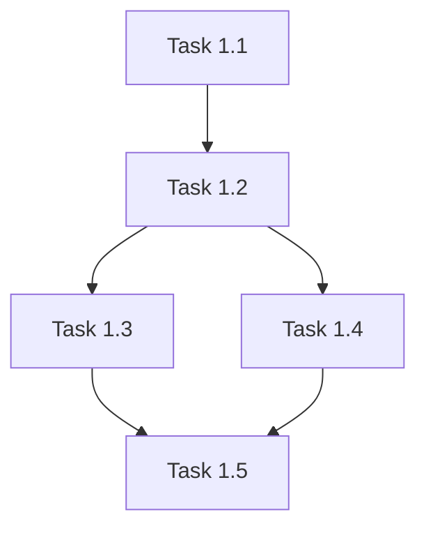

# Implementation Tasks: {{FEATURE_NAME}}

**Feature ID:** {{FEATURE_NUMBER}}
**Based on Plan:** [plan.md](./plan.md)
**Created:** {{DATE}}
**Status:** Draft | In Progress | Completed
**Author:** [Author Name]
**Last Updated:** {{DATE}}

> **Spec-Kit Compliance:** This task breakdown follows the [GitHub Spec-Kit](https://github.com/github/spec-kit) standards and was generated using `/speckit.tasks`.

## Task Organization

Tasks are organized by user story and implementation phase. Tasks marked with `[P]` can be executed in parallel.

**Execution Order:**
1. Execute tasks in the order they appear
2. Tasks with `[P]` can run in parallel with previous tasks
3. Respect dependencies between tasks
4. Mark tasks as complete with `[x]` when done

## User Story 1: [Story Title]

### Phase: Setup
- [ ] **Task 1.1**: [Task description]
  - File: `path/to/file`
  - Dependencies: None
  - Estimated time: [X hours]

- [ ] **Task 1.2**: [Task description]
  - File: `path/to/file`
  - Dependencies: Task 1.1
  - Estimated time: [X hours]

### Phase: Core Implementation
- [ ] **Task 1.3**: [Task description]
  - File: `path/to/file`
  - Dependencies: Task 1.2
  - Estimated time: [X hours]

- [ ] **Task 1.4** [P]: [Task description]
  - File: `path/to/file`
  - Dependencies: Task 1.2
  - Estimated time: [X hours]

### Phase: Testing
- [ ] **Task 1.5**: Write unit tests
  - File: `path/to/test/file`
  - Dependencies: Task 1.3, Task 1.4
  - Estimated time: [X hours]

### Checkpoint
- [ ] All tests passing
- [ ] Code review completed
- [ ] Documentation updated

## User Story 2: [Story Title]

[Repeat structure above]

## Dependencies Graph

## Notes

- Tasks marked with `[P]` can be executed in parallel
- All tasks should include appropriate tests
- Follow TDD approach where specified
- Update task status as you progress
- Document any blockers or issues encountered

## Execution

To execute these tasks:

1. **Manual Execution**: Follow tasks in order, marking as complete
2. **Automated Execution**: Run `/speckit.implement` to execute automatically

The `/speckit.implement` command will:
- Validate prerequisites (constitution, spec, plan, tasks)
- Execute tasks in the correct order
- Respect dependencies
- Run parallel tasks when marked with `[P]`
- Follow TDD when specified

## Related Documents

- [Specification](./spec.md) - Source specification
- [Implementation Plan](./plan.md) - Source plan
- [Research Document](./research.md) - Technical research
- [Data Model](./data-model.md) - Data structures

## Spec-Kit References

- [GitHub Spec-Kit Repository](https://github.com/github/spec-kit)
- [Spec-Kit Documentation](https://github.com/github/spec-kit/blob/main/README.md)
- [Project Constitution](../../memory/constitution.md)

