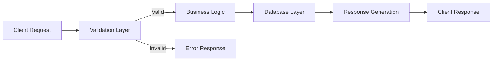
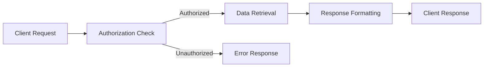
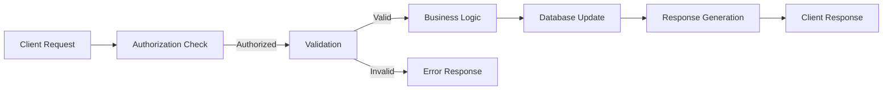
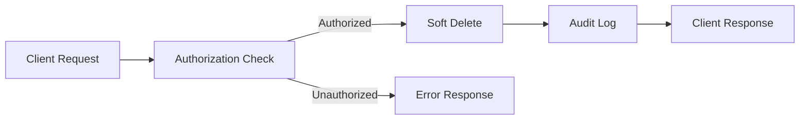

# Data Model: {{FEATURE_NAME}}

**Feature Name:** {{FEATURE_NAME}}
**Feature Number:** {{FEATURE_NUMBER}}
**Date:** {{DATE}}
**Version:** 1.0.0

## Overview

This document describes the data structures, relationships, and validation rules for the {{FEATURE_NAME}} feature.

## Database Schema

### Prisma Models

```prisma
// Primary model for {{FEATURE_NAME}}
model {{FEATURE_NAME_CAMEL_CASE}} {
  id          String   @id @default(uuid())
  field1      String
  field2      Int
  field3      Json?    @default("{}")
  userId      String
  createdAt   DateTime @default(now())
  updatedAt   DateTime @updatedAt

  @@index([userId])
  @@index([createdAt(sort: Desc)])
  @@map("{{FEATURE_NAME_SNAKE_CASE}}")
}

// User model (if new or referencing)
model User {
  id        String   @id @default(uuid())
  email     String   @unique
  name      String?
  createdAt DateTime @default(now())
  updatedAt DateTime @updatedAt

  {{FEATURE_NAME_CAMEL_CASE}} {{FEATURE_NAME_CAMEL_CASE}}[]
  @@map("users")
}
```

### Model Descriptions

#### {{FEATURE_NAME_CAMEL_CASE}}

The primary data structure for the {{FEATURE_NAME}} feature.

| Field | Type | Constraints | Description |
|-------|------|-------------|-------------|
| id | String (UUID) | Primary key, auto-generated | Unique identifier |
| field1 | String | @db.VarChar(100) | Primary text field |
| field2 | Int | @db.Int | Numeric field |
| field3 | Json? | Optional | Flexible JSON data |
| userId | String | Foreign Key | Reference to User.id |
| createdAt | DateTime | Auto | Creation timestamp |
| updatedAt | DateTime | Auto | Last update timestamp |

#### User

User account information.

| Field | Type | Constraints | Description |
|-------|------|-------------|-------------|
| id | String (UUID) | Primary key, auto-generated | Unique identifier |
| email | String | @unique, @db.VarChar(255) | User email |
| name | String? | Optional | Display name |
| createdAt | DateTime | Auto | Account creation timestamp |
| updatedAt | DateTime | Auto | Last update timestamp |

## Relationships

### Entity Relationship Diagram

```mermaid
erDiagram
    USER ||--o{ {{FEATURE_NAME_CAMEL_CASE}} : "has"
    {{FEATURE_NAME_CAMEL_CASE}} {
        uuid id PK
        string field1
        int field2
        json field3
        string userId FK
    }
    USER {
        uuid id PK
        string email UK
        string name
    }
```

### Relationship Types

| Relationship | Type | Description |
|--------------|------|-------------|
| User to {{FEATURE_NAME_CAMEL_CASE}} | One-to-Many | One user can have many {{FEATURE_NAME}} records |
| {{FEATURE_NAME_CAMEL_CASE}} to User | Many-to-One | Each {{FEATURE_NAME}} belongs to one user |

## TypeScript Types

### Core Types

```typescript
// Primary model type
export interface {{FEATURE_NAME_CAMEL_CASE}} {
  id: string;
  field1: string;
  field2: number;
  field3?: Record<string, unknown> | null;
  userId: string;
  createdAt: Date;
  updatedAt: Date;
}

// Create type
export interface Create{{FEATURE_NAME_CAMEL_CASE}}Input {
  field1: string;
  field2: number;
  field3?: Record<string, unknown>;
}

// Update type (all fields optional)
export interface Update{{FEATURE_NAME_CAMEL_CASE}}Input {
  field1?: string;
  field2?: number;
  field3?: Record<string, unknown>;
}

// List response with pagination
export interface {{FEATURE_NAME_CAMEL_CASE}}ListResponse {
  data: {{FEATURE_NAME_CAMEL_CASE}}[];
  pagination: {
    cursor: string | null;
    hasMore: boolean;
    total: number;
  };
}
```

### Types with Relations

```typescript
// {{FEATURE_NAME}} with user relation
export interface {{FEATURE_NAME_CAMEL_CASE}}WithUser extends {{FEATURE_NAME_CAMEL_CASE}} {
  user: {
    id: string;
    email: string;
    name?: string | null;
  };
}
```

## Data Validation

### Zod Schemas

```typescript
import { z } from 'zod';

// Create validation schema
export const create{{FEATURE_NAME_CAMEL_CASE}}Schema = z.object({
  field1: z.string()
    .min(1, 'Field1 is required')
    .max(100, 'Field1 must be 100 characters or less'),
  field2: z.number()
    .int('Field2 must be an integer')
    .positive('Field2 must be positive'),
  field3: z.record(z.unknown()).optional(),
});

// Update validation schema
export const update{{FEATURE_NAME_CAMEL_CASE}}Schema = z.object({
  field1: z.string()
    .min(1)
    .max(100)
    .optional(),
  field2: z.number()
    .int()
    .positive()
    .optional(),
  field3: z.record(z.unknown()).optional(),
});

// List query params validation
export const list{{FEATURE_NAME_CAMEL_CASE}}QuerySchema = z.object({
  cursor: z.string().optional(),
  limit: z.coerce.number()
    .min(1)
    .max(100)
    .default(20),
  sort: z.enum(['createdAt', 'updatedAt']).default('createdAt'),
  order: z.enum(['asc', 'desc']).default('desc'),
});
```

### Validation Rules

| Field | Type | Constraints | Error Message |
|-------|------|-------------|---------------|
| field1 | String | Required, min: 1, max: 100 | "Field1 is required and must be 1-100 characters" |
| field2 | Number | Required, integer, positive | "Field2 must be a positive integer" |
| field3 | JSON | Optional, valid JSON | "Field3 must be valid JSON" |

## Data Flow

### Create Flow



### Read Flow



### Update Flow



### Delete Flow



## Indexes and Performance

### Database Indexes

```prisma
model {{FEATURE_NAME_CAMEL_CASE}} {
  // ... fields

  @@index([userId])
  @@index([createdAt(sort: Desc)])
  @@index([field1])
}
```

### Index Strategy

| Index | Fields | Purpose | Type |
|--------|---------|----------|-------|
| idx_userId | userId | Fast user lookups | B-Tree |
| idx_createdAt | createdAt | Sorting by creation date | B-Tree |
| idx_field1 | field1 | Filtering by field1 | B-Tree |

### Query Optimization

| Query | Index Used | Explanation |
|--------|-------------|-------------|
| Find by userId | idx_userId | Direct lookup on foreign key |
| List by createdAt | idx_createdAt | Efficient sorting |
| Filter by field1 | idx_field1 | Fast filtering |

## Data Privacy and Security

### Sensitive Data

| Data | Classification | Protection |
|-------|----------------|--------------|
| userId | PII | Encrypted at rest, masked in logs |
| field2 | Sensitive | Only accessible with proper permissions |

### Encryption

- **At Rest:** AES-256 encryption for sensitive fields
- **In Transit:** TLS 1.3 for all connections
- **Hashing:** SHA-256 for sensitive comparisons

### Audit Logging

```prisma
model AuditLog {
  id          String   @id @default(uuid())
  action      String   // CREATE, UPDATE, DELETE
  entityType  String   // {{FEATURE_NAME}}
  entityId    String
  userId      String   // Who made the change
  changes     Json     // Before/after values
  ipAddress   String?
  userAgent   String?
  createdAt   DateTime @default(now())

  @@index([entityId])
  @@index([userId])
  @@map("audit_logs")
}
```

## Migration Strategy

### Migration File Naming

```bash
# Format: YYYYMMDD_descriptive_migration_name
pnpm prisma migrate dev --name add_{{FEATURE_NAME_SNAKE_CASE}}_model
```

### Rollback Strategy

1. Test migration in staging environment
2. Create backup before migration
3. Deploy with zero-downtime strategy
4. Verify data integrity
5. Have rollback procedure ready

### Data Migration (if needed)

```typescript
// Example data migration script
async function migrate{{FEATURE_NAME_CAMEL_CASE}}Data() {
  const oldData = await prisma.oldModel.findMany();
  const newData = oldData.map(item => ({
    id: item.id,
    field1: transformField1(item.oldField),
    field2: item.oldField,
    userId: mapUserId(item.userId),
  }));

  await prisma.{{FEATURE_NAME_CAMEL_CASE}}createMany({ data: newData });
}
```

## Testing

### Database Tests

```typescript
import { describe, it, expect } from 'vitest';
import { prisma } from '@/lib/prisma';

describe('{{FEATURE_NAME_CAMEL_CASE}} Model', () => {
  it('should create {{FEATURE_NAME}} with valid data', async () => {
    const data = await prisma.{{FEATURE_NAME_CAMEL_CASE}}.create({
      data: {
        field1: 'test',
        field2: 123,
        userId: 'user-id',
      },
    });

    expect(data).toHaveProperty('id');
    expect(data.field1).toBe('test');
  });

  it('should enforce field constraints', async () => {
    await expect(
      prisma.{{FEATURE_NAME_CAMEL_CASE}}.create({
        data: {
          field1: '', // Invalid: empty string
          field2: 123,
          userId: 'user-id',
        },
      })
    ).rejects.toThrow();
  });
});
```

### Type Safety Tests

```typescript
import { z } from 'zod';
import { create{{FEATURE_NAME_CAMEL_CASE}}Schema } from '@/schemas/{{FEATURE_NAME}}';

describe('{{FEATURE_NAME}} Validation', () => {
  it('should validate correct data', () => {
    const result = create{{FEATURE_NAME_CAMEL_CASE}}Schema.safeParse({
      field1: 'test',
      field2: 123,
    });

    expect(result.success).toBe(true);
  });

  it('should reject invalid data', () => {
    const result = create{{FEATURE_NAME_CAMEL_CASE}}Schema.safeParse({
      field1: '', // Invalid
      field2: -1, // Invalid
    });

    expect(result.success).toBe(false);
  });
});
```

## Backup and Recovery

### Backup Strategy

- **Frequency:** Daily full backups, hourly incremental
- **Retention:** 30 days
- **Storage:** Encrypted offsite backup

### Recovery Procedure

1. Stop application
2. Restore from most recent backup
3. Apply any missing transaction logs
4. Verify data integrity
5. Restart application

## Monitoring

### Database Metrics

| Metric | Alert Threshold | Description |
|---------|-----------------|-------------|
| Connection pool usage | > 80% | Pool exhaustion risk |
| Query latency | > 500ms | Performance degradation |
| Failed queries | > 1% | Data integrity issue |

### Health Checks

```typescript
// Database health check
async function checkDatabaseHealth(): Promise<boolean> {
  try {
    await prisma.$queryRaw`SELECT 1`;
    return true;
  } catch (error) {
    console.error('Database health check failed:', error);
    return false;
  }
}
```

## References

- [Prisma Documentation](https://www.prisma.io/docs)
- [Database Schema Best Practices](../../docs/ARCHITECTURE.md)
- [Testing Guidelines](../../docs/development/testing.md)
- [Security Requirements](../../docs/architecture/security.md)

---

**Document Version:** 1.0.0
**Last Updated:** {{DATE}}
**Maintained By:** WellWave Data Team

